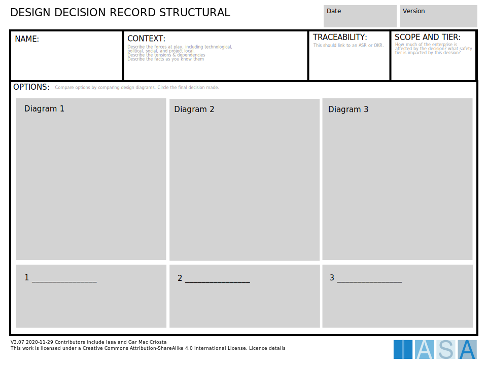

```yaml
title: "Architecture Structural Decision Record"
keywords: 
sidebar: mydoc_sidebar
toc: true
permalink: architecture_structural_decision.html
folder: structured_canvases
summary: "The ASDR provides a decision management tool for discrete decisions for traceability to ASR and usage."
tags:   - core
```

The ASDR provides 



| Area           | Description                                                 | Links To                                                                           |
| -------------- | ----------------------------------------------------------- | ---------------------------------------------------------------------------------- |
| Context        | The overall name and description of the decision to be made | [Context View](context_view_card.md){:target="_blank"}                             |
| Requirements   | The requirements (ASR) that drive the decision              | [ASR Card](https://iasa-global.github.io/btabok/asr_card.html){:target="_blank"}   |
| Decision Scope | The scope of impact of the decision                         | [Scope](https://iasa-global.github.io/btabok/scope_context.html){:target="_blank"} |
|                |                                                             |                                                                                    |
|                |                                                             |                                                                                    |
|                |                                                             |                                                                                    |
|                |                                                             |                                                                                    |
|                |                                                             |                                                                                    |
|                |                                                             |                                                                                    |

## Use this in Miro

We in the BTABoK are so very excited about the native support for architecture canvases in Miro! Find this canvas in the Miroverse!
