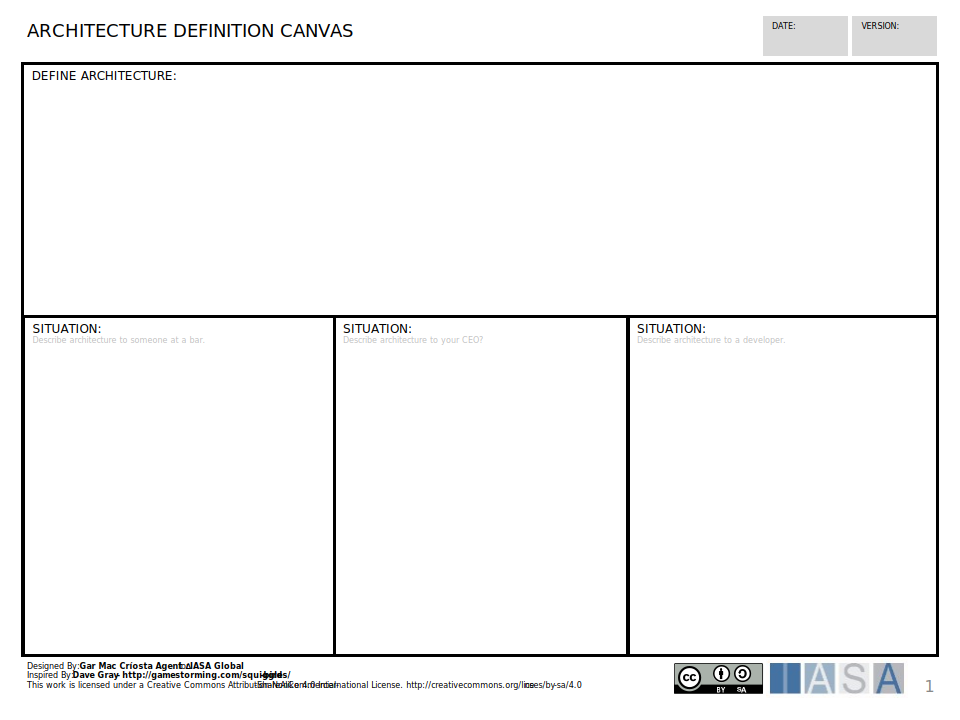

[Download PPT](media/ppt/architecture_tool_selection_canvas.ppt){:target="_blank"}

| Area                | Description                                                                                                                                                                                                                                                                                                                 | Links To |
| ------------------- | --------------------------------------------------------------------------------------------------------------------------------------------------------------------------------------------------------------------------------------------------------------------------------------------------------------------------- | -------- |
| Define Architecture | Put your definition of architecture in this area. Try to think in terms of a global definition for architecture that would apply to all 'types' of architects.                                                                                                                                                              | None     |
| Situation (areas)   | These situation areas allow you to describe architecture to a particular type of person or stakeholder. Think in terms of what they would understand about an architects value to a company or to society as a whole. For example, doctors 'heal people' and specific types of doctors provide particular types of healing. | None     |
