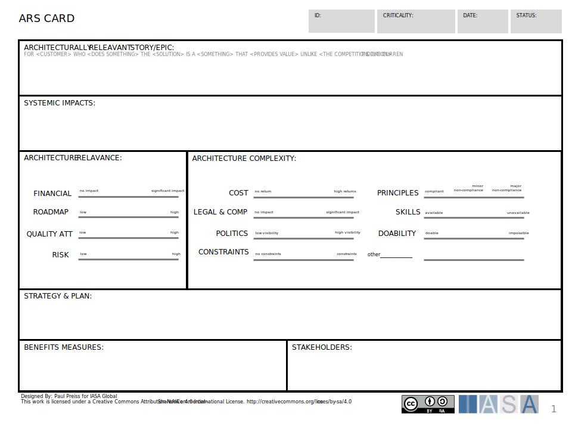

The ARS is used in agile architecture environments and mimics the epic or the detailed story while evaluating the requirement. Similar to ASR. 

[Download PPT](media/ppt/ars_card.ppt)

| Area                                | Description                                                                                                                      | Links To                       |
| ----------------------------------- | -------------------------------------------------------------------------------------------------------------------------------- | ------------------------------ |
| Architecturally Relevant Story/Epic | Describe the actor, their actions, their expectations and the systemic ,properties or quality attributes expected.               | Customer Journey, Capabilities |
| Systemic Impacts                    | What decisions need to be made? How will the decisions be executed? How will the architecture possibly address this requirement? | Decision Record Card           |
| Architecture Relevance              | How important is this requirement by money, strategic importance (roadmap), quality attributes, and risk?                        | OKR, Capabilities, Principles  |
| Architecture Complexity             | How complex is the requirement in terms of business and technology?                                                              | Context View                   |
| Strategy & Plan                     | What decisions need to be made? How will the decisions be executed? How will the architecture possibly address this requirement? |                                |
| Benefits Measures                   | How will this requirement be measured against outcomes?                                                                          | OKRs, Benefits Card            |
| Stakeholders                        | What stakeholders consider this requirement important.                                                                           | Stakeholder Management Plan    |
