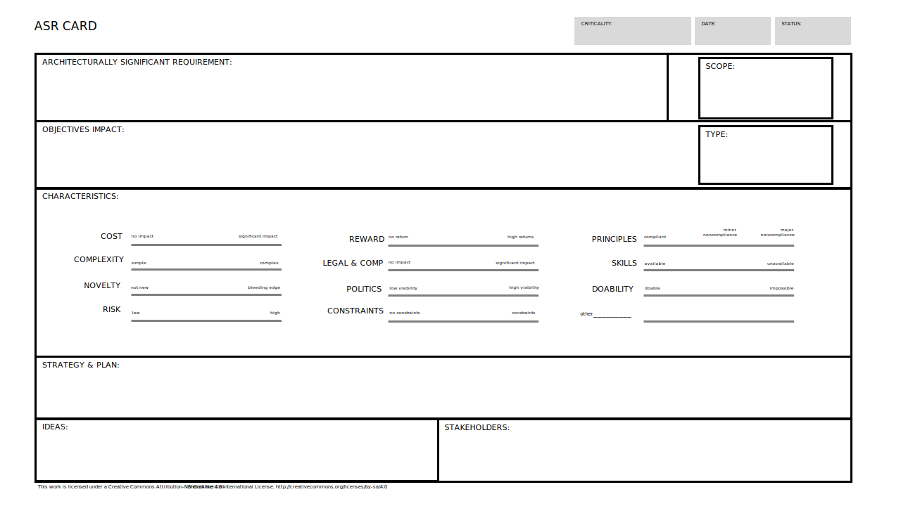

The ASR Card is a tool to define an architecturally significant requirement.

[Download PPT](media/ppt/asr_card.ppt){:target="_blank"}

| Area | Description | Links To |
| --- | --- | --- |
| ASR and Context | Write the ASR in common requirements format for your target PM method. |   |
| Significance & Impact | Describe how the ASR is significant and what makes it so. | OKRs |
| Characteristics | List relevant characteristics based on estimations from stakeholders. |   |
| Strategy & Plan | What decisions need to be made? How will the decisions be executed. | Decision Records |
| Ideas | Possible implementation ideas, linking, follow on requirements. |   |
| Stakeholders | What stakeholders consider this requirement important. | Stakeholder Management Plan |