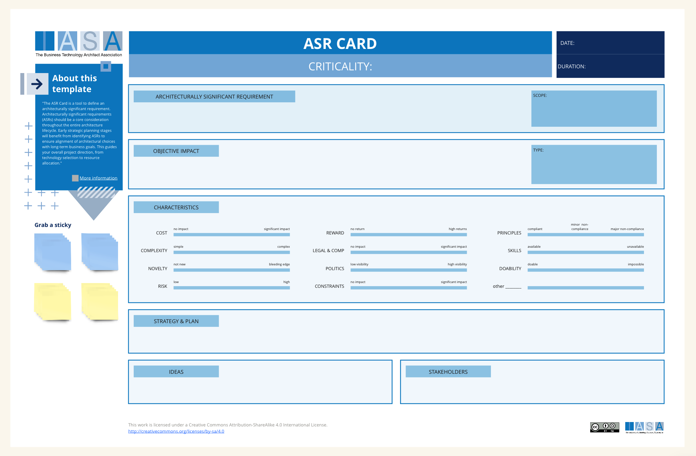

The ASR Card is a tool to define an architecturally significant requirement. Architecturally significant requirements (ASRs) should be a core consideration throughout the entire architecture lifecycle. Early strategic planning stages will benefit from identifying ASRs to ensure alignment of architectural choices with long-term business goals. This guides your overall project direction, from technology selection to resource allocation. ASRs become the foundation of a well-structured architecture, driving decisions on how the system's components interact, and how it will handle aspects like scalability and performance. During the design phase, they serve as a constant check for technical teams to ensure choices stay in line with the architectural vision. Even when requirements change or new technologies are considered, ASRs are essential. They help you quickly evaluate the potential impact these changes will have on existing architectural decisions and guide adaptations that won't compromise the system's integrity.

To successfully incorporate ASRs into your project, start with collaborative identification. Don't let architects work in a vacuum; involve stakeholders, developers, and architects to pinpoint requirements that have the potential to significantly impact the system's behavior or structure. Prioritize and classify ASRs as not all will have equal importance, so focus resources intelligently. Thorough documentation using a standardized format ensures that everyone has a clear, accurate understanding of each ASR. Creating clear links between ASRs, design decisions, and the actual implementation will allow you to track their influence throughout the development process. Regularly validate that your architectural choices are fulfilling the ASRs using tools like simulations and prototyping. Finally, continuous communication and collaboration across the project team about ASRs is paramount to ensure any changes are evaluated and shared clearly.

Remember, treating ASRs as an evolving part of your project is necessary, allowing for refinement and adjustments as needed. Consider risk assessment and build mitigation strategies for those ASRs that are crucial. Leverage tools designed for architectural modeling and management to give you a visual representation of the intricate links between ASRs, architecture decisions, and implementation. By giving ASRs the attention they deserve from the earliest stages of your project, you'll benefit by making informed decisions, building a system that is robust, adaptable, and more likely to achieve those long-term business goals.

Clearly defined architecture requirements are essential for several reasons:

- **Bridge Business Needs and Technical Solutions:** They bridge the gap between the business strategy and the technical specifications required to achieve it.
- **Guide Design Decisions:** Architecture requirements provide a clear roadmap for design teams, ensuring that technical decisions align with business goals.
- **Reduce Ambiguity and Errors:** Well-defined requirements minimize ambiguity and misunderstandings, leading to fewer errors during development and implementation.
- **Verification and Validation:** Requirements provide a baseline for verifying if the architecture meets the intended functionality and validating if it aligns with business needs.
- **Communication and Collaboration:** A shared understanding of requirements fosters better communication and collaboration between architects, developers, and stakeholders.

**How Architecture Requirements Differ from Regular Requirements**

Regular requirements typically focus on the functional features of a system, describing what the system should do from a user's perspective. Architecture requirements, on the other hand, delve deeper to specify how the system will be built and the technical constraints that shape those decisions. Here's a table summarizing the key differences:

| Feature         | Regular Requirements                 | Architecture Requirements                                         |
| --------------- | ------------------------------------ | ----------------------------------------------------------------- |
| Focus           | What the system should do            | How the system will be built                                      |
| Level of Detail | High-level, user-centric             | Technical, specific                                               |
| Audience        | Stakeholders, users                  | Architects, developers                                            |
| Source          | Business needs                       | Technical constraints, standards                                  |
| Examples        | "The system shall allow users to..." | "The system shall be built using a microservices architecture..." |

**Filling out the Architecture Requirements Card (ARC)**

- **Information Sources:**
  - Stakeholder Interviews and Workshops
  - System Design Documentation
  - Technical Standards and Regulations
  - Existing Architecture Documentation
- **Relationship to Other Architectural Practices:**
  - ARCs are used in conjunction with other architectural practices like architecture capability assessments, which evaluate your organization's ability to define and implement effective architecture requirements.

By documenting architecture requirements using a standardized format like the ARC card, you can ensure all stakeholders have a clear understanding of the technical considerations that shape the realization of business goals.

## How to use this card

- **Architectural Significance:** This section denotes the overall significance of the requirement to the entire architecture. Here you'd rate the requirement as Critical, High, Medium, or Low.
- **Requirement:** This section captures the specific architectural requirement itself. A well-written requirement should be clear, concise, unambiguous, and testable.
- **Scope:** This section defines which parts of the architecture the requirement applies to.
- **Objective Impact:** Here, you outline the desired outcome or objective that the requirement aims to achieve.
- **Type:** This section classifies the requirement by type. Common types include functional, non-functional, security, or integration requirements.
- **Source:** This section identifies the source or origin of the requirement. This might be a stakeholder need, a regulatory standard, or a system limitation.
- **Cost, Reward, Complexity:** These sections allow you to estimate the relative cost, potential benefit (reward), and implementation complexity associated with the requirement.
- **Novelty, Politics, Legality:** Here, you can consider how novel or innovative the requirement is, any potential political considerations surrounding it, and any legal or regulatory implications.
- **Risk:** This section assesses the potential risks associated with not implementing the requirement.
- **Strategy & Plan:** Here you outline the plan for implementing the requirement, including any mitigation strategies for potential risks.
- **Stakeholders:** This section identifies the key stakeholders who are impacted by or have an interest in the requirement.

## Downloads

[Download PPT](media/ppt/asr_card.ppt){:target="_blank"}

| Area                  | Description                                                            | Links To                    |
| --------------------- | ---------------------------------------------------------------------- | --------------------------- |
| ASR and Context       | Write the ASR in common requirements format for your target PM method. |                             |
| Significance & Impact | Describe how the ASR is significant and what makes it so.              | OKRs                        |
| Characteristics       | List relevant characteristics based on estimations from stakeholders.  |                             |
| Strategy & Plan       | What decisions need to be made? How will the decisions be executed.    | Decision Records            |
| Ideas                 | Possible implementation ideas, linking, follow on requirements.        |                             |
| Stakeholders          | What stakeholders consider this requirement important.                 | Stakeholder Management Plan |

## Use this in Miro

We in the BTABoK are so very excited about the native support for architecture canvases in Miro! Find this canvas in the Miroverse!

