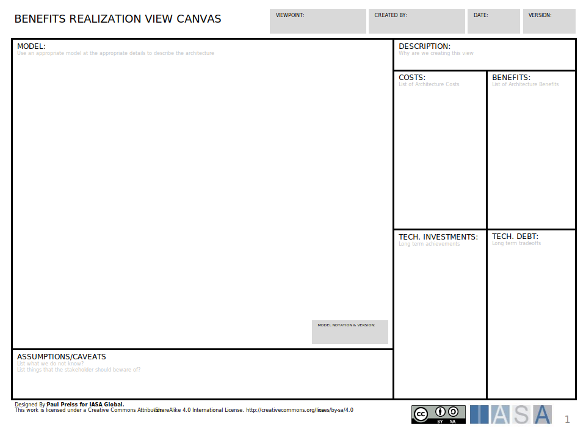
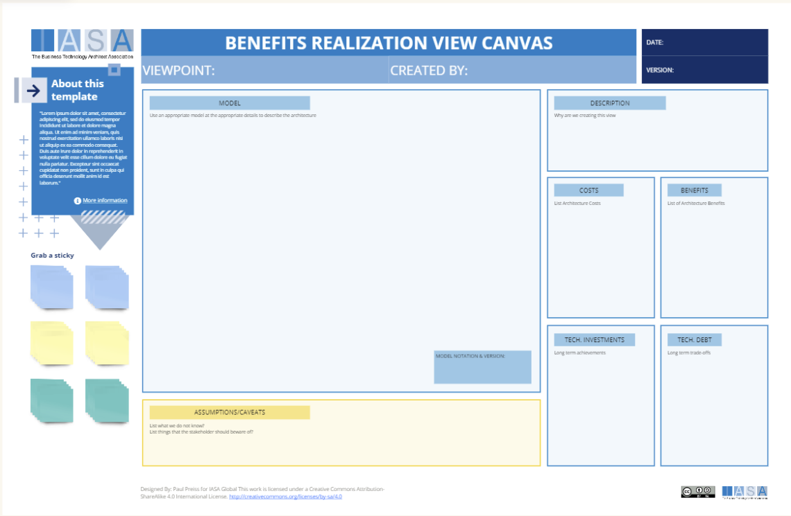

# Overview

The Benefits Realization View Canvas is a tool used in architecture to define a plan to realize the benefits of an investment in architecture. It can be used to identify and assess the costs, benefits, technical investments, and technical debt associated with an architecture decision.

The Benefits Realization View Canvas is a strategic planning tool that can be used to help organizations to align their architecture with their business strategy. By identifying the benefits of architecture, organizations can ensure that their architecture is driving business value. The Benefits Realization View Canvas can also be used to help organizations to execute on their architecture strategy. By identifying the costs, benefits, technical investments, and technical debt associated with an architecture decision, organizations can develop a plan to implement the architecture and realize the benefits.

By clearly identifying the costs and benefits of an architecture decision, architects can help stakeholders to make informed decisions about whether or not to invest in architecture and can help architects to identify and manage risks. By identifying the assumptions and caveats associated with an architecture decision, architects can help to mitigate risks and ensure that the architecture is successful.s

## How to use this canvas

1. **Define the Viewpoint:** The first step is to define the viewpoint for the benefits realization view. This means specifying who the audience is for the view and what they need to understand.
2. **Create the Model:** The next step is to create a model of the architecture. This model can be created using a variety of tools and techniques, such as ArchiMate or UML. The level of detail in the model will depend on the audience for the view.
3. **Describe the Model:** Once the model has been created, it is important to provide a brief description of the model. This description should explain what the model shows and how it relates to the benefits realization view.
4. **Identify Costs and Benefits:** The next step is to identify the costs and benefits associated with the architecture. The costs could include the cost of developing and implementing the architecture, as well as the ongoing costs of maintaining the architecture. The benefits could include improved business performance, reduced costs, and increased agility.
5. **Identify Technical Investments and Technical Debt:** The next step is to identify the technical investments that will be required to implement the architecture. This could include new hardware, software, or skills. It is also important to identify any technical debt that will be incurred as a result of the architecture decision. Technical debt is the additional work that will need to be done in the future to fix problems with the architecture.
6. **Document Assumptions and Caveats:** The final step is to document any assumptions that have been made in creating the benefits realization view. It is also important to document any caveats that stakeholders should be aware of. For example, the view may be based on a number of assumptions about the future of the business. These assumptions should be documented so that stakeholders can understand the risks involved.

## Downloads

[Download PPT](media/ppt/benefits_realization_view_canvas.ppt){:target="_blank"}

| Area                | Description                                                                                                                            | Links To               |
| ------------------- | -------------------------------------------------------------------------------------------------------------------------------------- | ---------------------- |
| Model               | The primary view of the architecture                                                                                                   |                        |
| Description         | The overview of the model                                                                                                              | Context View           |
| Costs               | This section lists the architecture costs and benefits.                                                                                | Risk and Cost Card     |
| Benefits            | This section lists the architecture costs and benefits.                                                                                | Benefit Card           |
| Tech. Investments   | The investments that can return a profit or value based on the cost.                                                                   |                        |
| Tech. Debt          | This section identifies the technical investments required to implement the architecture and the technical debt that will be incurred. | Technical Loan Request |
| Assumptions/Caveats | This section lists any assumptions made in creating the viewpoint and any caveats that stakeholders should be aware of.                |                        |

## Use this in Miro

We in the BTABoK are so very excited about the native support for architecture canvases in Miro! Find this canvas in the Miroverse!

