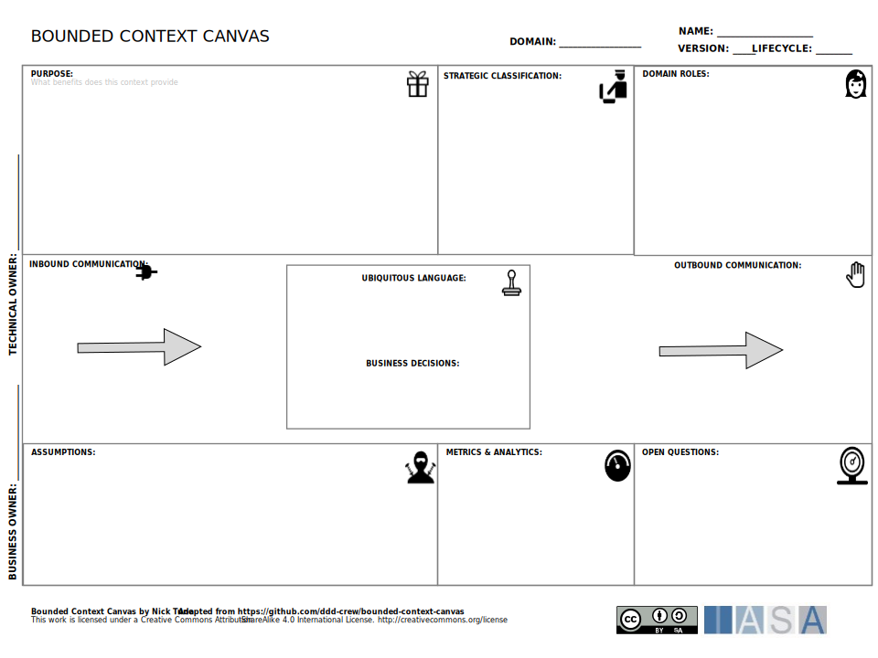

# Canvas Overview

The Bounded Context Canvas fits into strategy and execution by helping to develop a shared understanding of a system we are building. This shared understanding is essential for developing a successful strategy and for executing on that strategy. The canvas can also be used to identify potential risks and challenges early in the development process. This can help teams to mitigate these risks and challenges and to deliver a successful project.

There are a number of resources available to help you get started with the Bounded Context Canvas. Nick Tune and Eric Evans created the original canvas, and you can find more information about it on Nick Tune’s blog https://medium.com/nick-tune-tech-strategy-blog/bounded-context-canvas-v2-simplifications-and-additions-229ed35f825f. There are also a number of commercial tools available that can help you to use the Bounded Context Canvas, such as Domainlanguage.com [https://www.domainlanguage.com/](https://www.domainlanguage.com/).

## Bounded Context, Domains and Capabilities

A bounded context in DDD is a way to carve out a specific portion of a larger business domain. It defines a boundary within which a particular domain model applies. This means that terms, concepts, and relationships within that bounded context have a specific, well-defined meaning that might differ from their use in other parts of the system.

#### Bounded Context and Coupling

Bounded contexts provide an opportunity to connect domain concepts in their natural coupling levels. Many domain entities are tightly bound conceptually and at run-time. If significant development-time decoupling is added within a bounded context it should be with signficant design and thought as adding too much decoupling between bounded domain concepts will ultimately create both complexity and bottlenecks. (this definitely needs more research and discussion).

#### **Domains**

The Domain is the core of Domain-Driven Design and is critical in partitioning systems. These are the nouns of the business area: orders, Payments, and Employees. However, the missing connection is between capabilities and domain concepts.

**Business Capabilities Map an Organization's Activities**

Business capabilities essentially describe *what* an organization does, not *how* it does it. These are verb/noun combinations focused on functional and operational divisions. They are usually high-level, stable functionalities that provide value to the business. Examples of business capabilities might be:

- Customer Relationship Management (CRM)
- Order Fulfillment
- Inventory Management
- Payment Processing

**Alignment: Finding the Sweet Spot**

The real power of understanding the relationship between bounded contexts and business capabilities lies in their alignment:

- **Identifying Bounded Contexts:** Business capabilities can be a starting point for the discovery and definition of bounded contexts. Analyzing the distinct activities and responsibilities within a business capability can point towards natural divisions where separate, focused domain models might make sense.

- **Context Size:** Sometimes, a bounded context might directly encapsulate a single business capability. Other times, a business capability might be complex enough to be composed of several related bounded contexts.

- **Evolving Together:** Ideally, bounded contexts and business capabilities inform each other and evolve in tandem. Changes in how a business operates should be reflected in the capabilities it defines, and this will likely influence the models within your bounded contexts.

**Why This Relationship Matters**

1. **Reduced Complexity:** Breaking down a complex business domain into bounded contexts aligned with capabilities makes the system easier to understand, design, build, and maintain. Teams can focus on a smaller, more manageable domain.

2. **Clear Communication:** Explicitly aligning business terms with the concepts in bounded contexts creates a common language, improving communication between development teams and business stakeholders.

3. **Adaptability:** As a business's needs and capabilities change, bounded contexts that reflect those capabilities provide natural points for the software system to evolve and adapt as well.

## How to Use This Canvas

1. **Assemble your team.** The Bounded Context Canvas is a collaborative tool, so it is important to get all of the stakeholders involved in the bounded context together to work on it. This could include developers, business analysts, domain experts, and product managers.
2. **Fill out the canvas.** The canvas is divided into several sections, each of which prompts you to enter information about the bounded context. The specific sections may vary slightly depending on the version of the canvas you are using, but they typically include:
3. **Discuss and refine.** As you fill out the canvas, discuss each section with the team and come to a consensus on the information that you enter. This is a great opportunity to identify any areas of disagreement or uncertainty.
4. **Use the canvas to guide your design and implementation.** Once you have completed the Bounded Context Canvas, you can use it to guide your design and implementation of the bounded context. The information on the canvas will help you to make decisions about the architecture, technology stack, and APIs of the bounded context. 

## Downloads

[Download PPT](media/ppt/business_model_canvas.ppt){:target="_blank"}

## Canvas Sections and Links to BTABoK

| Area                     | Description                                                                                                            | Links To                      |
| ------------------------ | ---------------------------------------------------------------------------------------------------------------------- | ----------------------------- |
| Domain                   | The domain that the bounded context belongs to.                                                                        | Capability Article            |
| Purpose                  | A brief description of the purpose of the bounded context.                                                             |                               |
| Strategic Classification | How the bounded context is classified from a strategic perspective (e.g., Core, Context Layer, Anti-Corruption Layer). | Strategy Article              |
| Domain Roles             | The different roles that interact with the bounded context.                                                            | Stakeholder Environment       |
| Inbound Communication    | How the bounded context receives data from other bounded contexts.                                                     | API Designer, Capability Card |
| Outbound Communication   | How the bounded context sends data to other bounded contexts.                                                          | API Designer, Capability Card |
| Ubiquitous Launguage     | The key terms and concepts that are used within the bounded context.                                                   |                               |
| Assumptions              | Any assumptions that are made about the bounded context.                                                               | Principles                    |
| Metrics and Analytics    | The metrics that will be used to measure the success of the bounded context.                                           | Objectives, Benefits Card     |
| Open Questions           | Any open questions that the team has about the bounded context.                                                        |                               |