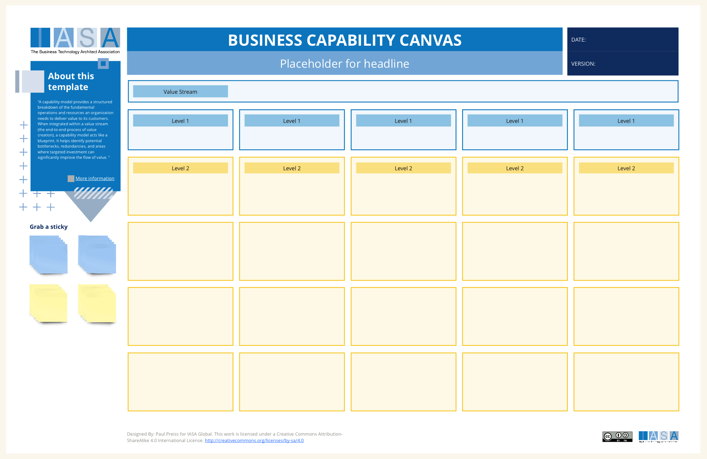

# Canvas Overview

A capability model provides a structured breakdown of the fundamental skills and resources an organization needs to deliver value to its customers. When integrated within a value stream (the end-to-end process of value creation), a capability model acts like a blueprint. It helps identify potential bottlenecks, redundancies, and areas where targeted investment can significantly improve the flow of value. This leads to greater efficiency, a better understanding of resource allocation, and the ability to pinpoint where innovation is most likely to yield results.

Creating a capability model within a value stream involves several key steps. First, thoroughly map out your value stream, documenting each stage from initial customer need to the delivery of the final product or service. Next, break down the essential abilities required at each stage. This could include things like marketing expertise, data analysis capability, or manufacturing capacity. Finally, categorize these capabilities, often done in a hierarchical way, to reveal the relationships and dependencies between them.

A well-constructed capability model is best represented visually. This allows for easy analysis of how different capabilities contribute to various stages of the value stream, highlighting areas of strength and weakness. This visual representation facilitates discussion, aiding in strategic decision-making. By overlaying performance metrics (throught the capability card) onto the model, you can identify where to focus resources to get the most impact and continuously align your capabilities with the changing needs of your value stream.

## How to Use This Canvas

- **Map Your Value Streams** Begin by identifying and mapping the major value streams in your organization – the processes that directly create value for your customers. Break down each stream into its core steps to visualize how the work flows. ([value stream canvas](value_stream_canvas.md))

- **Identify the Essential "What"** For each step in your value stream, ask: "What fundamental ability do we need to do this?" Focus on the essential actions or functions, not the specific execution methods. For example, within a "Product Development" value stream, some Level 1 capabilities might be "Market Research", "Prototyping," and "Quality Testing".

- **Aim for a Manageable Number** Level 1 capabilities should encompass related sub-tasks, but avoid being too granular. A manageable number is typically 5-15 capabilities per value stream. Sometimes, these map neatly to existing functional areas or departments.

- **Check for Alignment and Gaps** Ensure your Level 1 capabilities support the value stream's overall goals and customer needs. Look for any essential functions within the value stream that seem to be missing a corresponding capability.

**Key Considerations:**

- Level 1 capabilities are the starting point; you can later break them down into more detailed sub-capabilities (Level 2, 3, etc.).
- This is a collaborative and iterative process – it may require refinement as you get insights and feedback.

## Downloads

[Download PPT](media/ppt/business_capability_canvas.ppt){:target="_blank"}

## Canvas Sections and Links to BTABoK

| Area         | Description                                                                                                                                                                                                                                     | Links To                                                                                         |
| ------------ | ----------------------------------------------------------------------------------------------------------------------------------------------------------------------------------------------------------------------------------------------- | ------------------------------------------------------------------------------------------------ |
| Value Stream | The most common and effective way to name a value stream is with a simple verb-noun structure. This captures the action of the value stream and the object of that action. Examples: "Order to Delivery", "Concept to Launch", "Hire to Retire" | [Ecosystem Article](../engagement_model/ecosystem.md)                                            |
| Level 1      | At each stage of your value stream, ask yourself, "What core ability is needed to accomplish this step?" Ignore the "how" for now – the focus is on the fundamental tasks or functions required.                                                | [Business Capabilities Canvas](business_capability_canvas.md) (identifies critical capabilities) |
| Level 2      | Resources are the assets (like warehouses and distribution systems for Amazon) that directly impact the value model.                                                                                                                            | N/A                                                                                              |
| (below)      | Probably the most important area of the canvas. This is not a list of our products but the actual value we create for our customers. Good example was the iPod, "A seamless music experience"                                                   | N/A                                                                                              |

## Use this in Miro

We in the BTABoK are so very excited about the native support for architecture canvases in Miro! Find this canvas in the Miroverse!

