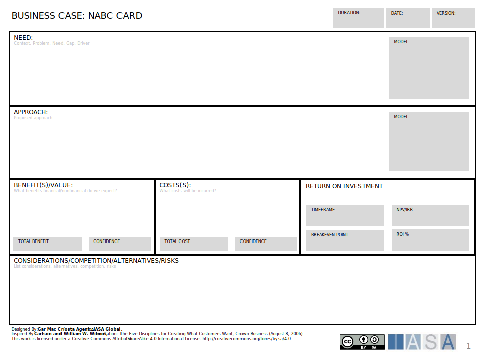

The Business Case has many names and uses. However, it primarily provides the details of a certain amount of work and it's expected benefits and costs. The BTABoK uses the NABC template (Need, Approach, Benefits, Considerations) as a Lean Business Case template which can be seen on a single page. It may still be necessary to use a larger document which will be added as another 'canvas' to the BTABoK though it will be in document formats.

[Download PPT](media/ppt/business_case_nabc_card.ppt){:target="_blank"}

| Area | Description | Links To |
| --- | --- | --- |
| Need | The need is a description of the drivers for the project. It should be driven from OKRs and should not include any of the approach section or proposed solution. |  OKRs (derived from) |
| Approach | The approach is the proposed solution to the need. It would contain a description of the product, project, or other proposed solution. |   |
| Benefit(s)/Value | The measured or expected benefits of the solution. | Benefits Card (may use) |
| Costs(s) | The expected costs of the solution, product or project.   |   |
| Return on Investment |   |   |
| Considerations, Competition, Alternatives, Risks |   |   |