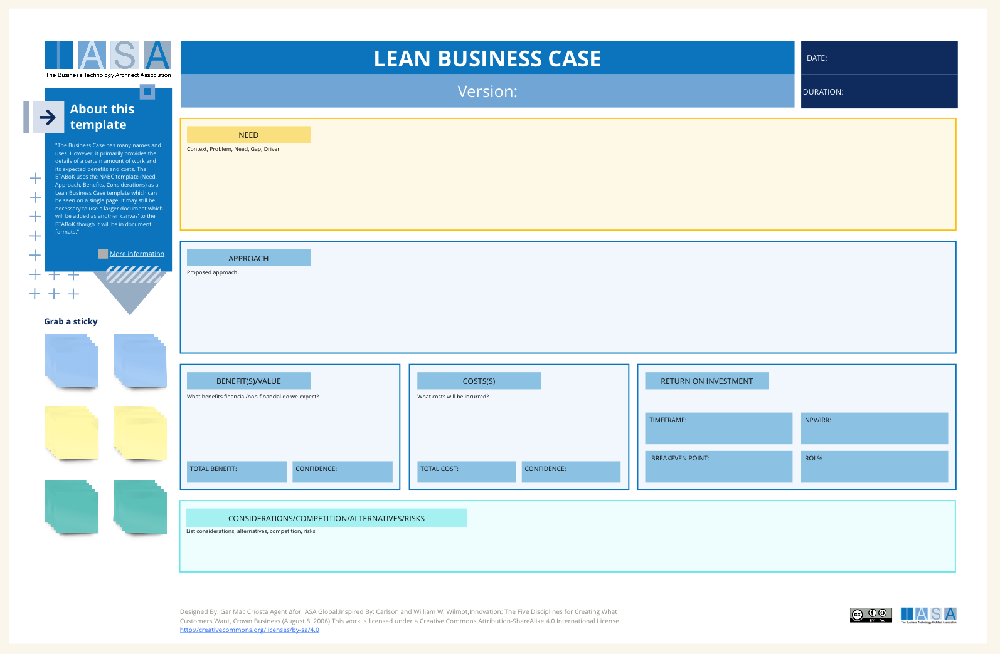
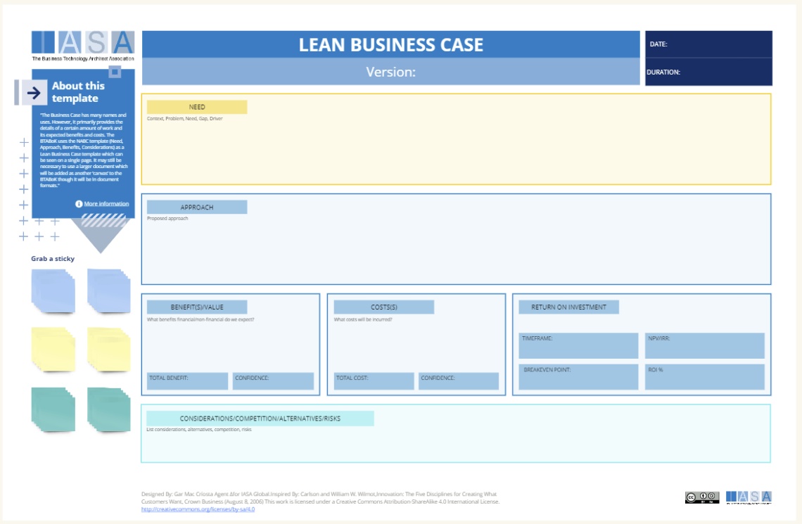

## Overview

The Business Case has many names and uses. However, it primarily provides the details of a certain amount of work and it's expected benefits and costs. The BTABoK uses the NABC template (Need, Approach, Benefits, Considerations) as a Lean Business Case template which can be seen on a single page. It may still be necessary to use a larger document which will be added as another 'canvas' to the BTABoK though it will be in document formats.

The Business Case Canvas can be a valuable tool for architects for a number of reasons.

- **Developing a project brief:** By using the Business Case Canvas to outline the need, different approaches, and expected benefits and costs of a project, architects can create a clear and concise project brief that can be used to communicate with clients and stakeholders [2].

- **Identifying project goals:** The Business Case Canvas can help architects to identify the specific goals of a project and ensure that all stakeholders are aligned on what the project is trying to achieve [2].

- **Considering different approaches:** The Business Case Canvas can be used to brainstorm different solutions to a problem and evaluate the feasibility of each option [2].

- **Assessing the value of a project:** By comparing the expected benefits of a project with its costs, the Business Case Canvas can help architects to assess the value of a project and make informed decisions about whether or not to proceed [2].

**How it Fits into Strategy and Execution**

The Business Case Canvas is a strategic tool that can be used in the early stages of project planning to develop a project brief and identify project goals. It can also be used to communicate the project’s value proposition to stakeholders. Once a project has been approved, the Business Case Canvas can be used as a reference point to track progress and ensure that the project is on track to achieve its goals [2].

## How to use this cards

The Business Case Canvas is a visual strategy and communication tool used to assess the feasibility of a project. It can be used by architects to develop a project brief, identify project goals, consider different approaches, and assess the value of a project versus its costs.

Here’s a breakdown of the Business Case Canvas and how it can be used:

**Need**

This section defines the problem, opportunity, or challenge that the project is aiming to address. It should include a clear and concise statement of the current situation and the desired future state.

**Approach**

This section outlines the proposed solution or approach to address the need. This could include different options or scenarios that will be evaluated further on in the canvas .

**Benefits/Value**

This section details the expected benefits of the project if it’s successful. These benefits can be both qualitative and quantitative. Qualitative benefits might include improved customer satisfaction or increased employee morale, while quantitative benefits could include cost savings or return on investment (ROI) .

**Costs**

This section details all the expected costs associated with the project. This could include one-time costs, like purchasing equipment, or ongoing costs, like staffing or maintenance .

**Return on Investment (ROI)**

This section compares the expected benefits of the project with its costs. ROI can be a simple calculation that divides the total benefit by the total cost, or it can be a more complex financial analysis that takes into account the time value of money.

**Considerations/Competition/Alternatives/Risks**

This section is used to brainstorm any other factors that could affect the project. This might include competition, alternative solutions, or potential risks that could occur during the project.

**Resources**

The Business Case Canvas is a relatively simple tool and doesn’t require any specific resources beyond the canvas itself, which can be found online or created with a whiteboard or flip chart.

## Downloads

[Download PPT](media/ppt/business_case_nabc_card.ppt){:target="_blank"}

| Area                                             | Description                                                                                                                                                      | Links To                             |
| ------------------------------------------------ | ---------------------------------------------------------------------------------------------------------------------------------------------------------------- | ------------------------------------ |
| Need                                             | The need is a description of the drivers for the project. It should be driven from OKRs and should not include any of the approach section or proposed solution. | OKRs (derived from)                  |
| Approach                                         | The approach is the proposed solution to the need. It would contain a description of the product, project, or other proposed solution.                           | Product Canvas, Solution Canvas      |
| Benefit(s)/Value                                 | The measured or expected benefits of the solution.                                                                                                               | Benefits Card (may use)              |
| Costs(s)                                         | The expected costs of the solution, product or project.                                                                                                          | Risk and Cost Card                   |
| Return on Investment                             | Calculated outcomes based on time, cost, benefits etc                                                                                                            | Benefits Card                        |
| Considerations, Competition, Alternatives, Risks | The other alternatives and risks to the approach                                                                                                                 | Decision Records, Risk and Cost Card |

## Use this in Miro

We in the BTABoK are so very excited about the native support for architecture canvases in Miro! Find this canvas in the Miroverse!

