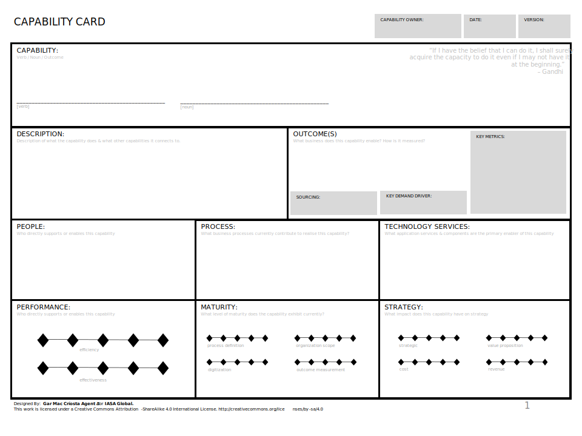
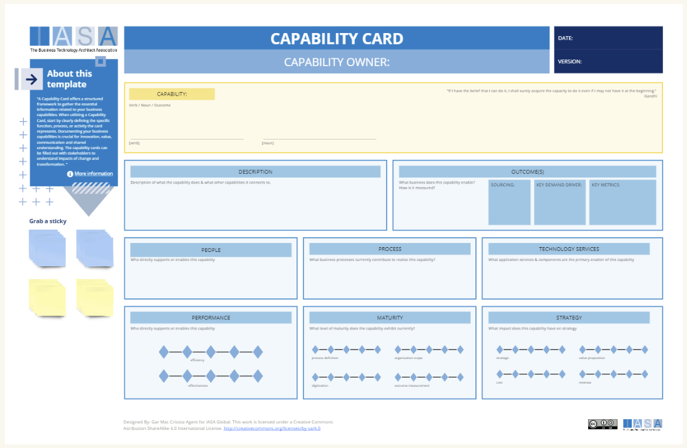

# Overview

The capability card provides a capability analysis tool for understanding a business capability and its measurements. Documenting your business capabilities is crucial for several reasons. Firstly, it establishes a shared understanding across the organization. This means everyone has the same reference point for how a capability works and the value it delivers, reducing ambiguity and misalignment. Documentation also protects your organization's knowledge base, making it less vulnerable to changes in personnel or unexpected disruptions. This is particularly important for complex or mission-critical capabilities. Additionally, documentation serves as a foundation for continuous improvement. With a clearly documented baseline of how a capability currently functions, you have a starting point to analyze areas that could be streamlined, innovated, or where targeted investments would yield the biggest return. Furthermore, by comparing existing documented capabilities against your strategic objectives, you can systematically identify potential gaps and where your organization may need to allocate resources towards building entirely new capabilities. Lastly, having well-documented capabilities with associated performance metrics provides robust, data-driven support for strategic decision-making.

**How to Use a Capability Card Template**

A Capability Card offers a structured framework to gather the essential information related to your business capabilities. When utilizing a Capability Card, start by clearly defining the specific function, process, or activity the card represents. Then, elaborate on that definition with a more detailed description explaining the capability's purpose, scope, and the value it brings to your organization. Next, it's vital to identify the tangible deliverables or results this capability produces, along with selecting key performance indicators that will best demonstrate its efficiency, effectiveness, or other relevant factors. Clearly map out the inputs and outputs of the capability, detailing what resources or data it needs to function, as well as what specific products, services, or decisions it creates as outcomes. Finally, document the "3Ps" – People (the skills and expertise required), Process (the key steps involved), and Technology (necessary systems and tools) – that are essential for the capability to function.

## How to use this card

**Techniques for Understanding Business Capability Metrics**

- **Identify Relevant Metrics:** Select metrics that directly tie to the value delivered by the capability and support strategic objectives.
- **Set SMART Goals:** Make sure your metrics are Specific, Measurable, Achievable, Relevant, and Time-bound.
- **Benchmarking:** Compare your capability metrics against industry standards or similar organizations to identify areas for improvement.
- **Track Performance Over Time:** Monitor how your capability metrics change over time to assess progress and identify trends.

**Understanding Inputs and Outputs**

- **Focus on Clarity:** Clearly define what the capability receives as input (e.g., materials, information, customer requests) and what it produces as output (e.g., finished products, reports, decisions).
- **Traceability:** Map the flow of inputs from the source to the capability, and then how the capability transforms those inputs into the desired outputs for the customer or next process in the value stream.
- **Voice of the Customer:** Consider incorporating the "Customer" section of the card to capture the specific needs and requirements the capability should address.

By capturing these elements and considerations within the Capability Card framework, you can gain a comprehensive understanding of a business capability and how it contributes to overall business goals.

The Capability Card provides a structured format to capture various aspects of a business capability. Here's a breakdown of the key sections:

- **Capability:** A concise statement describing the specific business function, process, or activity.
- **Description:** A more elaborate explanation of the capability and the value it delivers.
- **Outcomes:** The results or deliverables produced by the capability.
- **Key Metrics:** Measurable indicators that demonstrate how effectively the capability is performing.
- **Source:** The origin or trigger that initiates the need for this capability.
- **Key Demand Driver:** The primary reason or force creating a need for this capability.
- **People:** The skills and expertise required by the people who perform this capability.
- **Process:** The specific steps or procedures involved in carrying out this capability.
- **Technology Services:** The technology infrastructure and systems required to support this capability.

## Downloads

[Download PPT](media/ppt/capability_card.ppt){:target="_blank"}

## Canvas Sections and Links to BTABoK

| Area        | Description                                                                          | Links To                                                              |
| ----------- | ------------------------------------------------------------------------------------ | --------------------------------------------------------------------- |
| Capability  | The verb-noun name of the capability                                                 | [Capability Model/Canvas](business_capability_canvas.md)              |
| Description | The text description of the capability                                               | N/A                                                                   |
| Outcomes    | Description of what the capability does & what outcome it leads to.                  | [OKRs](okr_card.md){:target="_blank"}, KPIs                           |
| People      | Who directly supports or enables this capability?                                    | [Stakeholder Ecosystem](stakeholder_ecosystem_canvas.md)              |
| Process     | What business processes currently contribute to realizing this capability?           | Business Process Models                                               |
| Technology  | What application services & components are the primary enabler of this capability    | [Service Blueprint(s)](service_blueprint_canvas.md){:target="_blank"} |
| Performance | What overall performance (effectiveness and efficiency) does the capability display? | [Benefits Card](benefit_card.md){:target="_blank"}                    |
| Maturity    | What level of maturity does the capability exhibit currently?                        | N/A                                                                   |
| Strategy    | What impact does this capability have on strategy?                                   | [Strategy Scorecard](strategy_scorecard_canvas.md){:target="_blank"}  |

## Use this in Miro

We in the BTABoK are so very excited about the native support for architecture canvases in Miro! Find this canvas in the Miroverse!

