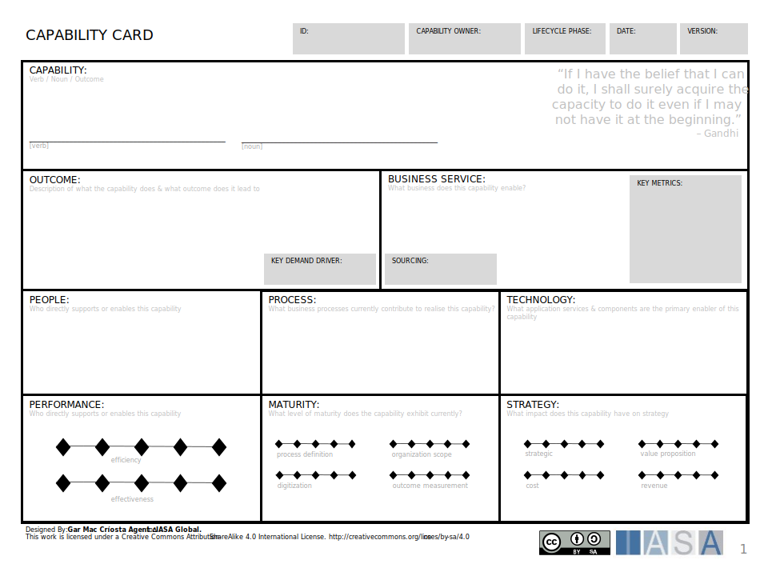

The capability card provides a capability analysis tool for understanding a business capability and its measurements.

[Download PPT](media/ppt/capability_card.ppt){:target="_blank"}

| Area | Description | Links To |
| --- | --- | --- |
| Capability | The verb noun name of the capability | Capability Model/Canvas |
| Outcomes | Description of what the capability does & what outcome does it leads to. | OKRs, KPIs |
| Value Streams | What value streams does this capability enable? | Value Stream Canvas |
| People | Who directly supports or enables this capability? | Stakeholder Ecosystem |
| Process | What business processes currently contribute to realize this capability? | Business Process Models |
| Technology | What application services & components are the primary enabler of this capability | Service Blueprint(s) |
| Performance | What overall performance (effectiveness and efficiency) does the capability display? |   |
| Maturity | What level of maturity does the capability exhibit currently? |   |
| Strategy | What impact does this capability have on strategy? | Strategy Scorecard |