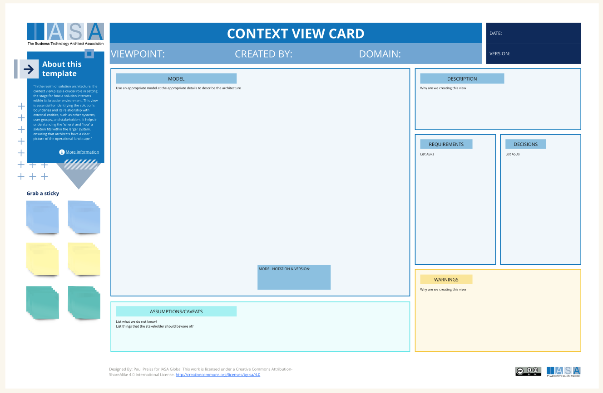

# Canvas Overview

The context view is primarily used to describe software intensive solutions. For product customization use a functional view as the primary view. For information intensive or infrastructure intensive systems you would use the corresponding primary views.

In the realm of solution architecture, the context view plays a crucial role in setting the stage for how a solution interacts within its broader environment. This view is essential for identifying the solution's boundaries and its relationship with external entities, such as other systems, user groups, and stakeholders. It helps in understanding the 'where' and 'how' a solution fits within the larger system, ensuring that architects have a clear picture of the operational landscape.

Expanding upon this foundation, the context view aids architects in pinpointing integration points, dependencies, and potential constraints that might impact the solution's implementation. This comprehensive understanding is key to anticipating challenges and opportunities in the solution's deployment, making it an indispensable tool in the architect's toolkit. It provides a roadmap that guides not only the technical design but also the strategic alignment of the solution with business objectives.

Furthermore, the context view fosters communication and alignment among stakeholders by offering a shared visualization of the solution's ecosystem. This common ground is vital for ensuring that all parties have a unified understanding of the solution's scope, capabilities, and limitations. By laying out the external interactions and dependencies, architects can effectively navigate the complexities of the solution's environment, leading to more informed decision-making and a more robust architectural design.

## How to use this canvas

To create a context view, follow these detailed steps:

- **Understand the Solution's Scope**: Define what your solution aims to achieve and its boundaries within the larger system.
- **Identify External Entities**: List all external systems, user groups, and stakeholders that interact with your solution.
- **Select a Modelling Language**: Choose a language like UML or ArchiMate for consistent representation of the context.
- **Diagram the Context**: Use your chosen language to visually map the solution's interactions with external entities.
- **Detail Interactions**: For each external connection, describe the nature of the interaction, data flow, and dependencies.
- **Relate to Other Views**: Connect the context view with other architectural views, showing how external interactions influence internal architecture.
- **Incorporate into Decision Records**: Link context view insights to decision-making processes, highlighting how external factors influence architectural choices.
- **Update Other Artifacts**: Ensure that the context view is reflected in relevant architectural documents for a cohesive understanding.

This process will guide you in creating a comprehensive context view, integrating it with your architectural practice, and leveraging it for informed decision-making.

## Downloads

[Download PPT](media/ppt/context_view_card.ppt){:target="_blank"}

## Canvas Sections and Links to BTABoK

| Area                | Description                                                                                                                                                                                                   | Links To                    |
| ------------------- | ------------------------------------------------------------------------------------------------------------------------------------------------------------------------------------------------------------- | --------------------------- |
| Model               | The model section contains the model in whichever modeling language or model type you will be using to display the view. The model should also contain a key if it is not using a standard modeling language. |                             |
| Description         | The overview of the context view and solution design space.                                                                                                                                                   | Lean Business Case          |
| Requirements        | The requirements section helps to align ASRs to ASDs, listing the primary requirements which drive the selections in the context view.                                                                        | ASRs.                       |
| Decisions           | The decisions section helps to align decision records which help shape the final context view according to patterns, constraints, requirements and value.                                                     | ASDs                        |
| Warnings            | The warnings are identified exceptions from architecture analysis or principles which are misaligned with the decisions and design in the current context view.                                               | QATT card, Principles card. |
| Assumptions/Caveats | The assumptions and caveats describes basic cognitive biases, tradeoffs and other aspects of the design which are consequenses of the forces at work on it.                                                   | Cost and Risk card          |

## Use this in Miro

We in the BTABoK are so very excited about the native support for architecture canvases in Miro! Find this canvas in the Miroverse!

