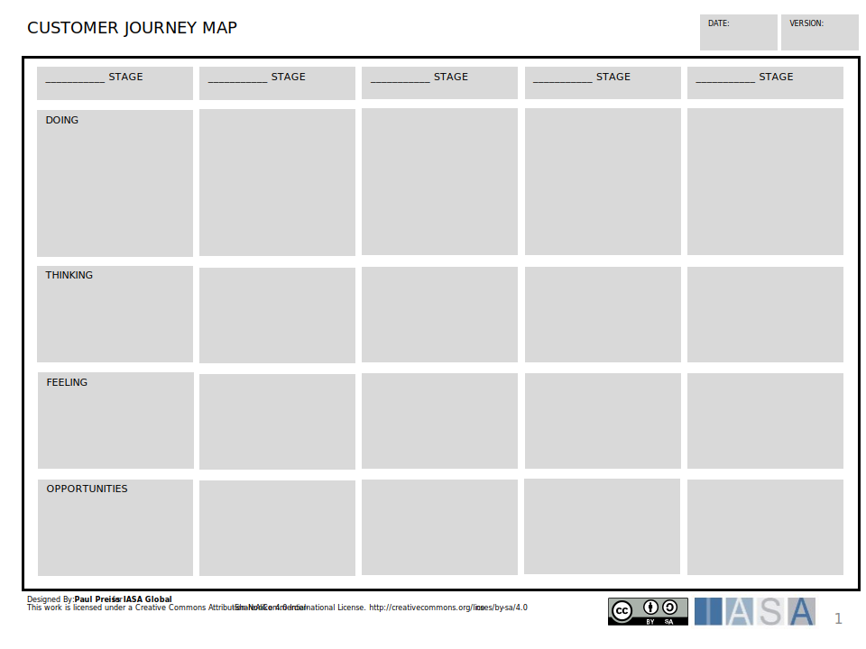

# Canvas Overview

The Customer Journey canvas is a crucial tool for architects because it helps us understand and improve how customers interact with a product or service. It gives us a clear picture of each step a customer takes, from first hearing about a product to getting support after buying it.

Using this canvas, we can see where customers might have problems or feel frustrated. By understanding their journey, we can make sure our designs meet their needs and make their experience better.

For architects, this canvas is like a map showing us where to focus our efforts. It helps us see what changes we need to make to create designs that customers will love. Plus, it's a great way to bring different teams together to talk about how to improve the customer experience.

In simple terms, the Customer Journey canvas helps us architects create designs that not only work well but also make customers happy, which is important for the success of any project.

## How to Use this Canvas

For an architect filling out a customer journey, consider:

- **Define Customer Personas**: Understand your audience by creating detailed profiles representing different user segments. Consider demographics, motivations, and pain points.

- **Map Touchpoints**: List all the points where customers interact with your service, both online and offline.

- **Identify Journey Stages**: Break down the customer journey into stages such as awareness, consideration, purchase, and post-purchase.

- **Assess Customer Experience**: At each stage, document what customers might be thinking, feeling, and doing.

- **Identify Pain Points**: Look for areas where customers might experience frustration or barriers.

- **Enhance the Experience**: Use insights from the above steps to propose improvements or innovations in the customer journey.

## Downloads

[Download PPT](media/ppt/customer_journey_map.ppt){:target="_blank"}

Canvas Sections and Links to BTABoK

| Area          | Description                                                                                                                                                                                                                                                                                | Links To                                                          |
| ------------- | ------------------------------------------------------------------------------------------------------------------------------------------------------------------------------------------------------------------------------------------------------------------------------------------ | ----------------------------------------------------------------- |
| Stages        | The stages section of the document provides the space to devide the journey into descrete sections. These sections should be based on both clear customer transitions (such as moving to a new status or focus area) as well as useful sections for your business.                         |                                                                   |
| Doing         | The doing section is a chance to describe concise information about what actions the customer is taking. This section would include action verbs and may be closely aligned with the service blueprint. Think about what the customer hopes to accomplish and how it is occuring for them. | [Service Blueprint](https://iasa-global.github.io/btabok/service_blueprint_canvas.html){:target="_blank"}, [JBTD Card](https://iasa-global.github.io/btabok/strategyn_jtbd_canvas.html){:target="_blank"}                                           |
| Thinking      | What is in the customers head? How do they think this should go? What do they know or want?                                                                                                                                                                                                | [Customer Persona](https://iasa-global.github.io/btabok/persona_card.html){:target="_blank"},[JBTD Card](https://iasa-global.github.io/btabok/strategyn_jtbd_canvas.html){:target="_blank"}                                            |
| Feeling       | What is the customer feeling as they take these steps? How are they excited or disappointed? Describe the customers emotional journey.                                                                                                                                                     | Customer Persona, [JBTD Card](https://iasa-global.github.io/btabok/strategyn_jtbd_canvas.html){:target="_blank"}                                            |
| Opportunities | What opportunities can you identify to improve the customers journey through the process?                                                                                                                                                                                                  | [OKRs](https://iasa-global.github.io/btabok/okr_card.html){:target="_blank"}, Lean Business Case, [Innovation Article](https://iasa-global.github.io/btabok/innovate.html){:target="_blank"}, [Experiments Article](https://iasa-global.github.io/btabok/experiments.html){:target="_blank"} |

## Use this in Miro

We in the BTABoK are so very excited about the native support for architecture canvases in Miro! Find this canvas in the Miroverse!

