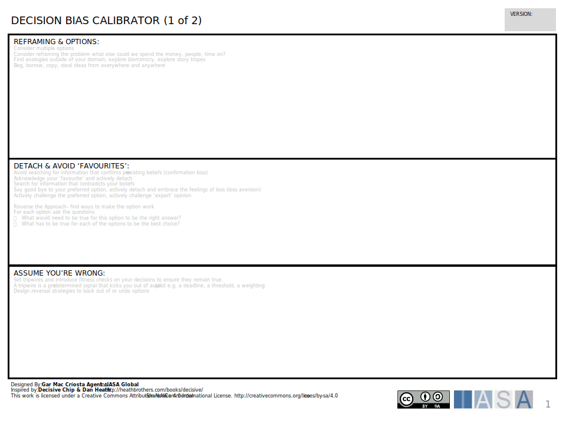

The bias calibrators help architects determine whether cognitive bias is impacting their decisions. The Decision Bias Caliberator Canvas is a valuable tool designed to pinpoint and address the potential cognitive biases that can unintentionally cloud rational decision-making within the context of architectural strategy. Architects face a myriad of complex choices and unchecked bias can lead to suboptimal outcomes. Some common biases, like anchoring, cause architects to overemphasize initial ideas while self-interest bias can lead to choices that benefit a specific team rather than the entire organization. Using a Decision Bias Caliberator Canvas provides a structured way to identify these biases, question your thought processes, and take proactive steps to ensure your decisions remain sound.

The canvas typically lists out various biases. Next to each bias are targeted questions designed to help you recognize if it's affecting a current decision. Finally, the canvas provides practical tips on how to counteract the identified bias. The Decision Bias Caliberator doesn't require specific external information – it's purpose is to stimulate discussion and critical thinking within your architecture team. It works hand-in-hand with other established architecture practices like creating a roadmap or gathering stakeholder input by adding another layer of scrutiny to the decision-making process. By consciously working to identify and mitigate cognitive biases, your architectural decisions become more innovative, better aligned with the overall business goals, and less susceptible to costly mistakes.

## How to use this canvas

his tool is designed to help identify and mitigate potential cognitive biases that can impede rational decision-making in the context of architectural strategy and execution.

Here's a breakdown of the sections of the card and how it relates to the importance of considering decision bias in your architecture practice:

#### **Sections of the Decision Bias Caliberator Canvas**

**Reframing & Options:**

This section encourages considering multiple architectural options and reframing the problem from different perspectives. It suggests exploring analogies outside your domain and considering alternative approaches to broaden the decision scope. 

- This section advocates for considering the opposite approach and asking critical questions like "What would need to be true for this option to be the right answer?" This helps identify potential flaws or unforeseen consequences in your initial considerations.

**Detach & Avoid Favorites:**

This section highlights the pitfalls of confirmation bias and the importance of detachment from preconceived favorites. It encourages actively seeking out information that contradicts your initial preferences and challenging the assumptions underlying favored options.

**Reverse Approach & Ask Why:**

This section advocates for considering the opposite approach and asking critical questions like "What would need to be true for this option to be the right answer?" This helps identify potential flaws or unforeseen consequences in your initial considerations.

**Assume You're Wrong & Set Tripwires:**

This section emphasizes the importance of humility and proactive risk mitigation. It encourages assuming you might be wrong and setting up "tripwires" like deadlines or thresholds to trigger re-evaluation of decisions if certain conditions aren't met.

## How to use these canvas

- **Bias:** This section lists various cognitive biases that can influence decision-making. The specific biases listed may vary slightly between different versions of the canvas. The example you sent includes biases like anchoring, self-interest, and availability bias.
- **Test:** This section provides questions to help you identify whether a particular bias might be influencing your architectural decisions.
- **Action:** This section offers suggestions on how to counteract the identified bias and make more objective decisions.

**Benefits of Identifying Decision Bias**

By using a Decision Bias Caliberator Canvas and consciously mitigating these biases, you gain several advantages:

**Improved Decision-Making:** A more balanced consideration of options leads to better architectural choices aligned with business needs.

**Enhanced Creativity:** Challenging assumptions and exploring alternative perspectives can spark innovative architectural solutions.

**Reduced Risks:** Proactive identification of potential flaws in decision-making helps avoid costly architectural mistakes down the road.

Here are some references for decision bias and its impact on decision-making:

- [List of cognitive biases - Wikipedia](https://en.wikipedia.org/wiki/List_of_cognitive_biases)
- [7 Ways to Remove Biases From Your Decision-Making Process | Entrepreneur](https://www.entrepreneur.com/living/7-ways-to-remove-biases-from-your-decision-making-process/351497)

## Downloads

[Download PPT](media/ppt/decision_bias_calibrator_1.ppt){:target="_blank"}

| Area                        | Description                                                                                                                                                                                                                                                                  | Links To |
| --------------------------- | ---------------------------------------------------------------------------------------------------------------------------------------------------------------------------------------------------------------------------------------------------------------------------- | -------- |
| Reframing & Options         | This section encourages considering multiple architectural options and reframing the problem from different perspectives. It suggests exploring analogies outside your domain and considering alternative approaches to broaden the decision scope.                          | ADR      |
| Detach & Avoid 'Favourites' | This section highlights the pitfalls of confirmation bias and the importance of detachment from preconceived favorites. It encourages actively seeking out information that contradicts your initial preferences and challenging the assumptions underlying favored options. | ADR      |
| Assume you're Wrong         | This section emphasizes the importance of humility and proactive risk mitigation. It encourages assuming you might be wrong and setting up "tripwires" like deadlines or thresholds to trigger re-evaluation of decisions if certain conditions aren't met.                  | ADR      |

## Use this in Miro

We in the BTABoK are so very excited about the native support for architecture canvases in Miro! Find this canvas in the Miroverse!

