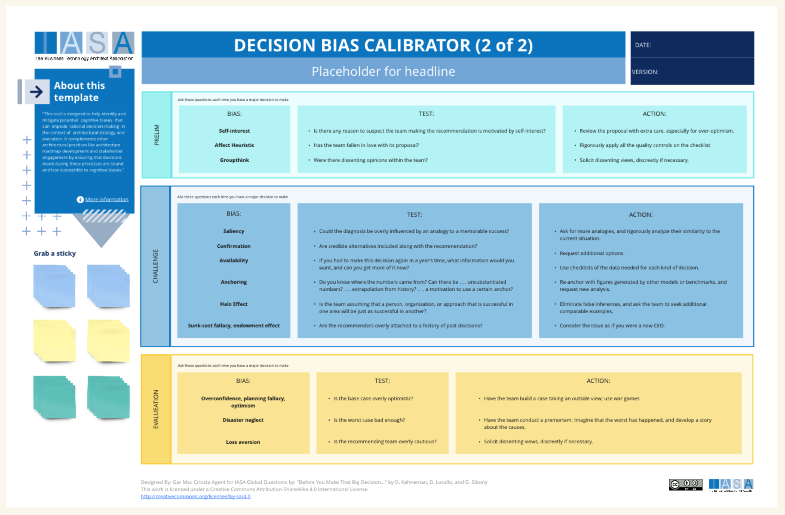

This tool is designed to help identify and mitigate potential  cognitive biases  that can  impede  rational decision-making  in the context of  architectural strategy and execution. It complements other architectural practices like architecture roadmap development and stakeholder engagement by ensuring that decisions made during these processes are sound and less susceptible to cognitive biases.

[Download PPT](media/ppt/decision_bias_calibrator_2.ppt){:target="_blank"}

| Area       | Description | Links To |
| ---------- | ----------- | -------- |
| Prelim     |             |          |
| Challenge  |             |          |
| Evaluation |             |          |

## Use this in Miro

We in the BTABoK are so very excited about the native support for architecture canvases in Miro! Find this canvas in the Miroverse!

