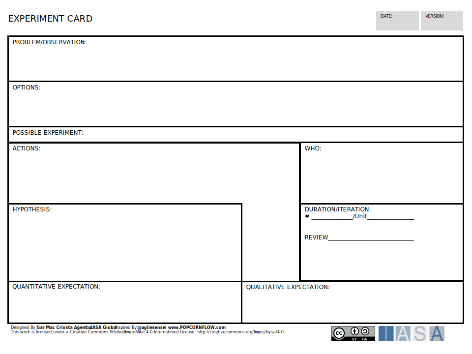

The experiment card provides a method for structuring an individual experiment. It tracks the experiments problem/opportunity and options evaluated as well as the possible experiment and methodology used to test the hypothesis.

[Download PPT](media/ppt/experiment_card.ppt){:target="_blank"}

| Area | Description | Links To |
| --- | --- | --- |
| Problem/Observation |   |   |
| Options |   |   |
| Possible Experiment |   |   |
| Actions |   |   |
| Who |   |   |
| Duration/Iteration |   |   |
| Hypothesis |   |   |
| Quantitative Expectation |   |   |
| Qualitative Expectation |   |   |