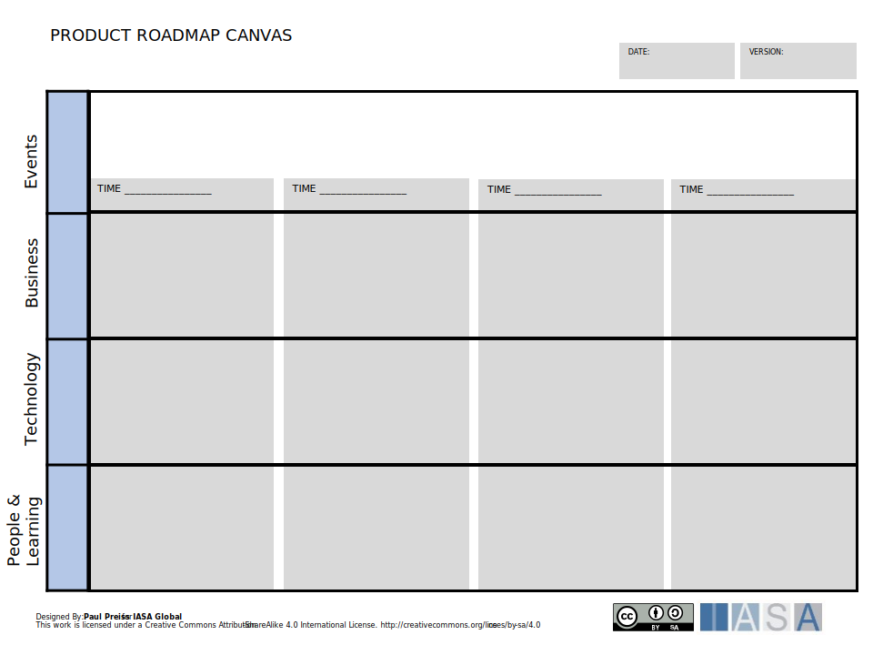

The layered roadmap provides a tool for understanding the business capability changes, technology services and stakeholder changes rolling out over time.

[Download PPT](media/ppt/layered_roadmap_canvas.ppt){:target="_blank"}

| Area | Description | Links To |
| --- | --- | --- |
| Events | The event lane represents the stakeholder visible and value oriented milestones in the roadmap. |   |
| Business | The business lane represents major changes in business capabilities, processes. | Capability Canvas (informs), Capability Card (relates to) |
| Technology | The technology lane represent the technical components and services with dependencies. | Service Blueprint (uses services), Context View (uses components) |
| People & Learning | The people and learning late represents the changes and learning needed to deliver the roadmap. | Stakeholder Canvases (describes roles) |
| Time Lane | Time increments should scale upward meaning closest time should be in short increments and farthest right in longer increments. |   |
| Milestones | Milestones represent key events in the system and are often shown with dependencies. |   |