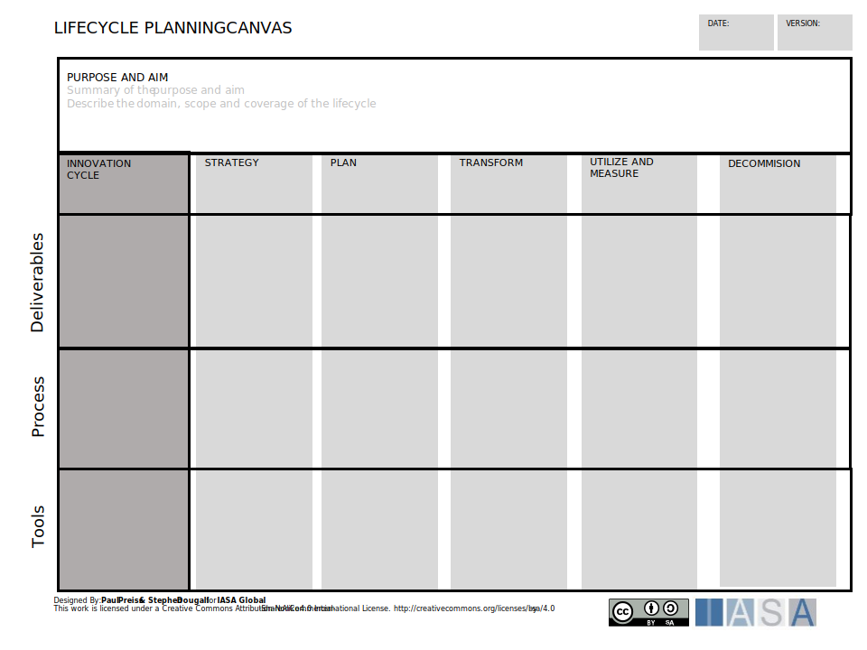

Think about the architects role in the lifecycle of the enterprise each year. There is strategy, planning, transformation, utilization and measurements and these cycle constantly on higher and lower scopes. 

[Download PPT](media/ppt/lifecycle_planning_canvas.pptx)

It helps to think of these lifecyle phases both in terms of a single product as well as the enterprise as a whole. For example, where did the idea for a particular product come from but also where is innovation managed? Think about reading the Scope article and then applying the lifecycle article across the different scopes. 

| Area                | Description                                                                                                                                                                                                                                 | Links To                                                                   |
| ------------------- | ------------------------------------------------------------------------------------------------------------------------------------------------------------------------------------------------------------------------------------------- | -------------------------------------------------------------------------- |
| Innovation          | The phase where ideas are generated, managed, discussed, tested and passed on to strategy.                                                                                                                                                  | [Innovation Article](../engagement_model/innovate.md), Innovation Canvases |
| Strategy            | The phase where overall objectives are set for the future of the product or organization. This can be applied at multiple scopes. This will include all of the target direction but not the actual project/products to achieve those goals. | [Strategy Article](../engagement_model/strategy.md), Strategy Canvases     |
| Plan                | Once the strategy has been set it is time to decide which products will best achieve those objectives and how to deliver them. The plan maps objectives to delivery.                                                                        | Roadmap Article                                                            |
| Tranform            | Where the work of change happens. This phase is most commonly linked to building, buying and operating. In architecture transformation continues until everything is safely in production and being used.                                   | Views and Viewpoints, Team management, Stakeholders                        |
| Utilize and Measure | This is the period where a product will deliver the value to its owners. It is in full use and the architects are measuring the outcomes against objectives.                                                                                | Measurement article                                                        |
| Decommission        | The end of life of a product or service when something new will replace fully something old.                                                                                                                                                |                                                                            |
| Deliverables        | The 'nouns', artifacts, views, templates and interfaces being used by the architecture team. This is the lane to put in the types of deliverables the team either influesnces or owns.                                                      | Views and Viewpoints, Deliverables Article.                                |
| Processes           | The architecture practice 'verbs'. The meetings, hallway conversations, reviews, assessments, proof of concepts and other processes the practice uses to engage in that phase.                                                              | Engagement model articles and canvases.                                    |
| Tools               | The tools the practice uses to deliver against this step. This tool set is not just 'named' tools like EA Tools but also collaboration, facilitation, modeling, calling, documents, etc.                                                    | Tools evaluation canvas                                                    |