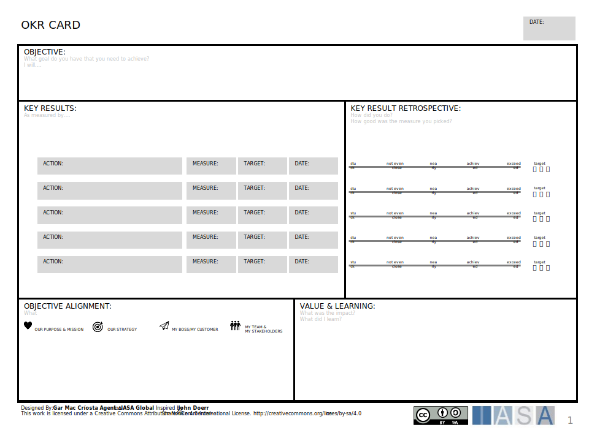
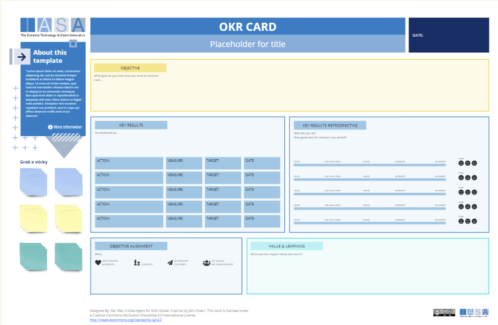

Objectives are one of the key areas to understanding business outcomes in the BTABoK. The Objective Key Result card represents a single objective which can be measured against a set of key results. The [Objectives article](../engagement_model/objectives.md) describes how to define and understand objectives. The OKR card should be used to understand impacts to the business model through strategy setting and benefits analysis. 

Steps

[Download PPT](media/ppt/okr_card.ppt){:target="_blank"}

| Area                     | Description | Links To |
| ------------------------ | ----------- | -------- |
| Objective                |             |          |
| Key Results              |             |          |
| Key Result Retrospective |             |          |
| Objective Alignment      |             |          |
| Value & Learning         |             |          |

## Use this in Miro

We in the BTABoK are so very excited about the native support for architecture canvases in Miro! Find this canvas in the Miroverse!

