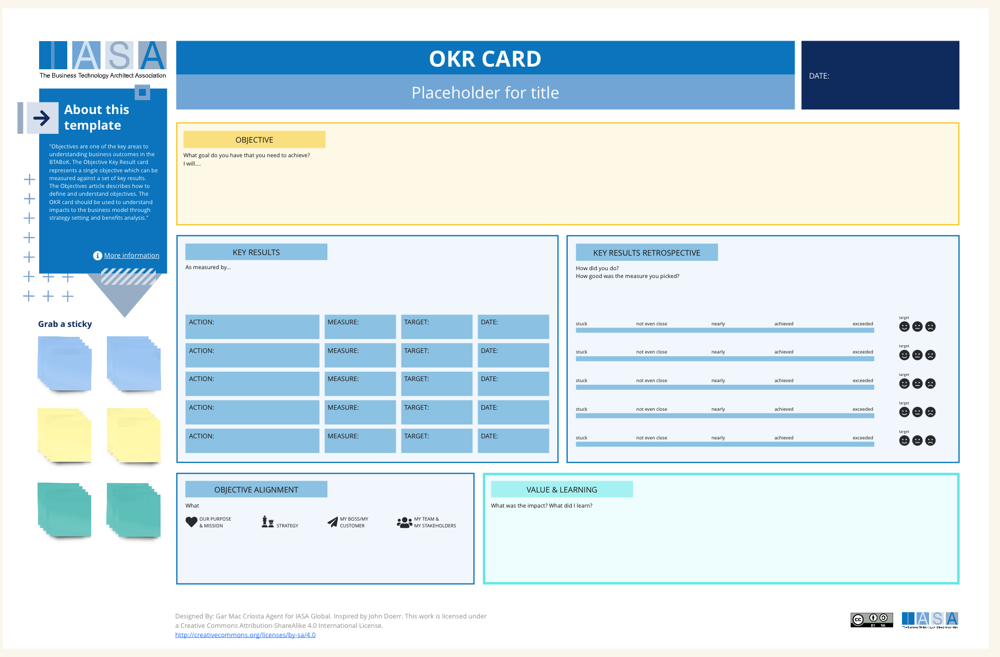

Objectives are one of the key areas to understanding business outcomes in the BTABoK. The Objective Key Result card represents a single objective which can be measured against a set of key results. The [Objectives article](../engagement_model/objectives.md) describes how to define and understand objectives. The OKR card should be used to understand impacts to the business model through strategy setting and benefits analysis. 

This OKR card provides a structured framework for architects to define clear objectives, track progress, and align their work with broader organizational goals. The card itself has several core sections. First is the "Objective" section, where architects articulate a concise and ambitious goal that directly supports the organization's strategic direction. This objective should be challenging yet achievable, inspiring focus and driving effort. Next, the "Key Results" section defines the quantifiable metrics that measure progress towards the objective. These key results should be SMART: Specific, Measurable, Achievable, Relevant, and Time-bound. Ideally, 3-5 key results provide a clear picture of success. The "Actions" section represents the concrete steps that will be taken to achieve the key results, translating the OKR into tangible deliverables. Finally, the "Objective Alignment" section is where the BTABoK's influence is most apparent, and it's critical to the process. Here, architects explicitly connect their objective to specific TASA goals and assess the potential impact. This reinforces the strategic value of their work and ensures that efforts contribute to the overarching vision of the organization.

## How to use this card

The OKR card bridges strategy and execution. The "Objective" section ensures that architectural initiatives stem from high-level strategic goals. Conversely, the card empowers architects to break down these grand objectives into actionable steps with clear indicators of success, ensuring the organization's strategic vision becomes a reality.

**Step 1: Define the Objective**

Begin by crafting a clear and compelling objective. This shouldn't be a laundry list of tasks, but a single, overarching goal that inspires action. Ensure this objective directly supports the organization's strategic direction. You can reference the BTABoK's strategic planning guidance for inspiration and to maintain a focus on alignment.

**Step 2: Establish Key Results**

Identify 3-5 quantifiable metrics that will measure progress towards your objective. These key results should be SMART (Specific, Measurable, Achievable, Relevant, and Time-bound). They provide tangible benchmarks of success and help you stay focused on what truly matters.

**Step 3: Determine Actions**

Break down your key results into concrete action steps. What specific initiatives need to be undertaken to achieve your desired outcomes? List these actions, and for each one, define a corresponding measure, target, and date to keep yourself accountable and track progress.

**Step 4: Assess Objective Alignment**

This is a critical step where the influence of the BTABoK is paramount. Explicitly connect your objective to specific TASA goals. Consider how your work contributes to these overarching aims and assess the potential impact. Document your thoughts in the "Objective Alignment" section to demonstrate the strategic value of your endeavor.

**Step 5: Iterate and Revise**

The OKR framework is designed for agility and adaptation. Revisit your card regularly (ideally quarterly) to assess progress, make adjustments as needed, and ensure continued alignment with evolving business needs. Think of the card as a living document, not a static artifact.

## Dowloads

[Download PPT](media/ppt/okr_card.ppt){:target="_blank"}

| Area                     | Description                                                                                                                                                                                                                                                                 | Links To                          |
| ------------------------ | --------------------------------------------------------------------------------------------------------------------------------------------------------------------------------------------------------------------------------------------------------------------------- | --------------------------------- |
| Objective                | Here, architects articulate a concise and ambitious goal that directly supports the organization's strategic direction.                                                                                                                                                     | Strategy Scorecard                |
| Key Results              | Key results are the quantifiable metrics that measure progress towards the objective. They should be SMART: Specific, Measurable, Achievable, Relevant, and Time-bound. Ideally, 3-5 key results provide a clear picture of success and avoid overcomplicating the process. | Benefits Card, Strategy Scorecard |
| Key Result Retrospective | By defining quantifiable key results, architects move beyond vague notions of success towards demonstrable progress. The card becomes a tool for reviewing outcomes after programs complete.                                                                                | N/A                               |
| Objective Alignment      | This section helps evaluate how well the objective aligns with strategic outcome areas.                                                                                                                                                                                     | Outcome Model                     |
| Value & Learning         | This section allows retrospectives to deliver the learning necessary to improve in the future and to understand what was learned in the process.                                                                                                                            | N/A                               |

## Use this in Miro

We in the BTABoK are so very excited about the native support for architecture canvases in Miro! Find this canvas in the Miroverse!

