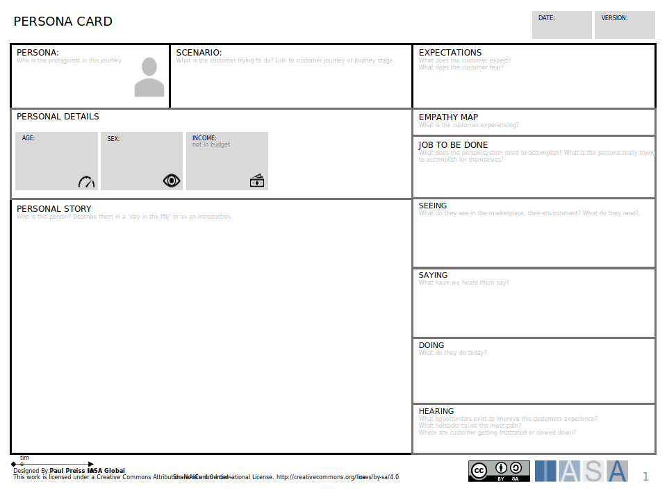
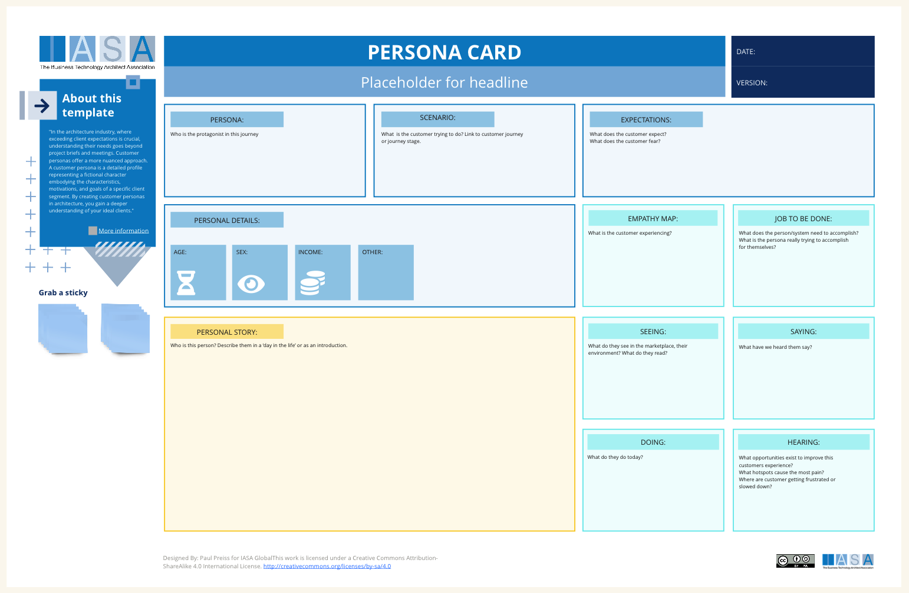

# Overview

In the architecture industry, where exceeding client expectations is crucial, understanding their needs goes beyond project briefs and meetings. Customer personas offer a more nuanced approach. The persona technique can also be used in internal stakeholder scenearios. 

A customer persona is a detailed profile representing a fictional character embodying the characteristics, motivations, and goals of a specific client segment. By creating customer personas in architecture, you gain a deeper understanding of your ideal clients. This allows you to:

- **Design with Deeper Empathy:** When you view projects through the lens of your personas, you can design spaces that truly resonate with their needs, preferences, and workstyles.
- **Improve Communication and Collaboration:** Customer personas foster better communication within your team and with clients. By referring to personas, everyone involved has a shared understanding of the client's vision and priorities.
- **Target Marketing Efforts:** Personas can inform your marketing strategy. By understanding your ideal client profiles, you can tailor your messaging and outreach to resonate with their specific needs and challenges.
- **Prioritize Project Features:** During the design phase, personas help you prioritize features and amenities that will have the most significant impact on your target client group.

## How to use this Card

To fill out each section of the persona card, you'll gather information from a variety of sources including market research, user interviews, and analytics data. For the **Personal Details** section, demographic data helps outline who the persona is, setting the stage for understanding their potential lifestyle and circumstances. In the **Personal Story** section, you'll craft a narrative based on user behavior patterns and feedback, illustrating a day in their life to give depth to the persona.

The **Scenario** block describes the context in which the persona uses your service, gleaned from user journey analyses. **Expectations** reflect the persona's goals and fears, which you can determine from surveys and interviews. The **Empathy Map** dives deeper, asking you to consider what the persona sees in their environment, hears from others, says about their experiences, and does in their daily routine, which requires a combination of observational research and direct user feedback.

Discussing the use of personas in business and technology involves communicating the persona’s story to stakeholders, showing how it aligns with business objectives, and ensuring that technical solutions address real user needs.

## Downloads

[Download PPT](media/ppt/persona_card.ppt){:target="_blank"}

## Canvas Sections and Links to BTABoK

| Area             | Description                                                                                                                                                                                                                                                                                                                                                                                   | Links To               |
| ---------------- | --------------------------------------------------------------------------------------------------------------------------------------------------------------------------------------------------------------------------------------------------------------------------------------------------------------------------------------------------------------------------------------------- | ---------------------- |
| Persona          | The name of the persona. Try to use a real name of a person who in your mind represents that persona.                                                                                                                                                                                                                                                                                         |                        |
| Scenario         | Choose a scenario name which matches the interaction level of the customer and the customer journey. For example, choose "Ordering at a Store" to describe the overall customer journey.                                                                                                                                                                                                      | [Customer Journey](https://iasa-global.github.io/btabok/customer_journey.html){:target="_blank"}       |
| Expectations     | Describe in text what the customer is expecting in the scenario. Think about how they may be looking forward to portions or dreading portions.                                                                                                                                                                                                                                                | Value Designer         |
| Personal Details | Use marketing and customer segmentation concepts as well as demograpic data about the person that is relevant to your activity.                                                                                                                                                                                                                                                               |                        |
| Empathy Map      | Describe the person in terms of empathy for the job they are doing. Taking out the trash after a long day is exhausting (if that is the job). Playing a video game in a noisy airport can be calming. Think about the 'overview' of the interaction and how someone is feeling.                                                                                                               |                        |
| Job to be done   | What are the persons real jobs? What do they actually have to do?                                                                                                                                                                                                                                                                                                                             |  [JTBD Card](https://iasa-global.github.io/btabok/strategyn_jtbd_canvas.html){:target="_blank"}            |
| Personal Story   | Dig in and describe a real human being! this section is the opportunity to describe the person in detail. Where did they go to school? What kind of breakfast do they like? How many children and what are their names? Think about this as your opportunity to get to know the customer in a personal way. These details will help you get a 'feel' for what the persona would like/dislike. |                        |
| Seeing           | Seeing is about what the customer is experiencing visually and around them? Advertisments, In store merchandising, what visual and situational information is coming to the customer about your product or scenario?                                                                                                                                                                          | [Customer Journey](https://iasa-global.github.io/btabok/customer_journey_map.html){:target="_blank"}        |
| Saying           | Saying is about what the customer says and believes. What do we hear them say? What data do we have on what they say to others?                                                                                                                                                                                                                                                               | [Customer Journey](https://iasa-global.github.io/btabok/customer_journey_map.html){:target="_blank"}       |
| Doing            | Doing is about what actions the customer takes and is taking 'around' the scenario. Buying coffee at an airport while catching a flight will create a much different experience than one sitting at a bookstore.                                                                                                                                                                              | [Customer Journey](https://iasa-global.github.io/btabok/customer_journey_map.html){:target="_blank"}, [JTBD Card](https://iasa-global.github.io/btabok/strategyn_jtbd_canvas.html){:target="_blank"} |
| Hearing          | Hearing is about what the customer hears from others as well as what they read. Especially focus on word of mouth long tails.                                                                                                                                                                                                                                                                 | Customer Journey       |

## Use this in Miro

We in the BTABoK are so very excited about the native support for architecture canvases in Miro! Find this canvas in the Miroverse!

