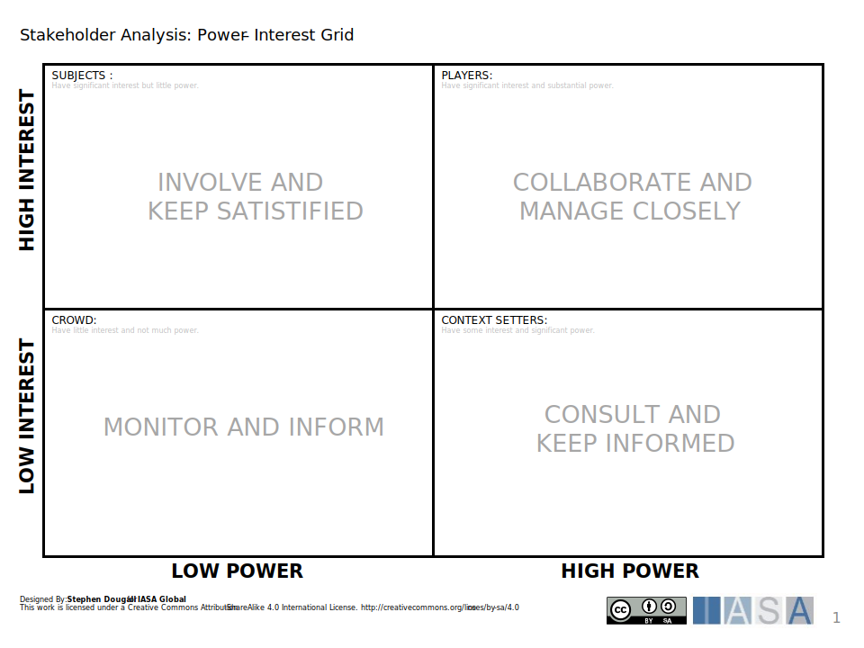
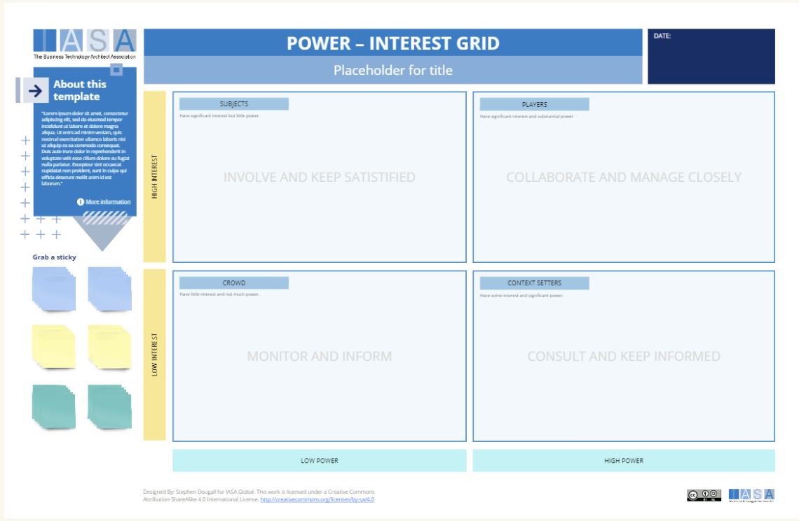

[Download PPT](media/ppt/power_interest_grid.ppt){:target="_blank"}

| Area            | Description | Links To |
| --------------- | ----------- | -------- |
| Subjects        |             |          |
| Players         |             |          |
| Crowd           |             |          |
| Context Setters |             |          |

## Use this in Miro

We in the BTABoK are so very excited about the native support for architecture canvases in Miro! Find this canvas in the Miroverse!

