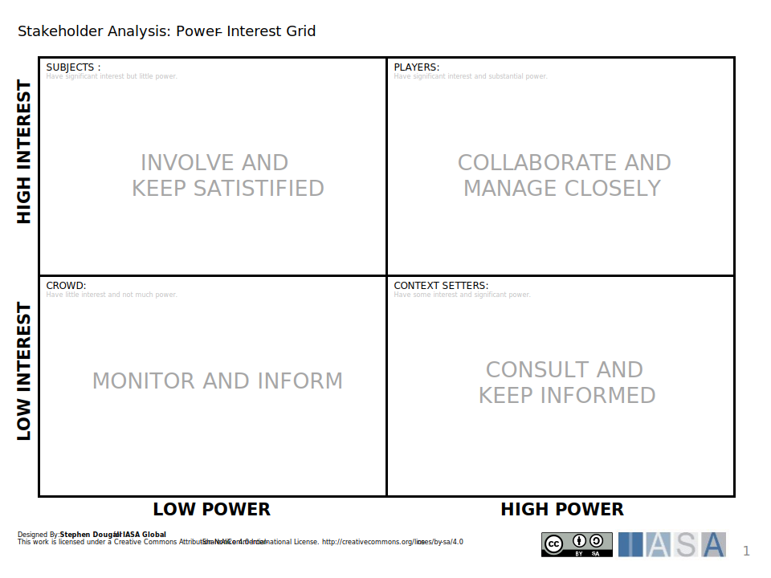

# Overview

This type of canvas is a visual tool that helps project managers and other stakeholders understand the project’s stakeholders, their interests in the project, their power to influence the project, and the best way to engage with them (https://www.projectmanagement.com/deliverables/282408/Stakeholder-Management-Plan).

## How to use this canvas

## Downloads

[Download PPT](media/ppt/power_interest_grid.ppt){:target="_blank"}

| Area            | Description | Links To |
| --------------- | ----------- | -------- |
| Subjects        |             |          |
| Players         |             |          |
| Crowd           |             |          |
| Context Setters |             |          |

## Use this in Miro

We in the BTABoK are so very excited about the native support for architecture canvases in Miro! Find this canvas in the Miroverse!

