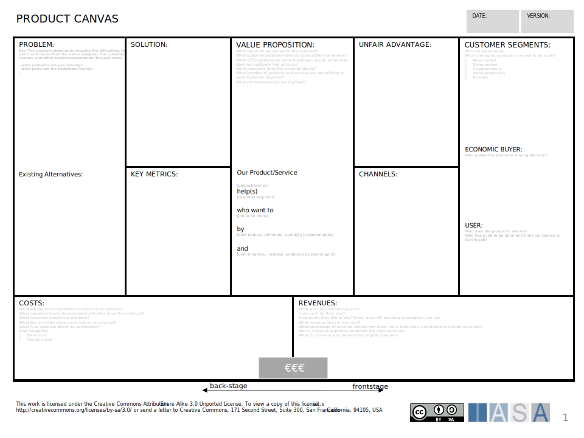

# Canvas Overview

The 

## How to Use This Canvas

**Problems**

Think about the businesses or suppliers that are critical to making your business work. Consider who helps you get the resources you need, carry out essential tasks, or even reach your customers. Determine what specific activities partners handle that your company doesn't, and what resources they possess that are valuable to you. Finally, understand why these partnerships matter – perhaps they reduce expenses, help you manage risk, or offer expertise that you lack internally.

**Solution**

Identify the most important actions your company needs to take in order to deliver your value proposition. These activities could include production, problem-solving, marketing, managing a platform or network, or distribution. Ask yourself if there are unique ways you approach these tasks that might differentiate you from competitors.

**Key Metrics**

List your most precious assets, whether they are physical (like equipment or facilities), intellectual (brand reputation, patents, or data), human (your skilled staff), or financial. Figure out which of these resources are crucial for creating the value your customers want. Additionally, determine which resources are vital for your distribution channels and for maintaining strong customer relationships.

**Value Proposition**

Clearly define the specific problem or pain point that your product or service solves for your customers. Identify the core offering that directly satisfies this need. Consider if there are additional benefits that go beyond the basic need that make your offering even more appealing to customers.

**Unfair Advantage**

Determine how you engage with each distinct customer segment. Describe the kinds of relationships you maintain – this could involve personal assistance, dedicated support, self-service options, online communities, or even co-creation processes where customers participate in shaping your offerings. Consider how you currently acquire and retain customers, and the costs associated with these efforts (staff, marketing, etc.). Ensure that your customer relationship styles and strategies are consistent with your overall business model and brand image.

**Customer Segments**

Clearly define your most important customer groups. Specify if you serve a niche segment, a mass market, or different participants within a multi-sided platform. Outline their common characteristics— consider demographics, geography, attitudes, or behaviors. Most importantly, define the fundamental problems that customers need your business to solve for them.

**Channels**

Describe how customers become aware of your business (advertising, PR, social media, etc.). Map out how you help customers evaluate your offerings— do you provide comparison tools, informative resources, or free trials? Explain how you physically deliver your product or service, including any distribution or sales partners. Determine how you offer ongoing support after the purchase, such as online help centers, technical support, or customer service staff.

**Cost Structure**

Identify your largest fixed costs, like overhead, buildings, or regular salaries. List your most significant variable costs, such as raw materials, usage-based fees, or commissions. Decide whether your business model is cost-driven (prioritizing minimizing expenses), or value-driven (focused on value creation, which might allow for a higher price point).

**Revenue Streams**

Outline how customers pay you— through subscriptions, one-time purchases, licensing, usage fees, advertising, or other models. Pinpoint what customers are truly paying for— is it the product itself, access or membership, status, or some other underlying value? Assess the relative contribution of each revenue stream to your business, understanding which ones are most critical for your financial well-being.

## Downloads

[Download PPT](media/ppt/business_model_canvas.ppt){:target="_blank"}

## Canvas Sections and Links to BTABoK

| Area                          | Description                                                                                                                                                                                                                         | Links To                                                                                                                            |
| ----------------------------- | ----------------------------------------------------------------------------------------------------------------------------------------------------------------------------------------------------------------------------------- | ----------------------------------------------------------------------------------------------------------------------------------- |
| Key Partners (also Suppliers) | Who do we do business with that makes our value proposition successful?                                                                                                                                                             | [Ecosystem Article](../engagement_model/ecosystem.md)                                                                               |
| Key Activities                | Key activities are the actions (verb/noun) that are critical to the effectiveness of the value proposition.                                                                                                                         | [Business Capabilities Canvas](business_capability_canvas.md) (identifies critical capabilities)                                    |
| Key Resources                 | Resources are the assets (like warehouses and distribution systems for Amazon) that directly impact the value model.                                                                                                                | N/A                                                                                                                                 |
| Value Proposition             | Probably the most important area of the canvas. This is not a list of our products but the actual value we create for our customers. Good example was the iPod, "A seamless music experience"                                       | N/A                                                                                                                                 |
| Customer Relationships        | Possibly the hardest of the areas, customer relationships are WHY our customers stay with our value proposition. For example, if a person has a large number of books on the Amazon Kindle they will likely not use another eReader | [Customer Personas](persona_card.md), [Empathy Maps](stakeholder_empathy_map.md)                                                    |
| Channels                      | The marketing, distribution and delivery of our products or services.                                                                                                                                                               | [Customer Journey(s)](customer_journey_map.md), [Service Blueprint(s)](service_blueprint_canvas.md)                                 |
| Customer Segments             | The Customers and their groupings we are serving. The best use of these come from marketing customer segments and then a real customer.                                                                                             | [Customer Persona(s)](persona_card.md)                                                                                              |
| Costs                         | The critical cost factors impacting the business model                                                                                                                                                                              | [Cost Risk Card](risk_and_cost_card.md)                                                                                             |
| Revenues                      | The critical revenue factors impacting the business model                                                                                                                                                                           | [Benefits Realization Article](../engagementmment_model/benefits_realization.md), [Benefits Card](benefits_card_layout-b_canvas.md) |

## Use this in Miro

We in the BTABoK are so very excited about the native support for architecture canvases in Miro! Find this canvas in the Miroverse!