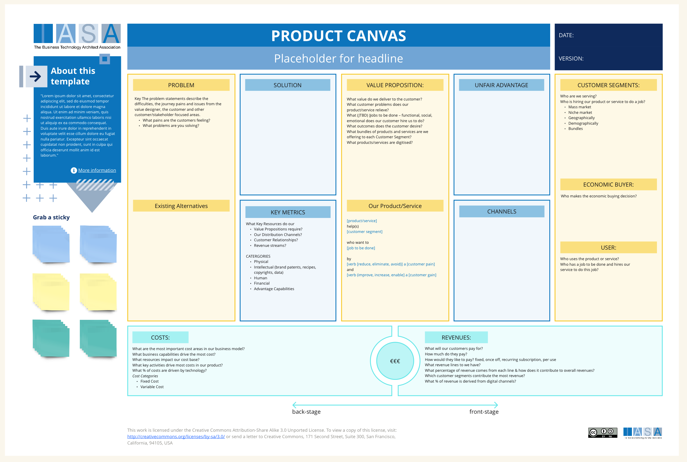

# Canvas Overview

The product canvas is a strategic business planning tool used by product managers and UX designers to describe a product or service offering. It helps development teams focus on the target audience, their needs and the solutions the product will provide. The canvas is helpful for brainstorming ideas, aligning stakeholders around a common vision, and setting product roadmaps. 

The product canvas is a valuable tool for architects because it helps them to understand the product vision and ensure that the architecture aligns with the business goals. It can also be used to communicate the product vision to other stakeholders.

The product canvas fits into strategy by helping you to define your product’s target market, value proposition, and competitive advantage. It fits into execution by helping you to develop a product roadmap and identify the key metrics that will be used to measure success.

## How to Use This Canvas

1. **Fill out the About This section.** Add a title for your product or service and the date. You can also use this section to specify the version of the canvas you’re working on.
2. **Define the problem.** What problem are you trying to solve for your customers? Be as specific as possible.
3. **Identify your customer segments.** Who are you building this product or service for? Consider demographics, behaviors, and needs.
4. **Brainstorm solutions.** How will your product or service solve the problem you’ve identified?
5. **Develop your value proposition.** What makes your product or service unique and valuable to your target customer? How will it be better than existing alternatives?
6. **Identify your unfair advantage.** What competitive advantage do you have? What makes it difficult for others to copy your product or service?
7. **Outline your channels.** How will you reach your target customers? Consider both online and offline channels.
8. **Identify your key metrics.** How will you measure the success of your product or service? This could include things like customer acquisition cost, customer lifetime value, and churn rate.
9. **Determine your revenue streams.** How will you make money from your product or service?

## Downloads

[Download PPT](media/ppt/business_model_canvas.ppt){:target="_blank"}

## Canvas Sections and Links to BTABoK

| Area              | Description                                                                                                                                                     | Links To                                                                                                                            |
| ----------------- | --------------------------------------------------------------------------------------------------------------------------------------------------------------- | ----------------------------------------------------------------------------------------------------------------------------------- |
| Problem           | Who do we do business with that makes our value proposition successful?                                                                                         | [Ecosystem Article](../engagement_model/ecosystem.md)                                                                               |
| Solutions         | How will your product or service solve the problem you’ve identified?                                                                                           | Solution Design Canvas                                                                                                              |
| Key Metrics       | How will you measure the success of your product or service? This could include things like customer acquisition cost, customer lifetime value, and churn rate. | Objectives                                                                                                                          |
| Value Proposition | What makes your product or service unique and valuable to your target customer? How will it be better than existing alternatives?                               | Value Designer                                                                                                                      |
| Unfair Advantage  | What competitive advantage do you have? What makes it difficult for others to copy your product or service?                                                     | Value Designer                                                                                                                      |
| Channels          | The marketing, distribution and delivery of our products or services.                                                                                           | [Customer Journey(s)](customer_journey_map.md), [Service Blueprint(s)](service_blueprint_canvas.md)                                 |
| Customer Segments | The Customers and their groupings we are serving. The best use of these come from marketing customer segments and then a real customer.                         | [Customer Persona(s)](persona_card.md)                                                                                              |
| Costs             | The critical cost factors impacting the business model                                                                                                          | [Cost Risk Card](risk_and_cost_card.md)                                                                                             |
| Revenues          | The critical revenue factors impacting the business model                                                                                                       | [Benefits Realization Article](../engagementmment_model/benefits_realization.md), [Benefits Card](benefits_card_layout-b_canvas.md) |

## Use this in Miro

We in the BTABoK are so very excited about the native support for architecture canvases in Miro! Find this canvas in the Miroverse!

