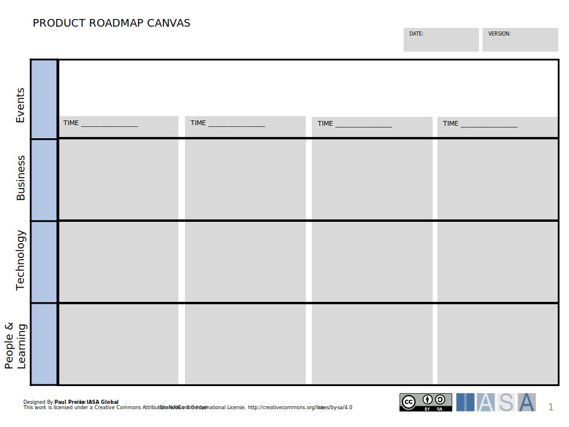
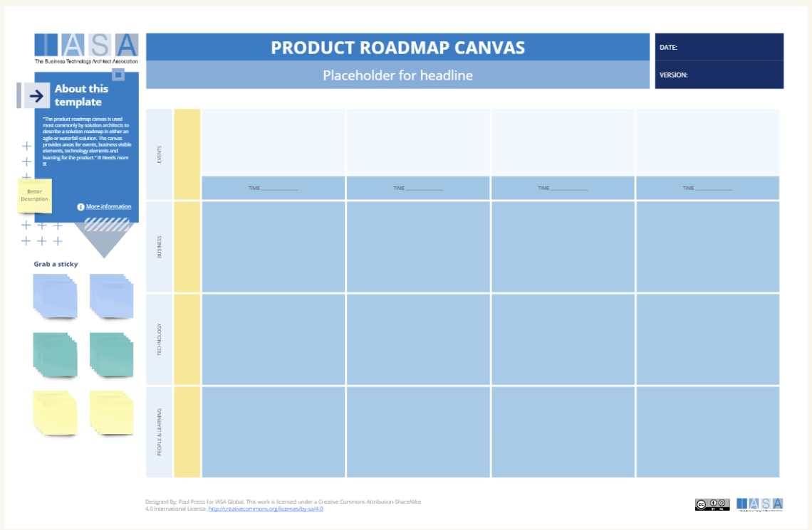

The product roadmap canvas is used most commonly by solution architects to describe a solution roadmap in either an agile or waterfall solution. The canvas provides areas for events, business visible elements, technology elements and learning for the product. Used by product teams and architects alike, it visualizes the overall product vision, key goals, essential initiatives, and a development timeline.

To work effectively with the canvas, start by gathering stakeholders invested in the product's success. This typically includes product managers, designers, developers, marketing, and sales representatives. Next, define the timeframe for your roadmap – a quarter or a year are common choices. This helps to focus on the most critical initiatives within that period.

Once assembled, begin defining your business goals. What do you hope to achieve with this product? Ensure these goals are measurable and time-bound. Alongside business goals, identify the specific needs of your target users. What problems does your product solve for them, and how will it improve their lives? User research techniques such as surveys, interviews, and usability testing are invaluable here. From user needs, craft user stories. These are short descriptions focused on how users will interact with your product and the value it delivers.

Now, using your user stories as a guide, identify the initiatives necessary to achieve your business goals. Initiatives are larger projects that will deliver specific outcomes. Consider the time and resources required for each initiative, then strategically plot them on your product roadmap timeline.

## How to use this canvas

**Step 1: Gather Your Materials**

- **Product Roadmap Canvas Template:** You can find a template here and in Miro.
- **Sticky Notes:** Use these for brainstorming and capturing ideas.
- **Markers:** For writing on the canvas and sticky notes.

**Step 2: Assemble Your Team**

- Bring together a cross-functional team invested in the product's success. This typically includes product managers, designers, developers, marketing, sales, and potentially other relevant stakeholders.

**Step 3: Define Business Goals**

- Start with the "why" behind your product. What are the specific business goals you are aiming to achieve? Examples might be increasing revenue, expanding market share, or improving customer satisfaction.
- Make sure your goals are SMART: Specific, Measurable, Achievable, Relevant, and Time-bound.

**Step 4: Understand User Needs**

- Dive deep into the problems your product solves. What pain points does it address for your target users? How does it make their lives easier or better?
- If you don't already have this data, conduct user research through surveys, interviews, usability testing, and other methods.

**Step 5: Write User Stories**

- Craft short, simple descriptions of how users will interact with your product. Frame them from the user's perspective, focusing on the value the product delivers. For example: "As a busy project manager, I want to easily track project progress on a visual dashboard so I can quickly identify any bottlenecks."

**Step 6: Identify Initiatives**

- Brainstorm the major projects or features that will deliver the value outlined in your user stories and achieve your business goals.
- Consider the resources (time, people, budget) needed for each initiative.

**Step 7: Prioritize and Map to Timeline**

- Determine the most critical initiatives that align with your business goals and available resources.
- Place these initiatives on your roadmap timeline, being mindful of any dependencies between initiatives.

**Step 8: Review and Iterate**

- Present the roadmap to your team and stakeholders. Gather feedback, make adjustments, and seek alignment.
- Remember, a product roadmap is a living document. Revisit it regularly to reflect changing priorities, new market information, or user feedback.

**Important Considerations:**

- **Keep it Visual:** The canvas is meant to provide a clear overview. Avoid excessive text, focusing instead on keywords and short descriptions.
- **Stay Focused:** Limit the timeframe to a quarter or a year for optimal focus and execution.
- **Be Flexible:** Adapting your roadmap as new information becomes available or priorities shift is key to its success.

Let me know if you want a more specific example or assistance in filling out a particular section of the canvas!

## Download

[Download PPT](media/ppt/product_roadmap_canvas.ppt){:target="_blank"}

| Area                | Description                                                                                                                                                                                                                                    | Link To                |
| ------------------- | ---------------------------------------------------------------------------------------------------------------------------------------------------------------------------------------------------------------------------------------------- | ---------------------- |
| Time___             | Insert timeframes in some similar format such as months or quarters. Often times are shorter closer to the beginning and longer on the far right.                                                                                              | N/A                    |
| Events              | The events section should show milestones, market events or outcomes. Things like 'version 1 available to public' or '10,000 users on the system'. Also compliance or external events can be shown here such as GDPR or other external events. | N/A                    |
| Business            | Business features, capabilities or processes should be shown in the business lane. A feature such as login or shopping cart or another functional area.                                                                                        | ASR                    |
| Technology          | Technology support components are technical services or products which support features. Using an authentication provider or a security framework would support login.                                                                         | Context View, ASR, ADR |
| People and Learning | The people needed or what they need to learn. Training, pilots, or other learning methods go here.                                                                                                                                             | Stakeholder Ecosystem  |
| Linking (between)   | Generally arrows connecting components on the roadmap indicate dependencies (if going down) or enablement (if going up). These are optional.                                                                                                   |                        |

## Use this in Miro

We in the BTABoK are so very excited about the native support for architecture canvases in Miro! Find this canvas in the Miroverse!

