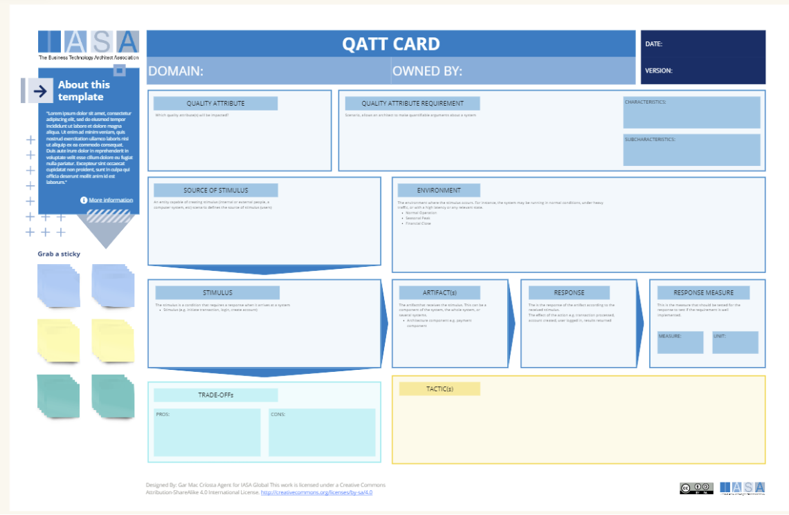

# Overview

The Quality Attribute Card is built to create ATAM scenarios to test the architecture decisions and approaches of a particular architecture. It is based on the notion of taking quality attribute requirements and then testing them with scenarios. The scenario includes a source of a 'stimulus' which is something the architecture must respond to and is generally taken from requirements. These stimuli can be planned or unplanned but include anything that might happen which would impact the final system. It can include both business and technical stimuli. For example, if our competitors change their prices or if we receive twice the number of requests per minute than we planned to handle. Use the QATT cards to 'test' the architecture for its' effectiveness and look for tradeoffs, tactics and risks. 

**Determining Quality Attributes**

Quality attributes are the non-functional characteristics that define the success of a system. They go beyond what the system does, and focus on how well it does it. Here are some ways to determine the right quality attributes for your project:

- **Understand Stakeholder Needs:** Talk to your clients, users, and business stakeholders to identify what they truly value in a system. Is it speed? Reliability? User-friendliness? Their priorities will guide your quality attribute selection.
- **Consider Industry Standards:** Your industry likely has established benchmarks for quality. Research what attributes are considered crucial within your domain.
- **Refer to Existing Frameworks:** There are well-established lists of quality attributes. Some popular ones include the ISO/IEC 25010 standard and the FURPS+ model (Functionality, Usability, Reliability, Performance, Supportability, + others like security, scalability).
- **Brainstorming Techniques:** Get your team together for brainstorming sessions. Use techniques like mind-mapping to generate a broad pool of potential quality attributes.

## How to use this card

Here is a step-by-step description of how to fill out the QAT card, based on the information in the image:

1. Fill in the header information. This includes the date, the domain, who owns the card, and the version number.
2. In the “About this” section, there is a placeholder that says “template.” This section may be used to provide more information about the template itself, or it may be left blank.
3. The next section is titled, “Quality Attribute / Quality Attribute Requirement / Characteristics / Sur-Characteristics.” It appears that this section is used to brainstorm a list of quality attributes that are important to the project, as well as the requirements for those attributes, and any characteristics or sur-characteristics that are relevant.
4. The section titled, “Source of Stimulus / Environment” may be used to identify the different stimuli that the project will be exposed to, as well as the environment in which it will exist.
5. The section titled, “Stimulus / Artifact / Response / Response Measure” may be used to define the specific responses that the project will have to different stimuli, as well as how those responses will be measured.
6. The section titled, “Trade-Offs” may be used to identify any trade-offs that need to be made between different quality attributes.
7. The section titled, “Pros” and “Cons” may be used to list the advantages and disadvantages of different approaches to meeting the quality attribute requirements.

Scenarios paint a picture of how your system will interact with its environment and users. To create useful scenarios:

- **Focus on Specific Interactions:** Instead of generic statements, zero in on concrete actions a user might take and how the system should respond (e.g., "A user enters an invalid password, the system displays an error message").
- **Involve Stimuli:** Identify the triggers that prompt a system response. This could be user input, a time-based event, or signals from other systems.
- **Define Measurable Responses:** Don't just say "the system should be fast." Quantify it – "the search results should load within 2 seconds."
- **Consider the Environment:** Factor in the context where your system will operate. Will it be under heavy load? What security threats exist?

## Downloads

[Download PPT](media/ppt/qatt_card.ppt){:target="_blank"}

| Area               | Description                                                                                                                                                                | Links To                                                                                                         |
| ------------------ | -------------------------------------------------------------------------------------------------------------------------------------------------------------------------- | ---------------------------------------------------------------------------------------------------------------- |
| Quality Attribute  | What quality attribute are we testing? Ex Performance, Security, etc.                                                                                                      | [ASR Card](architecture_requirement_card.md){:target="_blank"}                                                   |
| Requirement        | This is generally the QATT requirement.                                                                                                                                    | [ASR Card](architecture_requirement_card.md){:target="_blank"}                                                   |
| Source of Stimulus | An entity capable of creating stimulus (internal or external people, a computer system, etc) scenario defines the source of stimulus                                       |                                                                                                                  |
| Environment        | The environment where the stimulus occurs. For instance, the system may be running in normal conditions, under heavy traffic, or with a high latency or any relevant state | [Context View](context_view_card.md){:target="_blank"}                                                           |
| Stimulus           | The stimulus is a condition that requires a response when it arrives at a system                                                                                           |                                                                                                                  |
| Trade Offs         | The trade offs include the positives and negatives that will come from the particular tactics chosen.                                                                      |                                                                                                                  |
| Tactics            | The set of architecture decisions and techniques which will be used to create the desired result.                                                                          | [ADR](architecture_decision_record.md){:target="_blank"}, [Context View](context_view_card.md){:target="_blank"} |

## Use this in Miro

We in the BTABoK are so very excited about the native support for architecture canvases in Miro! Find this canvas in the Miroverse!

