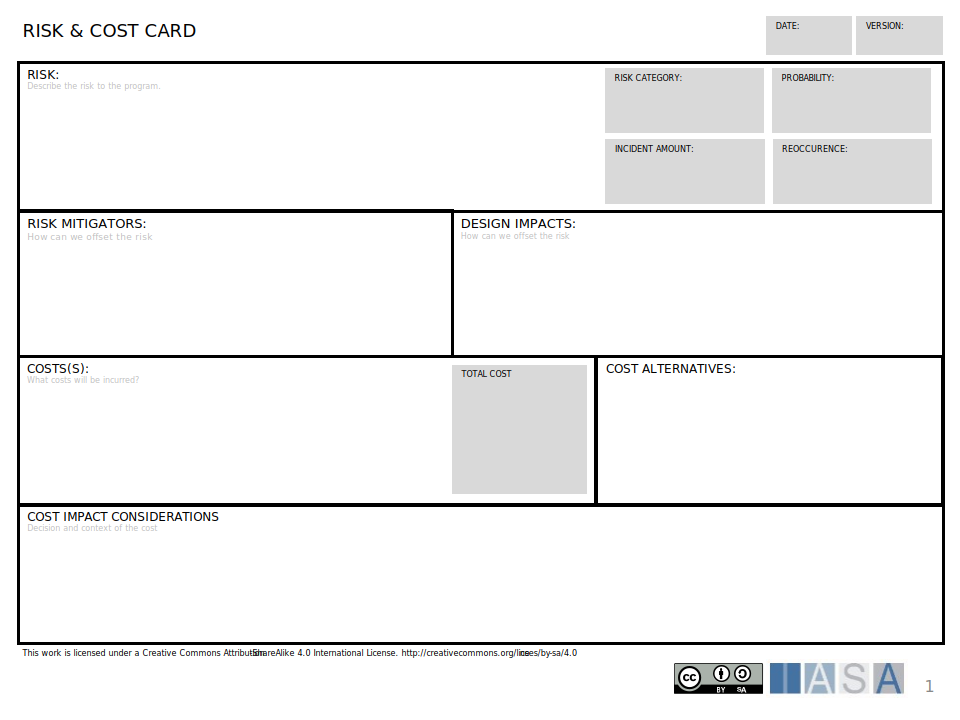

The Risk and Cost Card allows the evaluation of risk or costs as well as the relationship between a risk and possible costs. It can be used to catalog either risks alone, costs alone, or risk/cost combinations. 

[Download PPT](media/ppt/risk_and_cost_card.ppt){:target="_blank"}

| Area | Description | Links To |
| --- | --- | --- |
| Risk | The risk being considered. May include risk categories from risk management. The probability should be described as a percentage. The incident amount includes a cost/damage that would occur if the risk happens. The reoccurrence would include a possible repeatable time and volume.  | N/A |
| Risk Mitigators | These are elements in the architecture, the context or the organization which will or can mitigate the risk.  | N/A |
| Design Impacts | These are specific design elements that would be used to mitigate or address the risk.  | View/Viewpoint, Decision Record |
| Cost(s) | The cost or cost(s) to be considered. The total amount represents a way of calculating TCO of the include cost(s).  | N/A |
| Cost Alternatives | Options to avoid the cost.  | Decision Record |
| Cost Impact Considerations | The design implications and or decisions which are impacted by the cost.  | View/Viewpoint, Decision Record |

