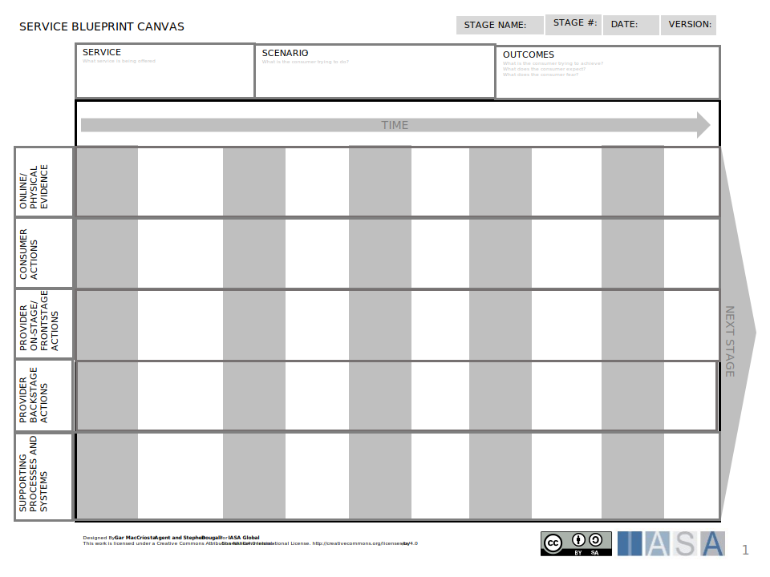
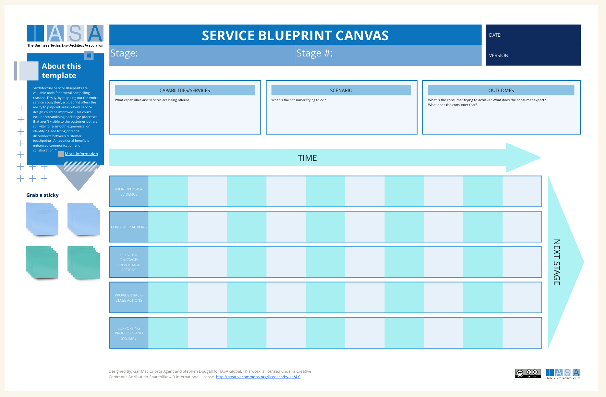

# Overview

Architecture Service Blueprints are valuable tools for several compelling reasons. Firstly, by mapping out the entire service ecosystem, a blueprint offers the ability to pinpoint areas where service design could be improved. This could include streamlining backstage processes that aren't visible to the customer but are still vital for a smooth experience, or identifying and fixing potential disconnects between customer touchpoints. An additional benefit is enhanced communication and collaboration. The blueprint acts as a visual reference point for everyone from business stakeholders to architects and IT teams. This common understanding of how the service works, from the client experience down to the architectural elements powering it, fosters a stronger sense of collaboration. Service Blueprint Canvas also help ensure that the infrastructure and technological components underpinning the service are in direct alignment with the overarching business strategy. By clearly defining the customer journey alongside desired outcomes, it's easier to make sure the technology is truly facilitating the delivery of the intended value.

While both Architecture Service Blueprints and Customer Journey Maps prioritize the customer experience, they take slightly different approaches. Service Blueprint Canvas delve deeper than journey maps by revealing not only those customer touchpoints but also the sometimes complex backstage activities and the architecture that ultimately makes the service possible. Customer journey maps hone in on the customer's perspective, but the Service Blueprint Canvas casts a wider net, bringing in the operational aspects of delivering a great service.

Populating your Service Blueprint Canvas means tapping into resources like Customer Journey Mapping Workshops, User Research Data, Business Process Documentation, and Architecture Documentation. Service Blueprint Canvas work seamlessly alongside other architecture practices such as business process modeling or IT infrastructure design.

The true payoff of using Service Blueprint Canvas is bridging the gap between what the business wants to achieve, the experience you want to deliver to the customer, and the technology needed to make it all happen. This collaborative approach to service design leads to services that excel in all areas: customer satisfaction, robust architecture, and direct support of your core business goals.

## How to use this canvas

**1. Define the Service and Scenario**

- **Service:** Clearly identify the specific service you're analyzing.
- **Scenario:** Choose a particular customer journey or use case related to the service. This will guide the remainder of the mapping process.

**2. Map the Customer Journey**

- **Outcomes:** Define the intended results the customer and the business want from this scenario. What needs are fulfilled, or what problems are solved?
- **Stakeholders:** List all internal and external people involved in this scenario (e.g., support staff, the customers themselves, partners).
- **Touchpoints:** Document each point of interaction or contact between the customer and the service (website, app, email, phone call, etc.).
- **Frontstage:** Describe the actions the customer sees and directly interacts with.

**3. Identify Backstage Activities and Supporting Elements**

- **Backstage:** For each customer action in the frontstage, identify the corresponding behind-the-scenes activities required for the service to happen (e.g., data processing, order fulfillment).
- **Supporting Processes:** Note the essential business processes that might not be directly customer-facing, but that impact the service delivery (e.g., inventory management, quality control).
- **Technology:** List the specific software, hardware, or infrastructure components needed to support the service scenario

**4. Analyze and Iterate**

- **Holistic View:** Step back and examine the completed blueprint. Do you see smooth transitions between frontstage and backstage? Does the technology genuinely enable the desired customer journey?
- **Identify Pain Points:** Analyze the blueprint for any inefficiencies, bottlenecks, or areas where service might break down.
- **Improvement Opportunities:** Brainstorm ways to improve the customer experience, optimize backstage processes, or leverage technology to streamline the service.
- **Collaborate:** Share the Service Blueprint canvas with stakeholders from across the organization. Get their feedback and perspectives to identify potential blind spots.

**Tips:**

- **Use Visuals:** Utilize sticky notes, diagrams, and colors to make the blueprint visually engaging and easier to digest.
- **Start Simple:** Begin with a high-level blueprint and add detail incrementally.
- **Involve Stakeholders:** Get input from various stakeholders (business, technical, customers) to ensure the blueprint reflects different perspectives.
- **Iterate Often:** Service Blueprint Canvas should be living documents that evolve alongside changes in your business or customer expectations.

## Downloads

[Download PPT](media/ppt/service_blueprint_canvas.ppt){:target="_blank"}

| Area                             | Description                                                                                                                                               |  |
| -------------------------------- | --------------------------------------------------------------------------------------------------------------------------------------------------------- | -------- |
| Capability/Service               | This section captures a brief description of the service being offered.                                                                                   |          |
| Scenario                         | This section outlines a specific user scenario or journey that interacts with the service.                                                                |          |
| Outcomes                         | This section details the desired outcomes for both the customer and the business from the user scenario.                                                  |          |
| Stakeholders                     | This section identifies the people involved in delivering the service, both internally (e.g., employees) and externally (e.g., partners).                 |          |
| Online/Physical Evidence         | These are the interaction points between the customer and the service. This could include user interfaces, physical locations, or communication channels. |          |
| Customer Actions                 | These are the actions the customer performs.                                                                                                              |          |
| Front Stage Actions              | These are the visible actions directly experienced by the customer during the user scenario.                                                              |          |
| Back Stage Actions               | These are the activities that occur behind the scenes to support the service delivery. These might not be directly visible to the customer.               |          |
| Supporting Processes and Systems | These are the internal business processes that enable service delivery.                                                                                   |          |

## Use this in Miro

We in the BTABoK are so very excited about the native support for architecture canvases in Miro! Find this canvas in the Miroverse!

