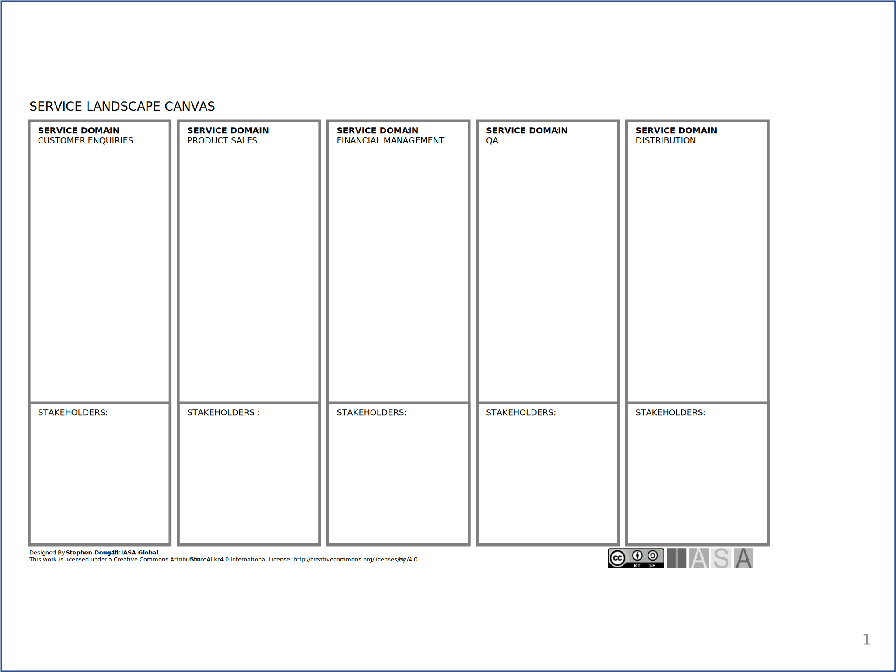

When delivering many services within a large organization, services have to be placed within some sort of organizational structure, otherwise it would be difficult to know who owns the service, where services can be found and how to get access to services. The description of how services are organized is the service landscape. The service landscape is rather like a map for services and contains number of service domains, where a service domain is a logical grouping of services. 

Service domains can be grouped in a number of ways, for example:

-   a capability (e.g. Vehicle Sales Services, Financial Services)
-   a technology (e.g. Business Intelligence Services, Cloud Services)
-   a solution (e.g. SAP Services, Azure Services)

[Download PPT](media/ppt/service_landscape_canvas.ppt){:target="_blank"}

| Area | Description | Links To |
| --- | --- | --- |
| Service Domain | The services exposed through this domain. | Service Design Canvas |
| Stakeholders | The stakeholders or capabilities which contain the services. | Stakeholders, Capability Model |