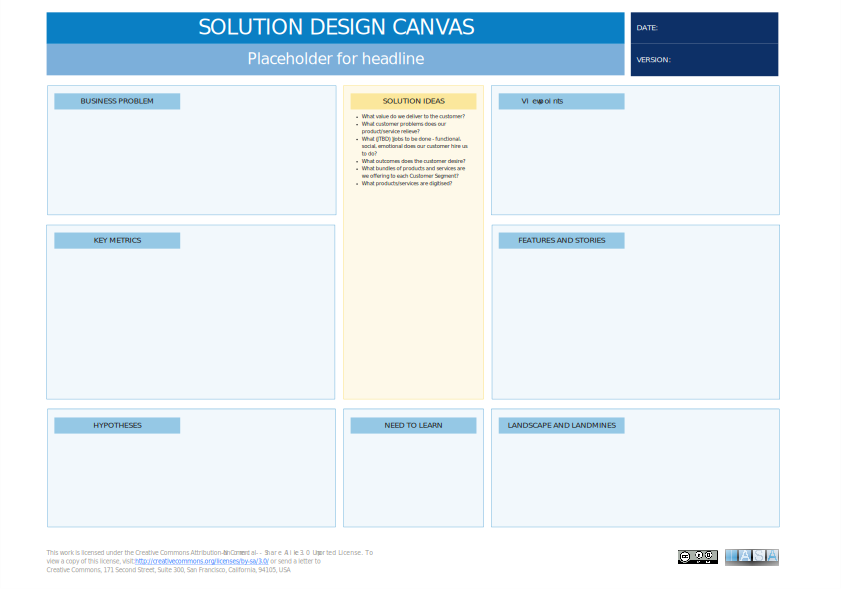

# Canvas Overview

The Solution Design Canvas is helpful for architects for a number of reasons. First, it encourages teams to think critically about the problem they are trying to solve and the desired outcomes. This can help to ensure that the final solution is aligned with business goals. Second, the canvas provides a framework for developing and testing ideas. This can help to save time and money in the long run by identifying and eliminating flawed concepts early on. Finally, the canvas can be used to communicate complex ideas to stakeholders in a clear and concise way.

The Solution Design Canvas can be used in conjunction with design thinking and lean startup methodologies [1]. Design thinking is a human-centered approach to problem solving that emphasizes understanding the needs of users. Lean startup is a methodology for rapidly developing and testing new products or services. The Solution Design Canvas can help to integrate these two methodologies by providing a framework for thinking about the business problem, the target customer, and the desired outcomes. 

## How to Use This Canvas

Guide the team to reach a concise, shared problem statement. Write this prominently on the canvas.

1. Discuss the desired goals of the solution. Be specific and measurable.
2. Prioritize the top 2-3 outcomes and add them to the canvas.
3. Brainstorm potential solutions - encourage wild ideas, quantity over quality here.
4. Cluster similar solutions together.
5. Choose 1-2 promising solutions. Break them into key features or 'user stories' (how a user experiences the solution).
6. Discuss assumptions about the market, users, or solution. These are your hypotheses.
7. Identify key areas you need to research or validate (Need to Learn).
8. Explore potential competitors, challenges, or risks (Landscape & Landmines).
9. Decide which metrics will determine whether the solution is successful. Link them to the Business Outcomes.

**Tips:**

- **Timeboxing:** Set a timer for each section to keep the meeting focused.
- **Diversity:** Include team members with various perspectives (technical, business, user-focused)
- **Visuals:** Use sticky notes and markers to capture ideas, making it easy to rearrange and group them.
- **Breaks:** Schedule short breaks to keep energy levels high.
- **Documentation:** Take photos of the completed canvas or transfer it digitally. This makes it easy to share and refine afterwards.

## Downloads

[Download PPT](media/ppt/solution_design_canvas.ppt){:target="_blank"}

## Canvas Sections and Links to BTABoK

| Area                    | Description                                                                                                                                                                                        | Links To                                     |
| ----------------------- | -------------------------------------------------------------------------------------------------------------------------------------------------------------------------------------------------- | -------------------------------------------- |
| Business Problem        | In this section, you need to clearly articulate the problem you are trying to solve. What are the customer needs that are not being met? What are the pain points that your solution will address? | Lean Busines Case                            |
| Business Outcomes       | What are the specific goals you hope to achieve with your solution? This could include things like increased revenue, improved customer satisfaction, or reduced costs.                            | OKRs                                         |
| Solution Ideas          | In this section, you will brainstorm potential solutions to the business problem. There are no bad ideas at this stage!                                                                            | N/A                                          |
| Key Metrics             | How will you measure the success of your solution? What data will you need to collect?                                                                                                             | OKR, Benefits Card                           |
| Features and Stories    | In this section, you will need to develop a more detailed description of your solution. What features will it have? How will it benefit users?                                                     | N/A                                          |
| Hypotheses              | What are your assumptions about the market and your customers? How will you test these assumptions?                                                                                                |                                              |
| Need to Learn           | What information do you still need to gather in order to move forward? What are the biggest risks associated with your solution?                                                                   | Product Roadmap                              |
| Landscape and Landmines | What is the competitive landscape? What are the potential risks and challenges that you need to be aware of?                                                                                       | Principles, Contraint Requirments, Ecosystem |

## Use this in Miro

We in the BTABoK are so very excited about the native support for architecture canvases in Miro! Find this canvas in the Miroverse!

