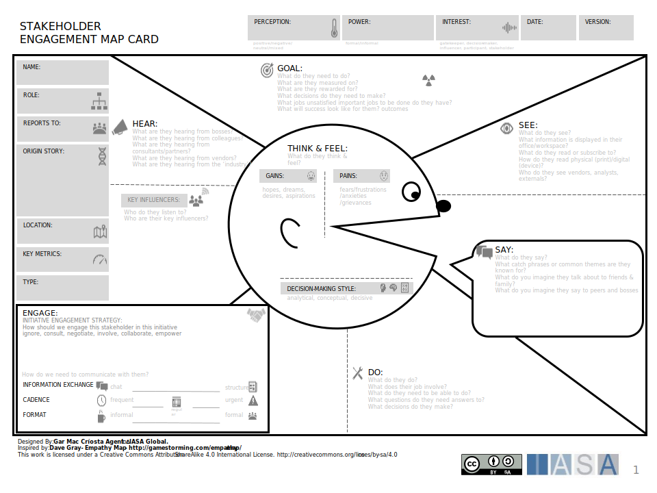

The stakeholder empathy map is one of the most useful tools in the stakeholder cards and canvases as it allows a deep dive into stakeholder motivations, communication styles, empathy tools, metrics and communication preferences. It would primarily be used for powerful and high interest stakeholders.

[Download PPT](media/ppt/stakeholder_engagement_map_card.ppt){:target="_blank"}

| Area                          | Description                                            | Links To                                        |
| ----------------------------- | ------------------------------------------------------ | ----------------------------------------------- |
| Personal Details              |                                                        | [Persona Card (used for stakeholder type)](persona_card.md){:target="_blank"}        |
| Goal(s)                       |                                                        | Stakeholder Initiatives, [OKRs](okr_card.md){:target="_blank"}                   |
| See, Say, Do, Hear            | Mapping to describe the stakeholder and what surrounds | [Customer Journey (used for stakeholder journey)](customer_journey_map.md){:target="_blank"} |
| Engage                        |                                                        | [Communication Strategy Card](communication_strategy.md){:target="_blank"}                     |
| Pains, Gains, Decision Making |                                                        | [SCARF](scarf_stakeholder_assessment.md){:target="_blank"}                                           |