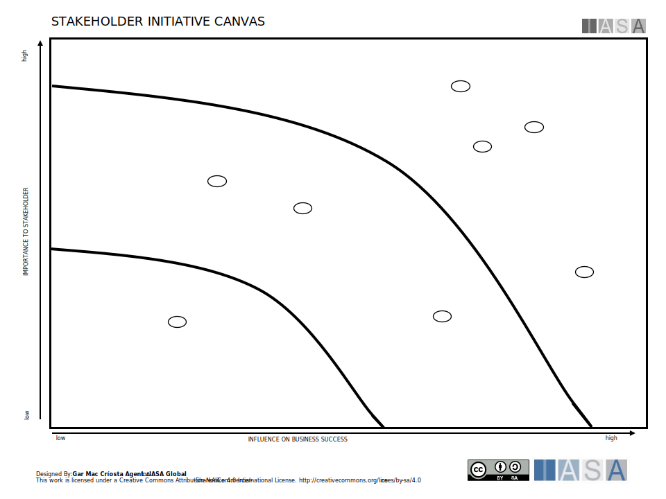

The stakeholder initiatives canvas is useful in determining prioritization of products and projects according a particular stakeholder or a stakeholder group against the initiatives measured value outcomes. This creates the optimum discussion related to importance of initiatives and how they impact stakeholder outcomes. Use this canvas as a fascilitation tool with a team or with a group of stakeholders to try and gain consensus and groupings related to priority, architect assignment and stakeholder management.

[Download PPT](media/ppt/stakeholder_initiative_canvas.ppt){:target="_blank"}

| Area                          | Description                                                                                                                                                          | Links To                                   |
| ----------------------------- | -------------------------------------------------------------------------------------------------------------------------------------------------------------------- | ------------------------------------------ |
| Importance to Stakeholder     | This spectrum describes how important an initiative is to a stakeholder. This can be ranked directly by the stakeholders using voting methods or through interviews. | Stakeholder Ecosystem, Stakeholder Empathy |
| Influence on Business Success | This spectrum defines the overall value of the initiative as measured by it's objectives and targets.                                                                | OKRs                                       |