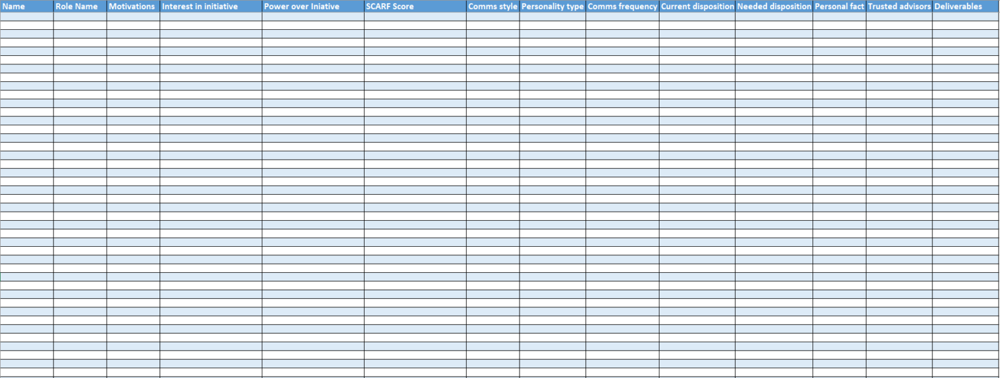

The stakeholder management plan provides the list of groups and individuals that impact any initiative and forms the core of the stakeholder templates, cards and canvases. The goal of the list is to provide a management plan for a group of stakeholders. The list is created using the set of additional and linked stakeholder cards and canvases.

[Download PPT](media/ppt/stakholder_management_plan.xlsx)

| Area | Description | Links To |
| --- | --- | --- |
| Name |   |   |
| Role |   |   |
| Motivations |   | Stakeholder Motivation Canvas |
| Interest In Initiatives |   | Power/Interest Canvas, Stakeholder Initiative Canvas |
| Power Over Iniatives |   | Power/Interest Canvas, Stakeholder Initiative Canvas |
| SCARF Score |   | SCARF Assessment Card |
| Communications Style |   | Communication Strategy Canvas |
| Personality Type |   | Stakeholder Empathy Card |
| Communications Frequency |   | Stakeholder Empathy Card |
| Current Disposition |   | Stakeholder Empathy Card |
| Needed Disposition |   | Stakeholder Empathy Card |
| Personal Fact |   | Stakeholder Empathy Card |
| Trusted Advisors |   | Stakeholder Empathy Card |
| Deliverables |   | Architect Stakeholder Canvas |