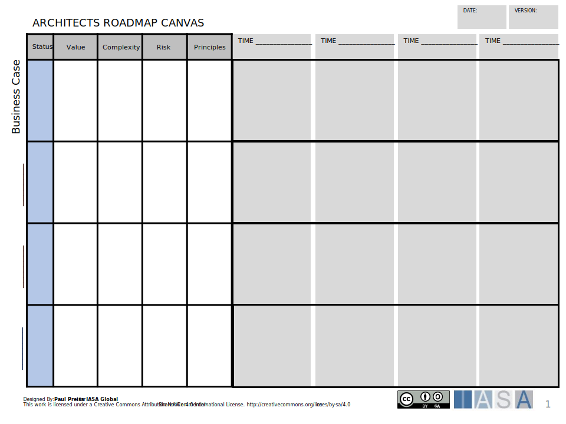
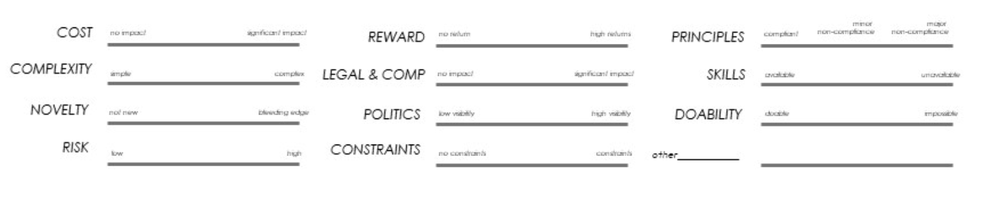
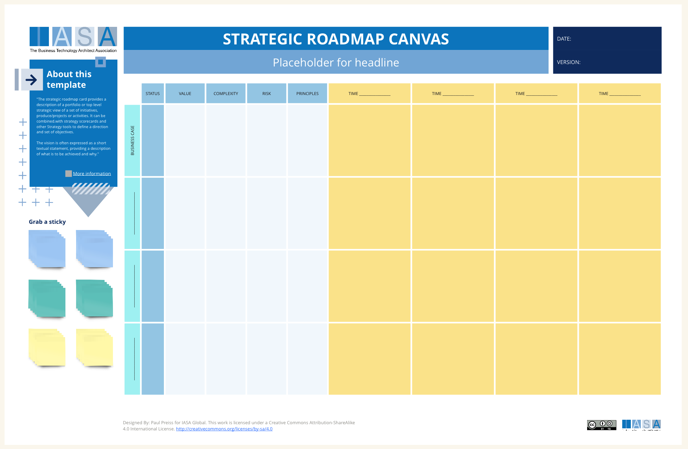
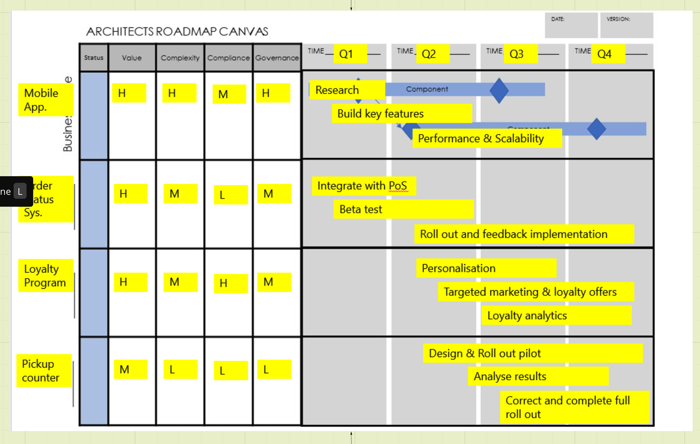

## Strategic Roadmap Canvas (Visual and Card)

The strategic roadmap canvas is a tool to bring together the architects view on multiple streams of work. This can be likened to the portfolio or program level in traditional project management but serves a different function for architects. The goal of this canvas is to bring together the strategic nature of the projects/products being delivered and how they depend on each other. By using an Architecture Strategic Roadmap, you can bridge the gap between your long-term business vision and the technical foundation required to achieve it. This collaborative approach ensures that your IT architecture remains strategic, aligned, and adaptable in the face of evolving business needs.

An Architecture Strategic Roadmap Canvas serves as a powerful tool for architecture disciplines. Firstly, it's vital in ensuring alignment between long-term business goals and the necessary technological groundwork. By outlining the evolution and direction of IT architecture within a defined timeframe, the canvas creates a clear connection between strategic objectives and the technical steps needed to achieve them. This fosters a collaborative environment where everyone involved, from architects and IT teams to company stakeholders, understand the role technology plays in realizing business success.

Beyond alignment, transparency is another key benefit. The roadmap canvas acts as a shared point of reference. Potential complexities of architectural initiatives are broken down into a digestible format, allowing everyone to understand the milestones, priorities, and potential challenges inherent in the architectural vision. The canvas also becomes an essential tool for decision-making. When choosing technology investments, allocating resources, or prioritizing projects, the roadmap provides the context needed to make informed choices that support the overall plan.

Perhaps most importantly, the Architecture Strategic Roadmap Canvas acts as a framework that embraces adaptability. Technology and business needs are dynamic – a roadmap doesn't dictate a single rigid path, but instead offers a structure that flexes and evolves. This means architects can make the shifts required to adapt to new technologies or reprioritize initiatives in response to changing market needs, all while maintaining a focus on the ultimate strategic goals.

**Strategic Roadmap vs. Product Roadmap vs. Business Cases**

While all three documents play a role in technology planning, they serve distinct purposes:

- **Architecture Strategic Roadmap:** Focuses on the long-term vision for the IT architecture and how it aligns with business strategy.
- **Product Roadmap:** Outlines the features and functionality planned for a specific product or service over a medium-term timeframe.
- **Business Case:** Justifies a particular project or investment by demonstrating its business value and return on investment (ROI).

## How to Use this Canvas

This tool is used to visualize the high-level strategic direction for an organization's IT architecture. Here's a breakdown of the sections of the canvas and how it relates to the importance of using architecture strategic roadmaps in your strategy and execution:

**Sections of the Architecture Strategic Roadmap Canvas**

- **Vision/Goals:** This section captures the overarching vision and goals for the IT architecture. How will technology support the organization's strategic objectives?
- **Initiatives:** This section lists the high-level architectural initiatives that will be undertaken to achieve the stated goals.
- **Status/Value/Complexity/Compliance/Governance:** These sections provide brief status updates, assess the business value of each initiative, estimate the level of complexity involved, consider compliance requirements, and indicate governance approaches for each initiative.
- **Timeframes:** Here you visualize the timeline associated with each initiative. This might involve start and end dates or milestones.

### Numbering System

As a team choose a numbering system from 1-5 or 1-10. Don't discuss too much for the first round of filling out the canvas as you want to explore different peoples ideas of numbers and rankings. There is no wrong answer. Managers should not participate in the learning phase. Let the architects have the opinions. Team mates are encouraged to disagree. After all numbers are written down, have the team display their numbers AT THE SAME TIME. Document all numbers into an average on the card. If their is a major disparity between two participants, allow each of them 1 MINUTE to describe their point of view with the more junior person going first. This encorages participation and allows dissenting ideas to emerge. Mentor senior architects to highly praise this sharing process. The team then votes on the final ranking. This process will build huge buy in for the architect roadmap across the architect groups. 

#### Value

Each team member fills out their perceived value of the business case or roadmap element. There is no wrong answer. Team mates are encouraged to disagree. Value is the perceived outcomes for the organization not just the architects. 

#### Complexity

Complexity of an initiative is based on a large number of factors... For a good list use the architecturally signficant requirement card characteristics....

#### Risk

The risks associated with the iniative and how big or small they are. 

#### Principles

Governance, constraints, guardrails and principles which impact the iniative. 

**Filling out the Architecture Strategic Roadmap Canvas**

- **Information Sources:**
  - Business Strategy Documents
  - Technology Trend Analysis
  - Enterprise Architecture Documentation
- **Relationship to Other Architectural Practices:**  
  Architecture roadmaps can be informed by and aligned with other architectural practices like business process modeling and IT infrastructure design.

**Additional Tips**

- **Keep it Strategic:** Focus on the big picture goals and initiatives, avoiding getting bogged down in technical details.
- **Prioritize Initiatives:** Clearly rank the architectural initiatives based on strategic importance and dependencies.
- **Visually Appealing:** Utilize icons, colors, or visuals to make the roadmap engaging and easy to understand.
- **Regular Reviews:** Regularly review and update the roadmap to reflect changing business priorities and technological advancements.

By following these steps and leveraging the Architecture Strategic Roadmap Canvas, you can chart a clear course for your IT architecture, ensuring it remains aligned with your business goals and delivers long-term value.

## Downloads

[Download the PPT](media/ppt/architects_roadmap_canvas.ppt), 

[Download the Strategic Initiatives XLS](media/architect_roadmap_analysis.xlsx)

Strategic Roadmap Card (Descriptive)

[Download PPT](media/ppt/strategic_roadmap_canvas.ppt){:target="_blank"}

| Area                            | Description                                                                                                                                              | Links To                                                                                    |
| ------------------------------- | -------------------------------------------------------------------------------------------------------------------------------------------------------- | ------------------------------------------------------------------------------------------- |
| Scope and Vision                | The Scope and direction or vision of the the roadmap. This section should describe the initiative in motivating words which outline its strategic value. | Strategy Scorecard (informs)                                                                |
| Goals, Objectives and Deadlines | Objectives (goals are used synonymously) of the initiative taken from Strategy or from OKRs.                                                             | OKR (populated by) , Strategy Scorecard (informed by)                                       |
| Transitions                     | The major events, milestones or points of change in the roadmap.                                                                                         | Transition Roadmap Canvas (populated by)                                                    |
| Key Dependencies                | Capabilities, Services or Project/Projects on which this roadmap is dependent.                                                                           | Services Landscape (comes from), Capabilities Canvas (comes from), NABC (initiatives names) |
| Risks                           | Major risks related to the initiative.                                                                                                                   | Risk Matrix Canvas (related to)                                                             |

## Use this in Miro

We in the BTABoK are so very excited about the native support for architecture canvases in Miro! Find this canvas in the Miroverse!

## Examples

