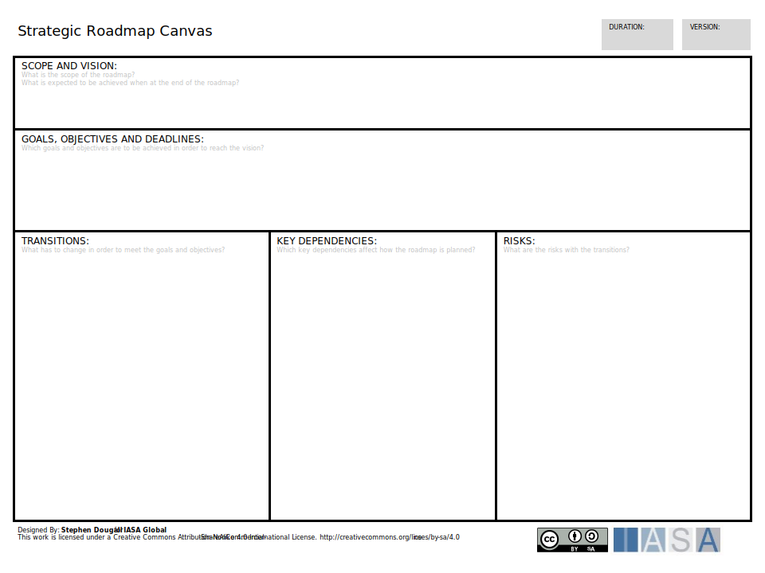

## Strategic Roadmap Canvas (Visual)

The strategic roadmap canvas is a tool to bring together the architects view on multiple streams of work. This can be likened to the portfolio or program level in traditional project management but serves a different function for architects. The goal of this canvas is to bring together the strategic nature of the projects/products being delivered and how they depend on each other. 

Download the PPT, Download the Strategic Initiatives XLS

## Strategic Roadmap Card (Descriptive)

The strategic roadmap card provides a description of a portfolio or top level strategic view of a set of initiatives, produce/projects or activities. It can be combined.with strategy scorecards and other Strategy tools to define a direction and set of objectives.

The vision is often expressed as a short textual statement, providing a description of what is to be achieved and why.

For example:

1. "Company X is an established provider of flat sheet steel throughout Europe and is a primary supplier to the automobile industry."
2. "The logistics department will provide the company with an exceptional service which can ensure delivery of goods to all customers in the UK within 2 days."

[Download PPT](media/ppt/strategic_roadmap_canvas.ppt){:target="_blank"}

| Area                            | Description                                                                                                                                              | Links To                                                                                    |
| ------------------------------- | -------------------------------------------------------------------------------------------------------------------------------------------------------- | ------------------------------------------------------------------------------------------- |
| Scope and Vision                | The Scope and direction or vision of the the roadmap. This section should describe the initiative in motivating words which outline its strategic value. | Strategy Scorecard (informs)                                                                |
| Goals, Objectives and Deadlines | Objectives (goals are used synonymously) of the initiative taken from Strategy or from OKRs.                                                             | OKR (populated by) , Strategy Scorecard (informed by)                                       |
| Transitions                     | The major events, milestones or points of change in the roadmap.                                                                                         | Transition Roadmap Canvas (populated by)                                                    |
| Key Dependencies                | Capabilities, Services or Project/Projects on which this roadmap is dependent.                                                                           | Services Landscape (comes from), Capabilities Canvas (comes from), NABC (initiatives names) |
| Risks                           | Major risks related to the initiative.                                                                                                                   | Risk Matrix Canvas (related to)                                                             |