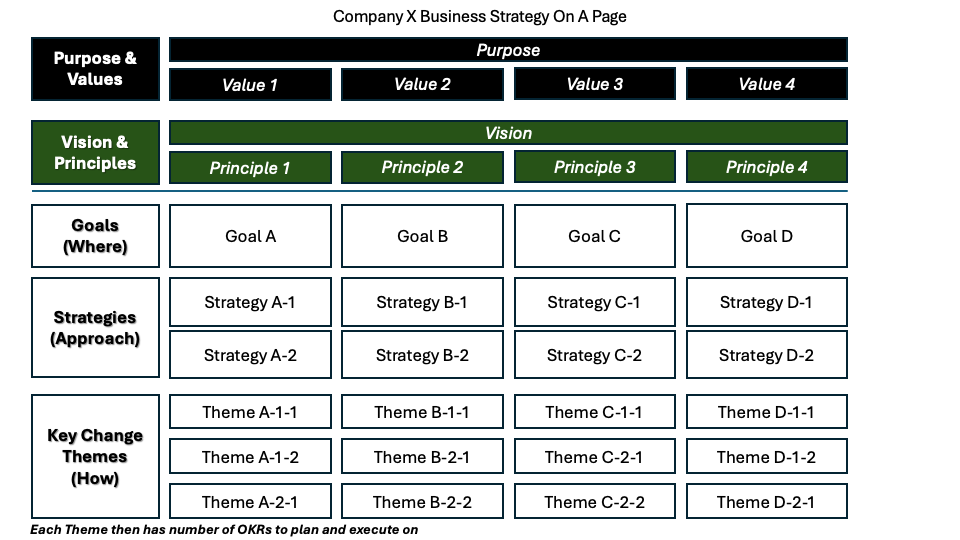

## Overview

<mark>This is a draft version...</mark> The strategy on a page canvas... 

[Download PPT](media/ppt/strategy_on_a_page.ppt){:target="_blank"}

| Area                  | Description          | Links To                                                |
| --------------------- | -------------------- | ------------------------------------------------------- |
| Purpose & Values      | Overview description | [Business Model](../engagment_model/business_model.md), |
| Purpose               | Overview description |                                                         |
| Value X               | How to               |                                                         |
| Vision and Principles | ...                  |                                                         |
| Vision                |                      |                                                         |
| Principle X           |                      |                                                         |
| Goals (Where)         |                      |                                                         |
| Goal X                |                      |                                                         |
| Strategies (Approach) |                      |                                                         |
| Strategy X            |                      |                                                         |
| Key Change Themes     |                      | [OKR](okr_card.md), Objectives                          |
| Theme X               |                      |                                                         |

## Usage Guidelines

The 

## What You Get From This

The 

## Worked Example

The