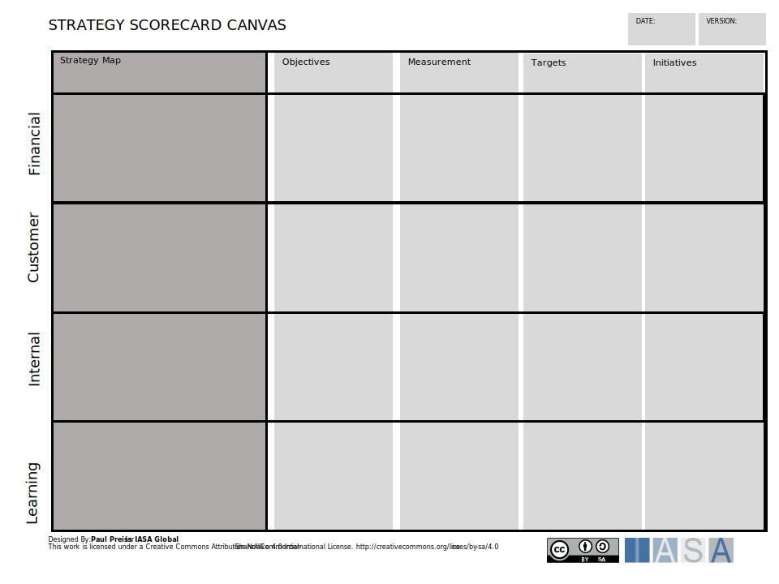

The strategy scorecard is a combination of a strategy map and a balanced scorecard. It is used to link strategic objectives to initiatives, Projects/Products, and measurements. The strategy scorecard is a tool used significantly in business. The columns align the goals of the executive levels to actual project/product level work. To do this it needs to be 'layered' against objectives meaning successive levels of detailed objectives can be added under the objectives and aligned with capabilities or delivery groups. It can be used with Roadmaps, and many other SCA tools.

The Strategy Scorecard Canvas is a structured framework used to align organizational strategy with actionable plans. It provides a comprehensive view of how different elements of strategy interact, allowing for better understanding, communication, and management of change, dependencies, and objectives. Here’s a detailed description, including how an architect would use it:

### Components of the Strategy Scorecard Canvas

1. **Strategy Map**:
   
   - **Financial**: The long-term goal of the organization, outlining what it aspires to become.
   - **Customer**: The organization’s purpose and primary objectives, defining its core activities and focus.
   - **Internal**: The focus on the internal processes and capabilities that need to be modified to support the customer strategy. 
   - **Learning**: The people and the systems that need to grow to support the overall objectives of the strategy. 

2. **Strategic Objectives**:
   
   - Specific goals that the organization aims to achieve to fulfill its mission and move towards its vision.
   - These objectives are usually categorized into financial, customer, internal process, and learning & growth perspectives.

3. **Measurements**:
   
   - Metrics used to measure the progress towards achieving strategic objectives.
   - KPIs provide quantifiable data to assess performance.

4. **Initiatives**:
   
   - Projects or actions that are planned to achieve the strategic objectives.
   - These initiatives are linked to specific KPIs and objectives.

5. **Dependencies**:
   
   - Relationships and interdependencies between various initiatives and objectives.
   - Understanding these dependencies is crucial for effective change management and resource allocation.

6. **Risks and Assumptions**:
   
   - Identification of potential risks that could impact the achievement of objectives.
   - Assumptions made while planning initiatives and setting objectives.

### How an Architect Uses the Strategy Scorecard Canvas

An architect, particularly a business or enterprise architect, uses the Strategy Scorecard Canvas to understand and communicate change management, dependencies, and objectives in the following ways:

1. **Alignment and Communication**:
   
   - **Understanding Vision and Mission**: By starting with the vision and mission, the architect ensures that all strategic objectives and initiatives align with the overall direction of the organization.
   - **Clear Communication**: The structured layout of the canvas helps in clearly communicating the strategy to stakeholders, ensuring everyone is on the same page.

2. **Identifying and Managing Dependencies**:
   
   - **Mapping Dependencies**: The architect identifies and maps out dependencies between different initiatives and objectives. This helps in understanding how changes in one area can impact others.
   - **Resource Allocation**: By understanding dependencies, the architect can better allocate resources and prioritize initiatives to ensure smooth implementation.

3. **Strategic Objectives and KPIs**:
   
   - **Setting Objectives**: The architect helps in defining strategic objectives that are aligned with the mission and vision of the organization.
   - **Tracking Performance**: Using KPIs, the architect tracks the performance of various initiatives, ensuring they are on track to meet the objectives.

4. **Change Management**:
   
   - **Impact Analysis**: Before implementing changes, the architect conducts an impact analysis using the canvas to understand how changes will affect different parts of the organization.
   - **Risk Mitigation**: By identifying risks and assumptions, the architect plans for contingencies and mitigates potential issues that could derail the strategy.

5. **Continuous Improvement**:
   
   - **Feedback Loop**: The architect uses the canvas as a feedback loop, regularly updating it based on performance data and changing conditions. This ensures that the strategy remains relevant and effective.

### Practical Example

Consider an organization aiming to enhance its customer satisfaction levels (Strategic Objective). An architect would:

1. **Link Objectives and Initiatives**: Identify initiatives like improving customer service training and implementing a new CRM system.
2. **Define KPIs**: Set KPIs such as customer satisfaction scores and response times.
3. **Map Dependencies**: Understand that the CRM implementation depends on IT infrastructure upgrades and staff training.
4. **Manage Change**: Analyze how these changes impact current operations and manage the transition smoothly.
5. **Monitor and Adjust**: Continuously monitor the performance using KPIs and adjust initiatives as needed based on feedback and performance data.

By using the Strategy Scorecard Canvas, the architect ensures a holistic view of the strategy, aligning day-to-day activities with the broader organizational goals and efficiently managing changes and dependencies.

[Download PPT](media/ppt/strategy_scorecard_canvas.ppt){:target="_blank"}

| Area                    | Description                                                                                                                                             | Links To                                                        |
| ----------------------- | ------------------------------------------------------------------------------------------------------------------------------------------------------- | --------------------------------------------------------------- |
| Strategy Map            | The strategy map is a tool to simplify executive strategic focus and the relationship to customer outcomes, internal processes and people competencies. |                                                                 |
| Objectives              | The objectives column lists the objectives which are the goal of the organization aligned with their strategic impact area.                             | OKR, Benefits Card                                              |
| Measurement             | The measure to change in the objective.                                                                                                                 | OKR, Benefits Card                                              |
| Targets                 | The goal of the objective, the number or percent of change.                                                                                             | OKR, Benefits Card                                              |
| Initiatives             | The projects/products which will deliver the change to the measurement.                                                                                 | NABC (described as)                                             |
| Financial, Mission      | The area of impact aligned with Financial outcomes (for profit businesses) or Mission objectives for non-profit or government businesses.               |                                                                 |
| Customer, Beneficiaries | The objectives for the customer and customer outcomes. This would be described as beneficiaries in a non-profit or government business.                 | Business Model Canvas (impacts), Mission Model Canvas (impacts) |
| Internal                | The are of capabilities and business processes which will deliver the change to customers/beneficiaries.                                                | Capability Model, Services                                      |
| Learning                | The competencies and learning that the organization staff will have to improve to achieve the changes. May also include a systems or technical level.   |                                                                 |
