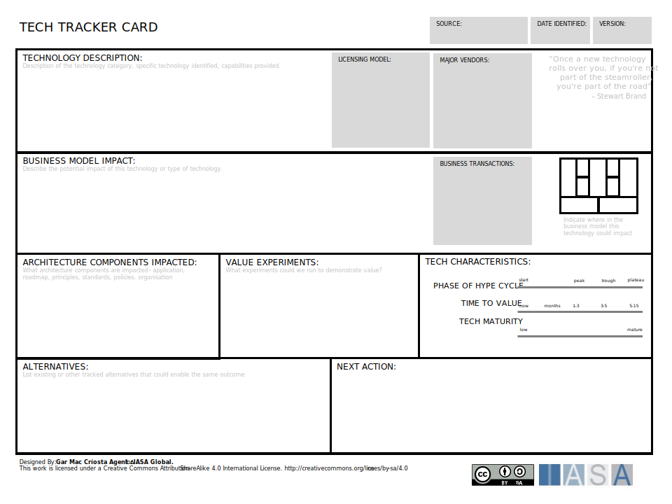

The technology tracker helps architects evaluate a new technology tracker for impacts on their environment.

[Download PPT](media/ppt/technology_tracker_card.ppt){:target="_blank"}

| Area | Description | Links To |
| --- | --- | --- |
| Technology Description |   |   |
| Business Model Impact |   |   |
| Architecture Components Impacted |   |   |
| Value Experiments |   |   |
| Tech Characteristics |   |   |
| Alternatives |   |   |
| Next Action |   |   |

