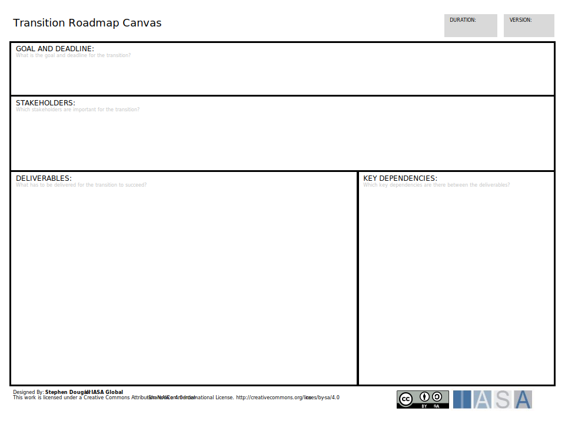

The transition roadmap canvas helps to define the major changes which are needed to transform the business to a state which will meet the vision. Each transition should contribute partly or completely to the achievement of the define goals and objectives. Using the transitions from the Strategic Roadmap Canvas, key stakeholders are called to a series of transition workshops where each workshop focuses on a single transition.

[Download PPT](media/ppt/transition_roadmap_canvas.ppt){:target="_blank"}

| Area | Description | Links To |
| --- | --- | --- |
| Goal and Deadline | The goal and deadline of the transition. Use SMART objectives for the goals. | [OKR Card](okr_card.md){:target="_blank"} (derives from), [Benefit Card](benefit_card.md){:target="_blank"} (derives from) |
| Stakeholders | Define the stakeholders in the enterprise who are likely to be affected by the transition. | [Stakeholder Management Plan](stakholder_management_plan.md){:target="_blank"} (linked to) |
| Deliverables | Consider the details of the transition and changes which will occur in the transition. Express these in terms of deliverables. | [Engagement Model Designer](architects_process_engagement_canvas.md){:target="_blank"} (derives from) |
| Key Dependencies | Consider the dependencies between deliverables which will affect how the roadmap is planned. | [Architects Roadmap Canvas](architects_roadmap_canvas.md){:target="_blank"} (defines dependencies) |