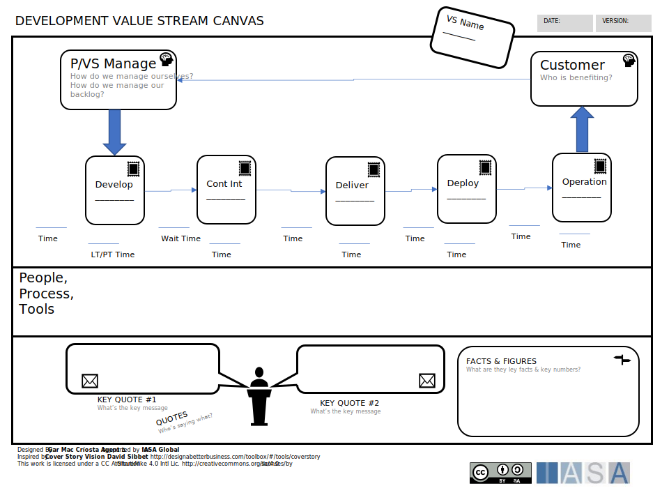

The value stream canvas is used to understand where value is created in an organization driven from customers through control, suppliers and operations. The first canvas available in the ITABoK is derived visually from traditional manufacturing value streams where it originated. Other value stream canvases such as the development value stream canvas may be more useful in digital activities.

[Download PPT](media/ppt/transition_roadmap_canvas.ppt){:target="_blank"}

| Area | Description | Links To |
| --- | --- | --- |
| Customer | The customer begins the traditional value stream with an event that initiates the value stream. This could be placing an order | [Business Model Canvas](business_model_canvas.md){:target="_blank"} (derives from customer), [Customer Persona Card](persona_card.md){:target="_blank"} (related to) |
| Control | The operations and capabilities of the organization which process the event from the customer and begin the delivery of value. |   |
| Supplier | Partners, suppliers necessary for the fulfillment of value to begin. | Ecosystem Canvas (partners with), [Business Model Canvas](business_model_canvas.md){:target="_blank"} (delivery from) |
| Process | Processes necessary to create the value for the customer. Derived from [capabilities](../engagement_model/business_capabilities.md){:target="_blank"}. | [Business Capability Card](capability_card.md){:target="_blank"} (derived from processes) |
| Time | Lead times related to active processing and lead times before next process activates. | Not Applicable |
| Core Idea | What is the big idea? What is the Value Stream? | Not Applicable |
| Facts & Figures | Key metrics which impact the value stream. Often understood as either internally related to the execution or externally related to value. | Objective Key Results (related to), Benefits (related to) |
| Quotes | Key quotes from [stakeholders](../engagement_model/stakeholders.md){:target="_blank"} or [customers](https://btabok.iasaglobal.org/customer-personas/){:target="_blank"}. | [Customer Journeys](customer_journey_map.md){:target="_blank"} (taken from), [Customer Personas](persona_card.md){:target="_blank"} (taken from), [Stakeholder Engagement Map](stakeholder_engagement_map_card.md){:target="_blank"} (taken from) |