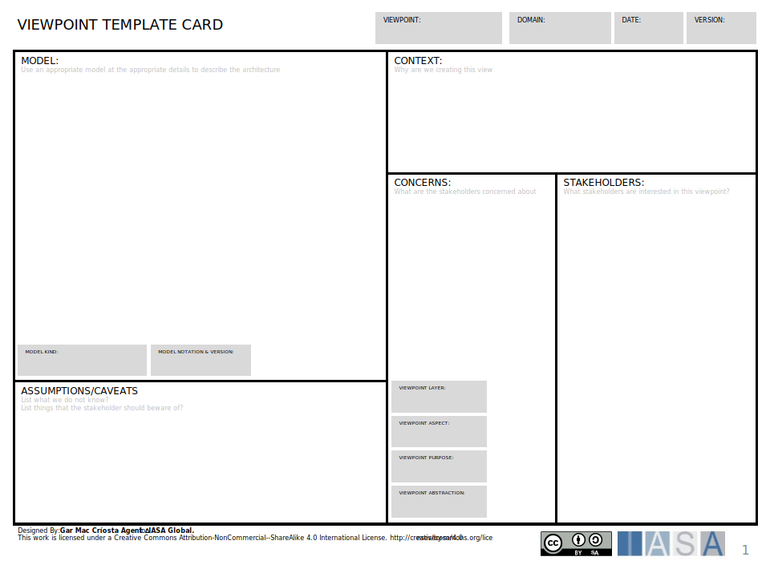

# Overview

The viewpoint template card is used to describe a viewpoint used by an architecture practice. The viewpoint concept [see views article](../engagement_model/views.md){:target="_blank"} is used to help in describing an architecture and is based on ISO 42010.

Using architecture viewpoints is a crucial practice for several reasons:

- **Multiple Perspectives:** Complex systems have many stakeholders with different priorities and concerns. Viewpoints allow you to document these differing perspectives and ensure the architecture considers the needs of each stakeholder group.
- **Improved Communication:** By clearly articulating viewpoints, you facilitate better communication and collaboration between architects, stakeholders, and development teams. Everyone has a shared understanding of the system from various perspectives.
- **Targeted Documentation:** Viewpoints allow you to tailor architectural documentation to the specific needs of different audiences. This avoids information overload and ensures stakeholders receive the information most relevant to them.
- **Reduced Risk:** Considering the system through various viewpoints helps you identify and mitigate potential risks early in the design process.

**How Viewpoints Differ from Architecture Descriptions**

Regular architecture descriptions typically provide a single, generalized view of the entire system. Viewpoints, however, deliberately focus on specific perspectives or areas of concern. Here's a table summarizing the key differences:

| Feature         | Regular Architecture Description  | Architecture Viewpoint             |
| --------------- | --------------------------------- | ---------------------------------- |
| Focus           | Overall system description        | Specific perspective or concern    |
| Audience        | Broad (all stakeholders)          | Tailored (specific stakeholders)   |
| Level of Detail | Can vary                          | Can vary, but often more focused   |
| Purpose         | Communicate overall system design | Address specific stakeholder needs |

**Filling out the Viewpoint Template Card**

- **Information Sources:**
  - Stakeholder Interviews and Workshops
  - System Requirements Documentation
  - Architectural Principles and Standards
- **Relationship to Other Architectural Practices:**  
  Viewpoint templates are used in conjunction with other architectural practices like the creation of architectural models used to visually represent the system according to the specific viewpoint.

By documenting your architecture using viewpoints, you can ensure that your designs consider the needs of all stakeholders and address their unique concerns. This leads to a more comprehensive, well-rounded architecture that is better positioned to meet the overall strategic objectives of your project.

## How to use this card

- **Viewpoint:** This section identifies the specific viewpoint you're documenting. This could be a business viewpoint (e.g., finance), a stakeholder viewpoint (e.g., CEO), or a technical viewpoint (e.g., security).
- **Domain:** This section identifies the domain or area of concern that the viewpoint focuses on.
- **Version:** This section tracks the version of the viewpoint template card.
- **About this Template:** This section provides a brief overview of the purpose of the template and how to use it.
- **Context:** This section captures the overall context surrounding the viewpoint. Here you might describe the system or project the viewpoint applies to, any relevant standards or regulations, and any assumptions you're making.
- **Concerns:** This section identifies the key concerns or priorities of the viewpoint holder (e.g., the business is concerned about maintaining costs, while security might be most concerned about data privacy).
- **Stakeholders:** This section identifies the stakeholders associated with the viewpoint.
- **Model(s) Used:** This section lists the architectural models used to represent the viewpoint. These models could depict the system's functionality, data flows, or deployment.
- **Viewpoint Abstraction & Aspect:** These sections differentiate how granular the viewpoint is (abstraction) and what particular aspects of the system it focuses on (aspect). For instance, a high-level abstraction might focus on the overall system landscape, while a lower-level abstraction might drill down into specific components.

## Download

[Download PPT](media/ppt/viewpoint_template_card.ppt){:target="_blank"}

| Area                | Description                                                                                                 | Links To                                                                                      |
| ------------------- | ----------------------------------------------------------------------------------------------------------- | --------------------------------------------------------------------------------------------- |
| Model(s)            | Views contain models and this area describes which model(s) are used within the viewpoint.                  | [Design](../engagement_model/design.md){:target="_blank"} (article)                           |
| Context             | Why are we creating this viewpoint, in what context should it be used. What problems does it solve.         | [Scope and Context](../engagement_model/scope_context.md){:target="_blank"} (article)         |
| Concerns            | The areas of interest to stakeholders or the architect which this viewpoint addresses.                      | Requirements                                                                                  |
| Stakeholders        | The list of stakeholders who are impacted or interested in seeing and architecture view for this viewpoint. | [Architect Stakeholder Canvas](architect_stakeholder_canvas.md){:target="_blank"} (describes) |
| Assumptions/Caveats | Areas which when working with the viewpoint are particularly difficult or assumed to exist.                 | Not Applicable                                                                                |

## Use this in Miro

We in the BTABoK are so very excited about the native support for architecture canvases in Miro! Find this canvas in the Miroverse!

