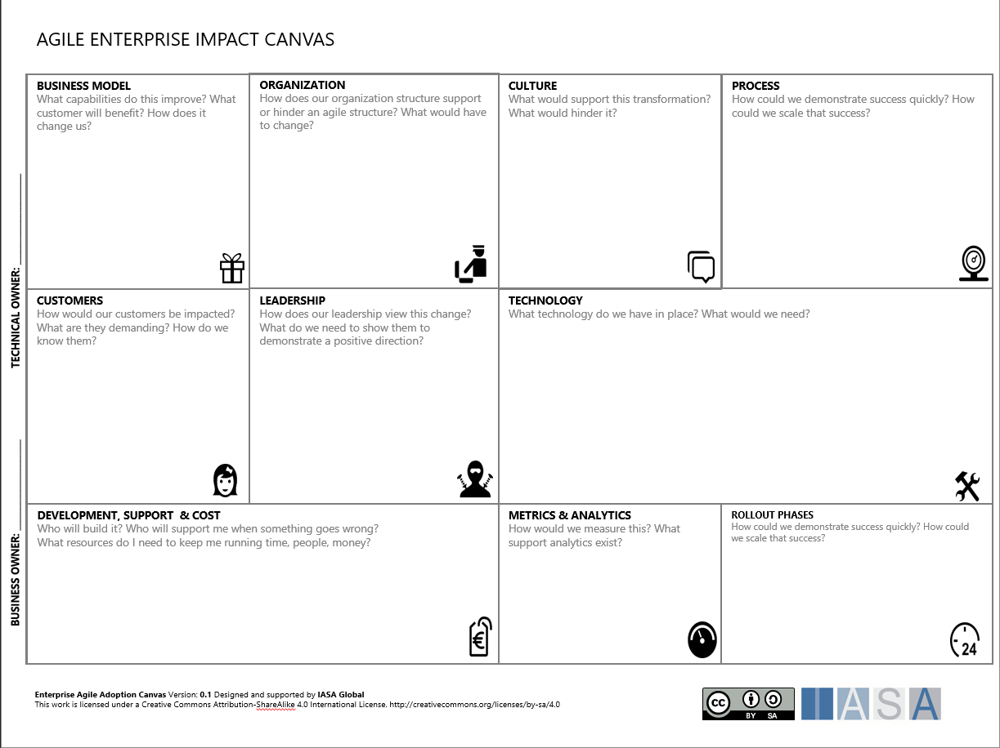

## What is an Engagement Model

The Iasa Engagement Model are the combined activities, deliverables, and
work that an organization of architects use to achieve a mature and
valuable architecture practice. The goal of the engagement model is to
make the best use of architecture teams work to deliver on business
technology strategy.

## Lifecycles, Weave(s) and Threads

The Iasa Engagement Model includes many practical activities which help
architects develop and grow their architecture capability. These
activities are often labeled Weaves or Threads to help isolate specific
activities in the engagement model. We use the term thread to delineate
a specific arrangement of activities that is somewhat smaller than a
Weave which has a much larger/multi-team-based usage.

## Business to Solution Architecture -- The Value Weave

This method is built to optimize value streams and large solutions which
require deep strategy to execution understanding throughout the
lifecycle. Note: while the timeline is written sequentially, this is NOT
considered a waterfall activity, it is simply the limitation of graphics
and navigation lending itself to a somewhat sequential order. It should
be understood that many of these activities happen concurrently,
iteratively and with multiple team members leading and participating.

<ul id="profileTabs" class="nav nav-tabs">
    <li class="active"><a href="#usageandvalue" data-toggle="tab">Usage and Value</a></li>
    <li><a href="#assessment" data-toggle="tab">Assessment</a></li>
    <li><a href="#agiledevOps" data-toggle="tab">Agile DevOps</a></li>
    <li><a href="#viewpoints" data-toggle="tab">Viewpoints</a></li>
    <li><a href="#qualityattributes" data-toggle="tab">Quality Attributes</a></li>
    <li><a href="#decisions" data-toggle="tab">Decisions</a></li>
    <li><a href="#options" data-toggle="tab">Options</a></li>
    <li><a href="#requirements" data-toggle="tab">Requirements</a></li>
    <li><a href="#stakeholders" data-toggle="tab">Stakeholders</a></li>
    <li><a href="#teamdesign" data-toggle="tab">Team Design</a></li>
</ul>
  

    <h2>Usage and Value</h2>
     
    
Usage and Value is achieved after a product/project is deployed. Many architects and organizations ignore the measurements of how well the product measures against the objects and key results that were used to justify it in the first place. The ITABoK heavily suggests usage information measured on dashboards against OKRs in retrospectives against the deployed system.

    <h2>Assessment</h2>
     
    
Architecture Assessments are the methods employed to design, review and assess architecture choices against options and to review the choices made in relation to the outcomes expected in the product/project. The goals of assessment are to find missing elements of architecture, things that wont meet quality attribute requirements or design tradeoffs that are not effective for the intended purpose.

    <h2>Agile DevOps</h2>
     
    
Agile DevOps delivery is the heart of most development and IT shops. The ITABoK makes plenty of room for both agile and traditional methods. The basis for the ITABoK is bottom up architecture, meaning architects are actively involved during delivery not in up front design. This means that architects are actively engaged with teams, projects, products and value streams in the business.

## The Red Thread

For smaller solutions and products, the Red Thread will generally be
enough to ensure the product delivers value and is aligned with the
technology strategy and outcomes of the organization.

## Building an Engagement Model

What is essential in understanding the architecture engagement model and
its relationship to digital transformation is that the architect team is
the primary driver for true digital transformation. The team is not the
only party involved in delivering such fundamental changes in the
enterprise but is the core professional kernel of that activity.

The engagement model is divided into three primary rings which represent
the architect team mandate, the components they use, and the outcomes
that the enterprise will achieve achieve if the team delivers.

You may utilize the engagement model in two primary ways. First click on
any element in the engagement model be taken to directly to that
section. The second way is to use the navigation on the right to journey
through the implementation of an engagement model.
