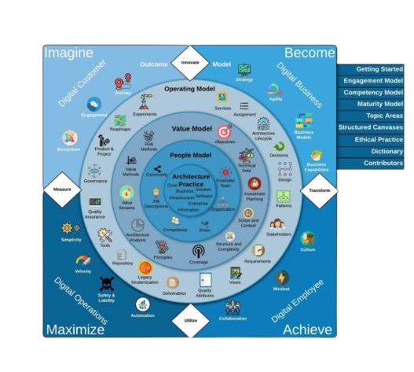
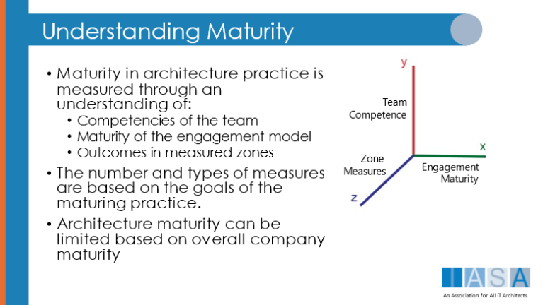

> "I think it’s my adventure, my trip, my journey, and I guess my attitude is, let the chips fall where they may."
**Leonard Nimoy**

# Forward to Getting Started by Paul Preiss

I was in Romania a number of years ago, with my good friend speaking at a conference when an idea struck me, ‘We have nothing that connects the concepts of architecture together, we need a way to connect our work, adopt it, and share it with other architects.’ I had been reading the latest news, interviewing thought leaders, conversing with other speakers all over the world both in and out of the Iasa community and one thing continued to bother me, everyone was complaining about the same problems and proposing the same old solutions using different words, with different meanings or often the same words with different meanings. TOGAF hadn’t solved the problem. SAFe wasn’t focused on architecture and the BABoK was brilliant and useful but also utterly specialized which was having negative effects with other types of architects (even when they NEEDED to understand it). The BCS has an IT competency model. FEAF has required views and some other useful tools. Framework after framework from small to large. But, as [Miha Krahlj](https://www.linkedin.com/in/mihak/){:target="_blank"} has joked, creating a framework to connect the frameworks would just make another framework and make the problem worse. Anyway it was then that what was to become the initial BTABoK image struck me (I won’t include it as it was pretty messy). Needless to say I didn’t sleep much the next few weeks. But what started then has now become reality.

That was the moment I realized we could put together a truly positive, connected set of concepts which could be adopted incrementally and would take the form of a body of knowledge which would be descriptive instead of prescriptive thus allowing it to be used with any existing framework while only requiring ‘adapters’ for basic definitions (always the hardest part) and providing a simple set of tools that can be used in the most simplistic environments or implemented in the most complex architecture practices on earth.

We have done that. I created Iasa 20 years ago to solve problems for real architects no matter who they work for or how large their team is. I believe this body of knowledge is the most important work published in that time. I am not dismissing the wonderful work, books and thought leadership of the professionals in any of the groups I mentioned earlier nor the speakers, authors and architect leaders during that time. In fact, you will find that this work is a connection of most of these amazing ideas into an implemtable practice model that will grow and be refined by generations of architects to come. I am proud it is free and and it is open source. I am even more proud of having known the primary contributors and the hundreds of architects who have helped shape its delivery.  

What is so special about the BTABoK? These major unique elements make the BTABoK special:

1. The most important is it connects all types of architects instead of dividing us further. From the competency model to the engagement model it makes doing architecture work, easier not harder and has a space for all types of practitioners… business, information, infrastructure, software, solution etc.
2. It is a tremendously practical toolset. You can adopt the whole thing or use a single tool, like the architecture decision record but it retains its consistency of message and tenets throughout. We have not backed off the hard problems, instead we worked with them to find solutions that make architecture practices stronger overall while be extremely versatile.
3. It is a baseline which allows us to publicly store our body of knowledge… from business capabilities to patterns to views to quality attributes, we can use the BTABoK to actively store worked examples of all forms of architecture.
4. It is incremental in numerous ways and supports an globally adoptable career path. Adoption of the BTABoK can be individual, corporate, vendor, or SI based. It allows for and is built for engagement models to be based on shared knowledge while still ‘brandable’ (to license the BTABoK for public sales as in an SI contact us). It supports both Big A as well as little a architecture and the same with agility.
5. It’s open source but curated and edited by certified architects. Anyone can commit a document but we have a very advanced panel of architects who review commits and edit or accept them. (We are working on a set of Git based tools to make this even more powerful in 2022).

I expect this body of knowledge, and especially its tenets, will anger a great number of people with the title and many without it. I hope it does so. And I hope it spurs those individuals to use that anger to distill their arguments into contributions which aid this wonderful profession in its growth. In the profession we envision, the title will not be granted, it will be earned with leadership, contribution, humility and successful practice.

# Getting Started with the BTABoK

The body of knowledge includes a lot of information. It is by far the most comprehensive amount of information found on architecture today. It includes concepts taken from around the entire profession and is built in a descriptive way and provides conceptual tools for almost all areas of architecture execution.

To get started with the BTABoK, a group of architects should first read this article in its entirety. It provides a getting around guide and will help getting started based on induvial goals and desires. Second, the group should decide where they want to begin. Often this is using the BTABoK ‘all the way through’ on a single project, but other organizations are adopting it more middle out or even top down.

# What is Digital Advantage?

Digital transformation is a vendor phrase. It is about changing into something and do so normally requires spending money. Why transformation and change management and how architects are involved in it is critical to the BTABoK, the primary point of the BTABoK is the value achieved from the transformation. This is a critical difference. Digital advantage is what organizations hope to achieve through digital transformation. By making this the focus of architecture efforts, there is less emphasis on measuring the change, and more emphasis on what has changed in the organization and how quickly it is changing. Think about a simple scenario. A company pays an advertising company for a major advertising initiative. The agency delivers on time and underbudget and the client loves the results. However, when the campaign goes live, no new leads, customers or other measurable results are achieved. Most would call this a failed initiative. However, with technology changes it is often called a success. The goal of the BTABoK is to create a class of professionals dedicated solely to outcome driven, measured digital investment. These professionals are called architects. And Iasa treats them as an independent profession from all others in and out of technology (engineers, project managers, etc).

## What Goes Where

The right hand navigation leads to semi-independent areas of knowledge exploration in the BTABoK and Iasa. The engagement model is represented by the primary diagram, however it is matched by the competency model, topic areas, the maturity model and structured canvases. All of these areas are connected under the BTABoK umbrella but may be used in independent ways.

## IBAM

The focus of the entire BTABoK is to create outcomes in the four major areas of Digital Advantage. Imagine the digital customer, become a digital business, achieve a digital employee, and maximize digital operations.

This proves the lenses through which one measures the outcomes of the organization in it’s digital strategy to execution and the architecture capability in specific which is its focus.

It is interesting to note that currently as a part of our assessments both corporate and individual the majority of architecture practices are focused primarily on the Maximize area.

## The Continuous Events (Diamonds)

The BTABoK treats the innovate, transform, utilize and measure diamonds as continuous events and activities both inside and outside the organization. They are related to the Lifecycles article but are treated as separate articles themselves as they are continuously happening throughout the enterprise and external to in industry, analysts, partners, customers, etc.

The events then should be treated as things that neither the architects nor the organization can control, but only harness and take advantage of as quickly as possible or understand and maximize where they can.  

## The Outcome Model

The outcome model is the set of articles dedicated to what all members of a business hope to achieve. These are not just the concerns of the architects or technologists but the goals of the entire business as it relates to digital advantage. Thus the outcome model is how digital advantage is measured and is directly related to the Maturity Model used to measure the architecture practice. Each of the outcome articles relates to its area of impact (the IBAM areas) while the areas inside the circles relate to specifically to architecture, how it is executed, and how it creates these outcomes.

The outcome model while directly shared with other business units should be the primary focus of the entire architecture practice. It should also be the commitment of any vendor and especially service integrators who provide architects to the enterprise to achieve results in these areas (see architecture practice article). Thus, the digital business model is as much the responsibility of a software architect as it is for a business architect. At the same time, maximizing digital operations excellence such as velocity, etc are as much the responsibility of the business architect as they are the information and infrastructure architects.

## The Operating Model

The operating model was named because it includes the primary operational activities, techniques, tools and methods of the architecture practice. It includes things like roadmapping, requirements, decisions, etc. which are the methods and techniques that architects use to deliver on IBAM and digital advantage. These are generally the articles that architects focus on to change their way of working, for example designing better.

## The Value Model

The value model was named based on the techniques to understand quality, value, and outcomes in architecture. It connects the operating model with the people model, in a way. Too many architecture practices are simply consultative, they do not ‘own’ outcomes. The value model builds at the heart of the practice a shared concept of measuring outcomes both in business and engineering terms. Thus Architecture Analysis, which can be both business and structurally driven, architecture principles, technical debt and value methods are all a part of the value model.

## The People Model

The people model is named primarily to deal with the people side of architecture, namely architects themselves. Note, this is different from the competency model which is a separately maintained body of knowledge on the competencies of an individual architect, including their specializatation. However it is the people model which connects the two bodies of knowledge together. It also includes things like how to organize architects, role descriptions, community methods and other valuable tools in practices especially as they grow beyond a couple of dozen architects towards the large value areas.

## The Architecture Practice

The architecture practice is a single article which attempts to bring together the goals of a group of architects working towards the aims of the profession and working together to create outcomes for the organization that employees them. This article is focused on demonstrating why and how a practice model for professionals (such as a medical practice, a legal practice, an accounting practice) differ from the current way in which architects work together and are employed.

## What is the Engagement Model – The Main Diagram

The engagement model of the BTABoK is the entire engagement process of an architecture team, whether it is 5 or 500. The largest group of architects that are using, evaluating and participating is currently around 2500, though they are in the process of scaling it. All architecture teams have to engage an organization, the BTABoK simply allows them to be objective and concrete about those activities as well as to set clear objectives and use the same language in doing so. For example, the stakeholder article provides tools and techniques to improve stakeholder management. The engagement model does not requie that a team use all of the concepts (articles). In fact a team may actively choose to not use a particular concept. One large organization which used Iasa training actively rejected using business cases, value methods, benefits realization etc. for a time (they have since begun using them as their digital maturity needs grew). Also each concept is linked to similar concepts in other frameworks, tools, etc where possible. The repository article mentions the Repository article from TOGAF which is acceptable. Disciplined Agile, ITIL, COBIT, SAFe, and many other repositories of information are referenced in the articles. Even further effort to do this officially is scheduled for BTABoK 4.0.

## What is the Competency Model – The Individual Architect

The competency model is a very well established body of knowledge on the competencies of architects and how they should be measured against a career path. It was initiatlly established around a decade ago and is used in training, certification and architect mentoring. The competency model has not changed much in that time as one would expect. To use the competency model there are downloadable versions of the competencies, their measureents and levels of each competency for architects. It is important to note that no architect has the highest level ranking in all competencies. This is explained more in the competency model itself. The competency model can be used for working with HR and adopted as a method for measuring architect success and growth in career. For example, some organizations require the CITA-P for achieving senior architect status. This certification measures the core competencies plus specialization competencies for experience (it is a board certification).  

## What is the Maturity Model

The maturity model is a very new element of the BTABoK and derives from work Iasa does with companies to evaluate their architecture practice and its impact on digital advantage. The maturity model connects the outcome measures of an organization with the maturity of the concepts of the engagement model and the competencies of the practitioners.

## What is the Structured Canvas Approach

The SCA or structured canvas approach, which can also be called the structured concept approach, is a set of predefined ‘cards’ and ‘canvases’. The cards are generally informational and a bit smaller and targeted at individual use, whereas the canvases are generally ‘bigger’, often used for fascilitating multiple people in an activity, or connecting multiple concepts together. For example the context view canvas connects decisions, design, requirements together and can be used to facilitate larger design discussions whereas the architecture significant requirement card is used for a single requirement.

The power of the SCA is signficant. The tools provide very focused types of thinking around a very focused activity and can thus eliminate a lot of the confusion and tangents in a particular session or activity. This is especially important when fascilitating a group on an activity like roadmapping. The second area is that the canvases are linked and informed by each other. That is not to say they are linear or mapped in a set way (meaning a team does not use one then the next etc except during training), but they provide clear guidance on what canvases may come from or support each other. For example, the customer segment portion of the business model canvas directly impacts and supports the customer journey canvas. These linkages have been mapped and therefore when used together they form a very powerful set of tools. Finally, the canvases are both simple and open source. This means that the team can customize them and use them how they see fit (note: customized versions cannot be used for commercial purposes without a license). Iasa hopes that any customized or improved examples will be resubmitted to the BTABoK for inclusion or modification of the SCA.

## What are Topic Areas

There are very deep areas of knowledge in architecture which are either technology focused or are not yet fully specialization themselves (see the architecture practice article for more information on specializations). These may include things like cloud, security, integration, AI, or others. These topic areas are sub-working groups of the BTABoK which provide deep guidance for architects in the particular area. The topic areas may provide additional certifications or badges of achievement for architects. Working groups are expected in each of the listed areas for BTABoK 4.

# Adoption

The goal of the BTABoK is adoption across industries. This means putting it to the test, using it and improving it across individuals and organizations. It is the long-term goal of the BTABoK to be the primary knowledge resource and linking body of knowledge in the industry. This does not mean that the BTABoK replaces frameworks, but in fact makes them more successful by providing common techniques and competencies against which they can be implemented.

The first place to start is reading about the Architecture Practice Model represented in the BTABoK. Then move forward to Implementing an Engagement Model. Iasa is providing Adoption Scenarios which describe different approaches for implementation with diagrams, examples and video support. These scenarios represent common use cases for the BoK and include things like Managing Stakeholders, Objective to Delivery Traceability, Better Decisions, etc. These scenarios will continue to be expanded and as organizations adopt and use these methods Iasa hopes they will contribute even more. For example, one large SI is using the BTABoK to provide a response to an RFP and facilitate dialog with the organization to understand their business objectives.

## Corporate Adoption

Corporate adoption involves the organization using some or all portions of the BTABoK in their architecture practice. It also involves bringing knowledge from within the organization and putting it out there for others to use, contribution.

Corporate adoption normally includes some or all of the following:

1. Initial assessment of individuals against the competency model,
2. Initial assessment of the architecture practice against the engagement model,
3. Training plan for architects in the organization,
4. Mentoring plan for architects in the organization,
5. Project/Product level implementation of the Engagement Model,
6. Advisory activities and mentoring of leadership for steering group formation,
7. Collaboration with other Iasa corporate members and community.

## Vendor or SI Adoption

Service integrators and vendors have a very difficult position in maintaining architecture practices. This difficulty arises in the extreme differences between clients expectations, beliefs and capabilities related to architecture and the disconnection between vendor account teams thus leading to architects who do not work together. In addition, employee turn-over in the vendor community is very high leading to significant differences from architect to architect. Finally, vendors are often the most at risk for both hype and sales objectives to get in the way of architects providing true benefits to clients.

## Government or NGO Adoption

Mission based organizations have as strong or even stronger need for architecture than for-profit companies as in many cases the problem space is much bigger and has very real impact on peoples lives. In addition value is much harder to understand in a mission based organization as it cannot be aligned to profitability. Many non-profits and government agencies have to deal with very high safety and liability issues, risk aversion, and beauracratic or political difficulties. This is a very exciting place to get architecture done but requires very careful handling and setup of federated methods across agencies, states, provinces, local governments etc. This often creates significant complexity as well as duplication of effort and difficulties in funding.

## For-Profit Adoption

For profit adoption in non-vendor organizations (those organizations whose primary value proposition to custoers is not technology or technology services) is the most common case for the BTABoK. It has been designed by individuals in banks, insurance firms, energy, and other industries. What is becoming more and more exciting for architects is the continued use of technology as a fundamental differentiator in the primary business model. This is what it means to achieve a digital business, one in which the business model itself is based on technology in the same way that Airbnb is a hotel company in one way but is actually just a web application company.

## SME Adoption

One of the most underserved areas in architecture are small to medium business. Architects are rare enough that in general they will work for large organizations where the pay and benefits are significant. However, this area is growing and represents the vast majority of businesses in the world. These companies need great architects in some ways more than the big companies do as they cannot afford to fail at technology initiatives. One area for growth in the Topic Areas is SME architecture methods and techniques. This is a goal for BTABoK 4.0-5.0.

## Individual Adoption

For individuals the adoption of the BTABoK is generally relatively simple. There are the BTABoK engagement model articles which can be read and used one at a time plus the competency model which has 42 core articles and then the articles within the primary specialization area. This will give an individual all the primary tools to deliver successfully as an architect.

## Think Big, Start Small, Move Fast

The goal to adoption is effective velocity and growth of the entire architecture practice. Regardless of how an organization starts it needs to think about how the adoption will move forward over years. Iasa has always recommended starting with smaller elements while having goals in the

# Training, Certification and the BTABoK

Previous to the official BTABoK release Iasa certifications were based on Iasa training. However the entire Iasa certification and career track will now be open with the publication of BTABoK 3.0.

## Iasa Training

Iasa training reflects both the BTABoK and practical examples (also being uploaded to the BoK) based on a fictious company. As more examples are submitted by members more and more of these will be used in class. Iasa training remains currently the primary source for learning to practice BTABoK Concepts under a certified instructor.

Iasa Training is broken up into phases and three types of education opportunities. It is important to note that due to the comprehensive nature of the BTABoK and the variability of the role of architect in industry that Iasa training and expectations for certification may not match with years of experience, current job level or title.

|                                          | Training                                                                                                                                                                                                                                                                   | Mentoring (2022)                                                                                                                                                                                                                          | Center of Excellence                                                                                                                                                                                                                                                                                            |
| ---------------------------------------- | -------------------------------------------------------------------------------------------------------------------------------------------------------------------------------------------------------------------------------------------------------------------------- | ----------------------------------------------------------------------------------------------------------------------------------------------------------------------------------------------------------------------------------------- | --------------------------------------------------------------------------------------------------------------------------------------------------------------------------------------------------------------------------------------------------------------------------------------------------------------- |
| Developer to Architect                   | The d2a course focuses on quality attribute, design, structural concerns and better decisions as well as stakeholder management.                                                                                                                                           | The mentoring program uses self-paced learning, guided exercises used in real world problems with a certified reviewer.                                                                                                                   | The center of excellence model provides a developer onboarding to architect program which is talored to create the next generation of architects at the organization.                                                                                                                                           |
| Core Architect                           | The core architect course develops the basic business skills, roadmapping and customer skills on more in-depth architecture design and delivery methods.                                                                                                                   | The mentoring activities consist of a the same set of materials covered in Core but with a more self-paced delivery and with active review and guidance of cohorts of students applying the tools and concepts to their own organization. | The CoE focus for the Core is to begin delivering real value and innovation throughout the architecture practice, normalize language and meaning and show real results to stakeholders within a single quarter.                                                                                                 |
| Core 2 – Specialist/ Associate Architect | The solution, software, business courses constitute the associate architecture level of depth and understanding. They are based on early adoption of the core architecture concepts. Associate architecture is also specialized where the architect focuses on one branch. | The mentoring consist of actively delivering an architecture within the specialization area. This depth architecture must include all of the core concepts plus deeper elements of design, technology and business outcomes.              | The CoE provides depth opportunities to explore specialization in larger teams. The CoE focuses on alignment of architects both in competency seniority as well as opportunities to utilize skills on actual programs. Internal mentoring generally only works with larger teams or very specialized practices. |
| Professional Architect                   | Reaching professional architect designation requires demonstration of competencies beyond the classroom.                                                                                                                                                                   | The mentoringing program for professional architecture preparation involves demonstration of competencies with a mentor who may nominate the candidate for the Professional certification.                                                | The CoE is the optimal environment for creating professional architects within a mentoring and certification pathway. The mentoring is done on real projects and products under certified mentors both internally and externally.                                                                               |
| Distinguished Architect                  | Continuing depth education in specialized areas.                                                                                                                                                                                                                           | Mentoring from distinguished architects in the form of advanced activities on large scale initiatives.                                                                                                                                    | Mentoring from distinguished architects in the form of advanced activities on large scale initiatives.                                                                                                                                                                                                          |

## What are Learning Shots

Learning shots are 20-45 min online self-paced training that provides guidance and support on delivery of an architecture concept, canvas, technique, etc. These learning shots are combined into lessons and modules for some self-paced training.

## Accredited Training

With the publication of the BTABoK publicly it is now possible to become an accredited Iasa training partner. Training partners must either create their own material which is reviewed by the Iasa team. The materials must be reviewed each year for updates against the BoK and the training partner must use Iasa certified trainers to deliver the training.