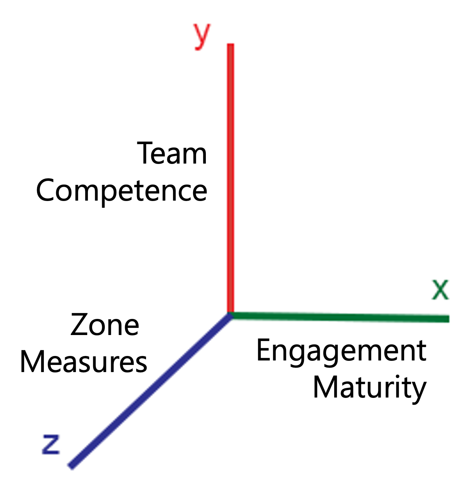
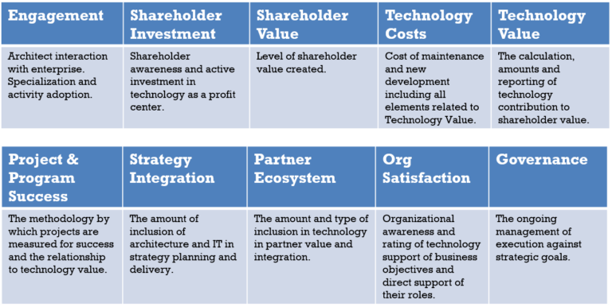
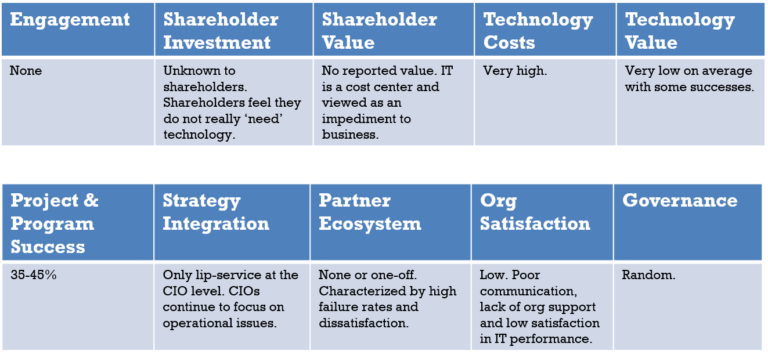
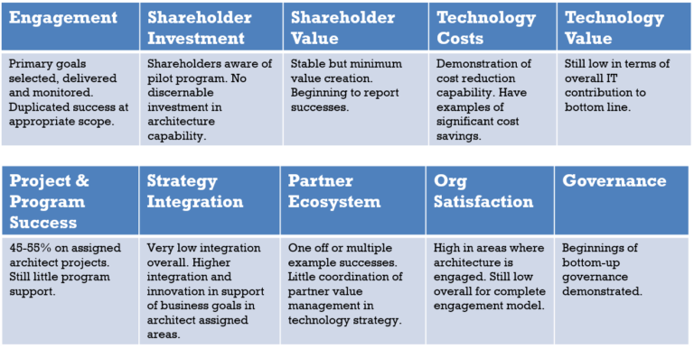
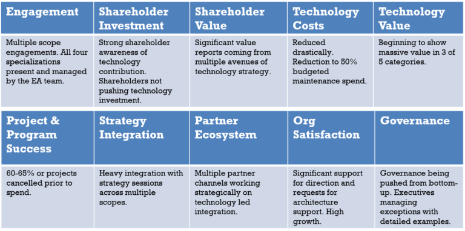
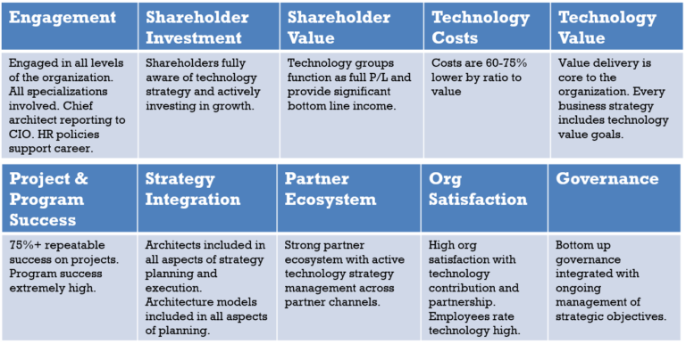

> This article is under development. It does not reflect final thoughts from the BTABoK

There are numerous maturity models for architecture mostly which are mostly EA focused. In addition their are other maturity models which touch or influence architecture maturity. However, as the articl

Maturity in architecture practice is measured through an understanding of:

1. Competencies of the team

2. Maturity of the engagement model

3. Outcomes in measured zones

The number and types of measures are based on the goals of the maturing practice. Architecture maturity can be limited based on overall company maturity.

This section of the BTABoK provides three primary sections. One proposes an architecture maturity model as a part of the BTABoK. The second section provides references and connection points to 3rd party architecture maturity models and related maturity models, some of which are much more robust than the built in Iasa maturity assessment. The third section provides a mechanism for maturity assessment using the BTABoK method or another method to gather practical success and improvement data in a functional engagement model.

## Section 1: A Simple Value Based Maturity Model

1. Assess your organization against value delivery
2. Ensure you architects are functioning as a team
3. Grow your program through stable phases of architecture

| Engagement | Ecosystem | Journey | Strategy | Agility | Capabilities | Business Model |
| ---------- | --------- | ------- | -------- | ------- | ------------ | -------------- |
|            |           |         |          |         |              |                |
|            |           |         |          |         |              |                |
|            |           |         |          |         |              |                |

 

## Outcome Measures

### Level 0

 

### Level 1

 

### Level 2

 

### Level 3

| Engagement | Ecosystem | Journey | Strategy | Agility | Capabilities | Business Model |
| ---------- | --------- | ------- | -------- | ------- | ------------ | -------------- |
|            |           |         |          |         |              |                |
|            |           |         |          |         |              |                |
|            |           |         |          |         |              |                |

 

### Level 4

| Engagement | Ecosystem | Journey | Strategy | Agility | Capabilities | Business Model |
| ---------- | --------- | ------- | -------- | ------- | ------------ | -------------- |
|            |           |         |          |         |              |                |
|            |           |         |          |         |              |                |
|            |           |         |          |         |              |                |

### Level 5

| Engagement | Ecosystem | Journey | Strategy | Agility | Capabilities | Business Model |
| ---------- | --------- | ------- | -------- | ------- | ------------ | -------------- |
|            |           |         |          |         |              |                |
|            |           |         |          |         |              |                |
|            |           |         |          |         |              |                |
